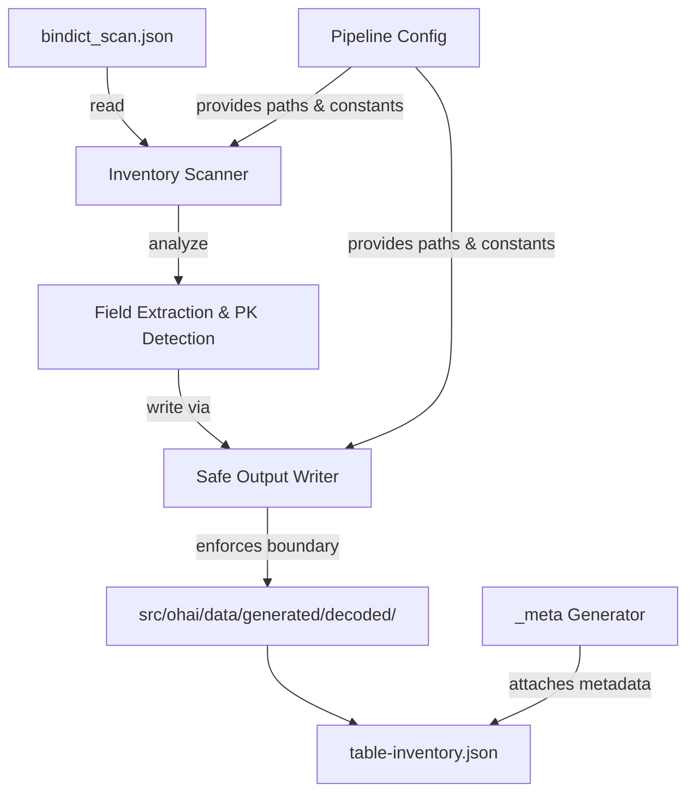
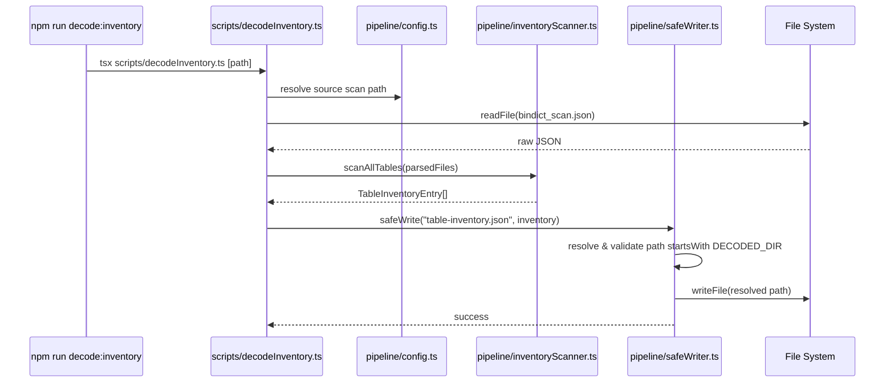

# Design Document: Data Decode Pipeline — Phase 0

## Overview

Phase 0 establishes the foundational infrastructure for the OHMM data decode pipeline: the output directory structure, pipeline configuration constants, a safe output writer that guarantees writes stay within the `generated/decoded/` boundary, `_meta` block generation for provenance tracking, npm script entry points, and the first executable command — `decode:inventory` — which scans `bindict_scan.json` and produces `table-inventory.json`.

This phase intentionally excludes normalization logic, conflict detection, cross-reference maps, and UI changes. Those are separate phases that build on this foundation.

## Architecture





## File Layout

```
src/ohai/
├── src/
│   └── pipeline/
│       ├── config.ts              # Pipeline constants & paths
│       ├── safeWriter.ts          # Boundary-enforcing file writer
│       ├── inventoryScanner.ts    # Table analysis logic
│       ├── metaGenerator.ts       # _meta block factory
│       └── types.ts               # All pipeline TypeScript interfaces
├── scripts/
│   ├── decodeInventory.ts         # npm run decode:inventory entry point
│   ├── decodeAll.ts               # npm run decode:all entry point (stub Phase 0)
│   └── validateDecoded.ts         # npm run validate:decoded entry point (stub Phase 0)
└── data/
    └── generated/
        └── decoded/
            └── .gitkeep           # Ensures directory exists in version control
```

## Core Interfaces/Types

```typescript
// src/ohai/src/pipeline/types.ts

/** Trust level for a decoded record — ordered from highest to lowest confidence */
export type ConfidenceLevel =
  | 'project_verified'
  | 'observed'
  | 'decoded'
  | 'inferred'
  | 'placeholder';

/** How the data was extracted from source */
export type ExtractionMethod =
  | 'bindict'
  | 'npk_script'
  | 'pyc_bytecode'
  | 'workbook';

/** Lifecycle status of a record's verification */
export type VerificationStatus =
  | 'verified'
  | 'manual'
  | 'generated'
  | 'decoded'
  | 'inferred';

/** Provenance metadata attached to every decoded output file */
export interface MetaBlock {
  /** Original source file name (e.g., "02548_58575b3c.pyc") */
  sourceFile: string;
  /** Absolute path within the scan that produced this data */
  sourceScannedPath: string;
  /** Method used to extract the data */
  extractionMethod: ExtractionMethod;
  /** ISO 8601 timestamp when decoding was performed */
  decodedAt: string;
  /** Number of records in this output */
  recordCount: number;
  /** SHA-256 hex digest of the input JSON content */
  sourceHash: string;
  /** Pipeline version string (semver) */
  pipelineVersion: string;
}

/** A single table entry in the inventory manifest */
export interface TableInventoryEntry {
  /** Source .pyc file name */
  sourceFile: string;
  /** Full path within bindict_scan */
  sourcePath: string;
  /** All field names found in the parsed records */
  fieldNames: string[];
  /** Best-guess primary key field name */
  likelyPrimaryKey: string | null;
  /** Number of records in the table */
  recordCount: number;
  /** Up to 3 sample records (raw, unmodified) */
  sampleRecords: Record<string, unknown>[];
  /** Confidence assessment for this table */
  confidence: ConfidenceLevel;
  /** Warnings encountered during scanning */
  parseWarnings: string[];
}

/** Top-level structure of table-inventory.json */
export interface TableInventoryManifest {
  /** _meta provenance block */
  _meta: MetaBlock;
  /** The source scan path used */
  sourceScannedPath: string;
  /** Total table count discovered */
  tableCount: number;
  /** All discovered tables */
  tables: TableInventoryEntry[];
}

/** Pipeline configuration constants */
export interface PipelineConfig {
  /** Absolute resolved path to the generated/decoded output directory */
  decodedOutputDir: string;
  /** Default source scan path (overridable via CLI arg) */
  defaultSourceScanPath: string;
  /** Current pipeline version */
  pipelineVersion: string;
}
```

## Key Functions with Formal Specifications

### Function 1: `createPipelineConfig()`

```typescript
function createPipelineConfig(overrides?: Partial<PipelineConfig>): PipelineConfig
```

**Preconditions:**
- Called from a context where `__dirname` resolves within `src/ohai/`

**Postconditions:**
- `decodedOutputDir` is an absolute path ending with `src/ohai/data/generated/decoded`
- `pipelineVersion` is a valid semver string
- `defaultSourceScanPath` is a non-empty string

### Function 2: `safeWrite(relativePath, content, config)`

```typescript
async function safeWrite(
  relativePath: string,
  content: string,
  config: PipelineConfig
): Promise<void>
```

**Preconditions:**
- `relativePath` does not start with `/` or contain `..` traversal
- `content` is a non-empty string
- `config.decodedOutputDir` is a resolved absolute path

**Postconditions:**
- File is written at `path.resolve(config.decodedOutputDir, relativePath)`
- The resolved write path starts with `config.decodedOutputDir` (boundary enforced)
- Parent directories are created if they don't exist
- If resolved path escapes the boundary, throws `Error` with descriptive message — no file is written

**Loop Invariants:** N/A

### Function 3: `scanTable(fileEntry)`

```typescript
function scanTable(fileEntry: BindictFileEntry): TableInventoryEntry
```

**Preconditions:**
- `fileEntry` has a `parsed` field that is a non-null value (object or array)

**Postconditions:**
- `fieldNames` contains all unique top-level keys found across all records
- `recordCount` equals the number of records (array length or dict key count)
- `sampleRecords` contains at most 3 entries, taken from the first records
- `likelyPrimaryKey` is the first integer-typed field, or a field named `id`/`ID`/`Id`, or `null`
- `confidence` is `'decoded'` when fully parsed, `'inferred'` when parseWarnings is non-empty
- `parseWarnings` is empty when parsing succeeds fully

### Function 4: `buildInventory(scanData, config)`

```typescript
async function buildInventory(
  scanData: BindictScan,
  config: PipelineConfig
): Promise<TableInventoryManifest>
```

**Preconditions:**
- `scanData` contains a `files` array of objects
- `config` is a valid PipelineConfig

**Postconditions:**
- Returns manifest where `tableCount === tables.length`
- Every entry in `tables` was derived from an entry in `scanData.files` that has a truthy `parsed` field
- `_meta.recordCount` equals total records across all tables
- `_meta.sourceHash` is SHA-256 of the raw JSON input string
- `_meta.decodedAt` is a valid ISO 8601 timestamp at time of execution

### Function 5: `generateMeta(options)`

```typescript
function generateMeta(options: {
  sourceFile: string;
  sourceScannedPath: string;
  extractionMethod: ExtractionMethod;
  recordCount: number;
  sourceContent: string;
  config: PipelineConfig;
}): MetaBlock
```

**Preconditions:**
- `sourceContent` is the raw string content used for hashing
- `recordCount >= 0`

**Postconditions:**
- `sourceHash` is lowercase hex SHA-256 of `sourceContent`
- `decodedAt` is ISO 8601 with timezone (`Z`)
- `pipelineVersion` matches `config.pipelineVersion`
- All string fields are non-empty

## Implementation Details

### Safe Writer Approach

The safe writer uses Node.js `path.resolve()` to canonicalize the target path, then checks that the resolved path starts with the configured `decodedOutputDir`:

```typescript
import * as path from 'path';
import * as fs from 'fs/promises';

export async function safeWrite(
  relativePath: string,
  content: string,
  config: PipelineConfig
): Promise<void> {
  // Reject obvious traversal attempts early
  if (relativePath.startsWith('/') || relativePath.startsWith('\\')) {
    throw new Error(`safeWrite: relativePath must not be absolute: "${relativePath}"`);
  }

  const resolved = path.resolve(config.decodedOutputDir, relativePath);
  const boundary = path.resolve(config.decodedOutputDir);

  // On Windows, normalize to consistent casing for startsWith check
  const normalizedResolved = resolved.toLowerCase();
  const normalizedBoundary = boundary.toLowerCase();

  if (!normalizedResolved.startsWith(normalizedBoundary + path.sep) &&
      normalizedResolved !== normalizedBoundary) {
    throw new Error(
      `safeWrite: path escapes boundary.\n` +
      `  Resolved: ${resolved}\n` +
      `  Boundary: ${boundary}`
    );
  }

  await fs.mkdir(path.dirname(resolved), { recursive: true });
  await fs.writeFile(resolved, content, 'utf-8');
}
```

Key properties:
- Case-insensitive comparison on Windows (paths are lowercased before check)
- Handles both `/` and `\` separators
- `..` in relativePath is resolved by `path.resolve` — the startsWith check catches any escape
- Creates parent directories automatically

### Inventory Scanner Approach

The scanner reads `bindict_scan.json`, iterates the `files[]` array, and for each entry with a truthy `parsed` field:

1. **Determine record shape**: If `parsed` is an array, each element is a record. If `parsed` is a dict, each value is a record (keys are IDs).
2. **Extract field names**: Union of all keys across all records.
3. **Identify likely PK**: First field where: name matches `/^id$/i` OR first field whose sample values are all integers.
4. **Count records**: Array length or dict key count.
5. **Take samples**: First 3 records (preserving original field names and values verbatim).
6. **Assess confidence**: If no exceptions during scan → `'decoded'`. If any field access throws or structure is unexpected → `'inferred'` with `parseWarnings` describing the issue.

```typescript
function identifyPrimaryKey(records: Record<string, unknown>[]): string | null {
  if (records.length === 0) return null;

  const firstRecord = records[0];
  const keys = Object.keys(firstRecord);

  // Priority 1: field named "id" (case-insensitive)
  const idField = keys.find(k => /^id$/i.test(k));
  if (idField) return idField;

  // Priority 2: first field where all sampled values are integers
  const sample = records.slice(0, 10);
  for (const key of keys) {
    const allIntegers = sample.every(r => {
      const v = r[key];
      return typeof v === 'number' && Number.isInteger(v);
    });
    if (allIntegers) return key;
  }

  return null;
}
```

### _meta Generation

```typescript
import * as crypto from 'crypto';

export function generateMeta(options: {
  sourceFile: string;
  sourceScannedPath: string;
  extractionMethod: ExtractionMethod;
  recordCount: number;
  sourceContent: string;
  config: PipelineConfig;
}): MetaBlock {
  const hash = crypto.createHash('sha256')
    .update(options.sourceContent, 'utf-8')
    .digest('hex');

  return {
    sourceFile: options.sourceFile,
    sourceScannedPath: options.sourceScannedPath,
    extractionMethod: options.extractionMethod,
    decodedAt: new Date().toISOString(),
    recordCount: options.recordCount,
    sourceHash: hash,
    pipelineVersion: options.config.pipelineVersion,
  };
}
```

### Pipeline Config

```typescript
import * as path from 'path';

const OHAI_ROOT = path.resolve(__dirname, '..', '..');

export function createPipelineConfig(
  overrides?: Partial<PipelineConfig>
): PipelineConfig {
  return {
    decodedOutputDir: path.resolve(OHAI_ROOT, 'data', 'generated', 'decoded'),
    defaultSourceScanPath: String.raw`C:\Users\tyr3x\Downloads\makeoh\.codex\neox_probe\script_extract_full\bindict_scan.json`,
    pipelineVersion: '0.1.0',
    ...overrides,
  };
}
```

### npm Scripts

Added to `src/ohai/package.json`:

```json
{
  "decode:inventory": "tsx scripts/decodeInventory.ts",
  "decode:all": "tsx scripts/decodeAll.ts",
  "validate:decoded": "tsx scripts/validateDecoded.ts"
}
```

All scripts accept an optional positional argument for the source scan path:
```bash
npm run decode:inventory -- "C:\path\to\bindict_scan.json"
```

If no argument is provided, the script uses `config.defaultSourceScanPath`.

### Entry Point: `decodeInventory.ts`

```typescript
import * as fs from 'fs/promises';
import * as path from 'path';
import { createPipelineConfig } from '../src/pipeline/config';
import { buildInventory } from '../src/pipeline/inventoryScanner';
import { safeWrite } from '../src/pipeline/safeWriter';

async function main(): Promise<void> {
  const config = createPipelineConfig();
  const scanPath = process.argv[2] || config.defaultSourceScanPath;

  console.log(`[decode:inventory] Reading: ${scanPath}`);
  const raw = await fs.readFile(scanPath, 'utf-8');
  const scanData = JSON.parse(raw);

  const manifest = await buildInventory(scanData, config);

  const output = JSON.stringify(manifest, null, 2);
  await safeWrite('table-inventory.json', output, config);

  console.log(`[decode:inventory] Done. ${manifest.tableCount} tables written to table-inventory.json`);
}

main().catch(err => {
  console.error('[decode:inventory] FATAL:', err.message);
  process.exit(1);
});
```

## Example Usage

```typescript
// Running the inventory scanner programmatically
import { createPipelineConfig } from './src/pipeline/config';
import { buildInventory } from './src/pipeline/inventoryScanner';
import { safeWrite } from './src/pipeline/safeWriter';
import * as fs from 'fs/promises';

const config = createPipelineConfig();
const raw = await fs.readFile(config.defaultSourceScanPath, 'utf-8');
const scan = JSON.parse(raw);
const manifest = await buildInventory(scan, config);

// manifest.tables[0] looks like:
// {
//   sourceFile: "02548_58575b3c.pyc",
//   sourcePath: "script_extract_full/02548_58575b3c.pyc",
//   fieldNames: ["equipOriginId", "gunNo", "blueprintNo", "equipType", ...],
//   likelyPrimaryKey: "equipOriginId",
//   recordCount: 1847,
//   sampleRecords: [{ equipOriginId: 10111100, gunNo: 10110011, ... }, ...],
//   confidence: "decoded",
//   parseWarnings: []
// }

await safeWrite('table-inventory.json', JSON.stringify(manifest, null, 2), config);

// Safe writer rejects escapes:
try {
  await safeWrite('../../../etc/passwd', 'bad', config);
} catch (e) {
  // Error: safeWrite: path escapes boundary.
}
```

## Testing Strategy

### Smoke Tests (matching project convention)

All tests run via `tsx` as self-contained scripts that exit non-zero on failure. No test framework.

**Test scripts location**: `src/ohai/scripts/pipeline/__tests__/`

#### Smoke Test: Safe Writer Boundary

```typescript
// Verifies that safeWrite rejects path traversal attempts
const config = createPipelineConfig({ decodedOutputDir: tmpDir });

// Should succeed
await safeWrite('foo.json', '{}', config);
assert(existsSync(path.join(tmpDir, 'foo.json')));

// Should throw
await assertThrows(() => safeWrite('../escape.json', '{}', config));
await assertThrows(() => safeWrite('../../etc/hosts', '{}', config));
await assertThrows(() => safeWrite('/absolute/path.json', '{}', config));
```

#### Smoke Test: Inventory Scanner

```typescript
// Uses a small fixture (3 files from bindict_scan) to verify:
// - fieldNames extraction is complete
// - recordCount matches actual array length
// - sampleRecords has at most 3 entries
// - likelyPrimaryKey detects integer ID fields
// - confidence is 'decoded' for clean files, 'inferred' for broken ones
```

#### Smoke Test: Meta Generation

```typescript
// Verifies:
// - sourceHash is deterministic (same input → same hash)
// - decodedAt is valid ISO 8601
// - pipelineVersion matches config
```

### npm Scripts for Testing

```json
{
  "test:pipeline:writer": "tsx scripts/pipeline/__tests__/safeWriterSmokeTest.ts",
  "test:pipeline:inventory": "tsx scripts/pipeline/__tests__/inventorySmokeTest.ts",
  "test:pipeline:meta": "tsx scripts/pipeline/__tests__/metaSmokeTest.ts"
}
```

## Correctness Properties

*A property is a characteristic or behavior that should hold true across all valid executions of the pipeline — essentially, a formal statement about what Phase 0 components must guarantee.*

### Property 1: Safe Writer Boundary Enforcement

*For any* relative path string (including those containing `..`, absolute prefixes, or symlink-like segments), the safe writer SHALL either write the file within the configured `decodedOutputDir` boundary OR throw an error — it shall never write outside that boundary.

**Validates: Requirements 1.5, 9.1, 9.2**

### Property 2: Inventory Completeness

*For any* `bindict_scan.json` input containing N file entries with truthy `parsed` fields, the resulting `table-inventory.json` SHALL contain exactly N `TableInventoryEntry` objects with `tableCount === N`.

**Validates: Requirements 1.1, 1.4**

### Property 3: Field Extraction Faithfulness

*For any* table entry in the inventory, the `fieldNames` array SHALL be the exact union of all keys present across all records in the source `parsed` data — no fields added, no fields omitted.

**Validates: Requirements 1.2, 2.1, 2.2**

### Property 4: Sample Record Bound

*For any* table entry, `sampleRecords.length <= 3` and each sample is a verbatim copy of a source record (no field renaming or value modification).

**Validates: Requirements 1.2, 2.1**

### Property 5: Meta Hash Determinism

*For any* input content string, calling `generateMeta` twice with the same `sourceContent` SHALL produce identical `sourceHash` values (SHA-256 is deterministic).

**Validates: Requirements 2.5**

### Property 6: Source Path Reproducibility

*For any* execution of `decode:inventory`, the output manifest SHALL include a `sourceScannedPath` field that exactly matches the source path argument used, enabling reproducible re-runs.

**Validates: Requirements 1.6**
