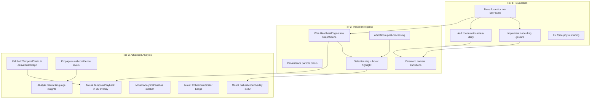
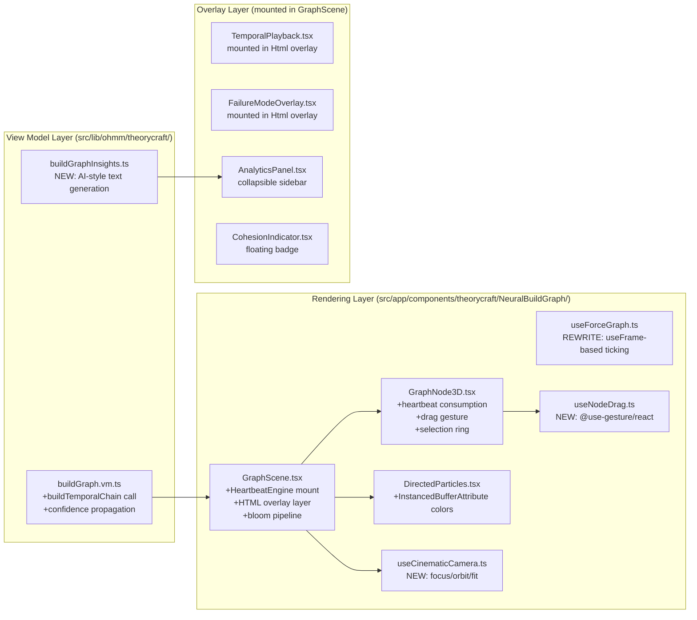
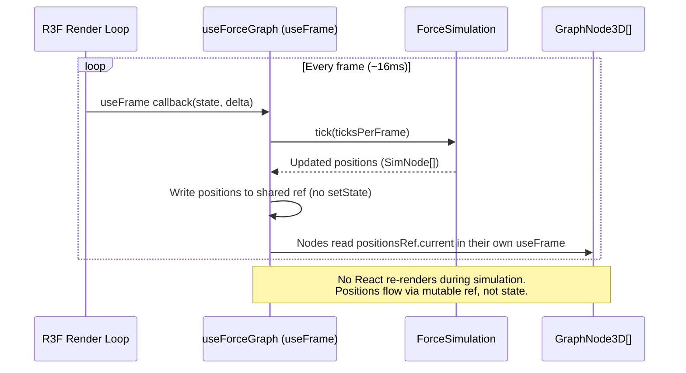
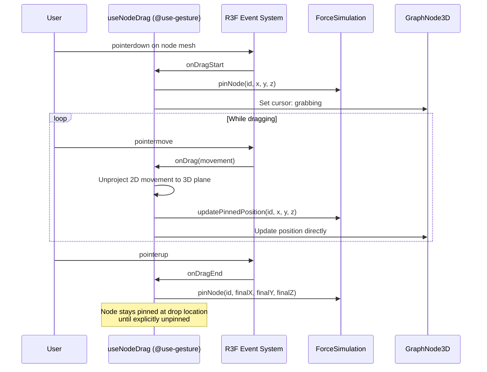
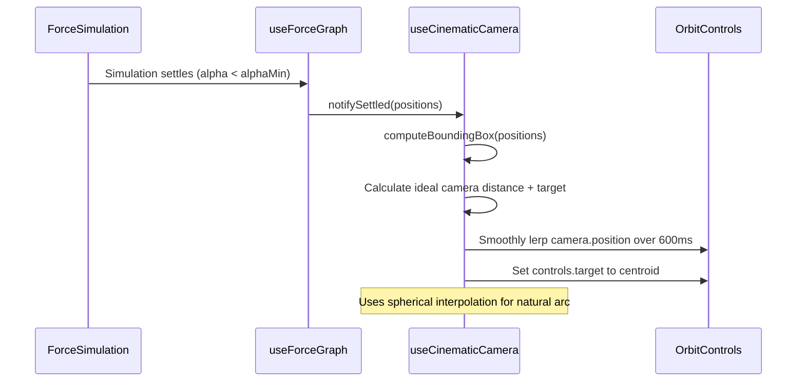
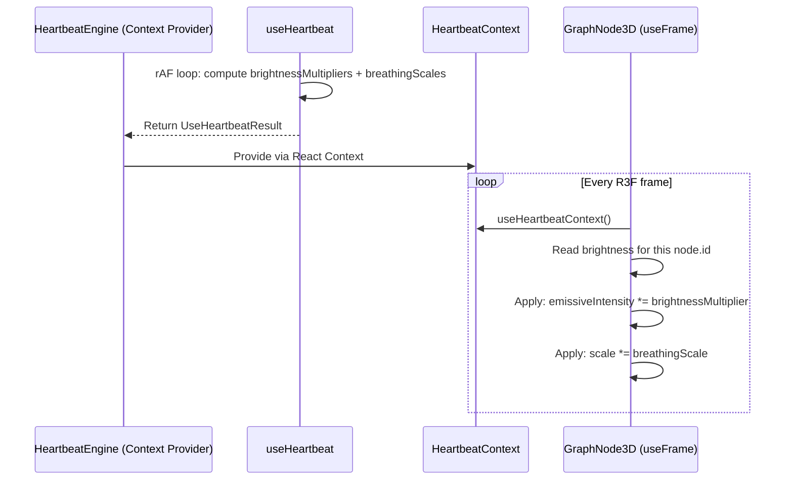
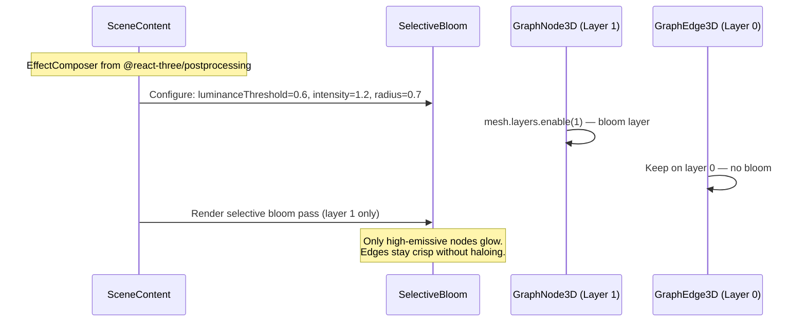
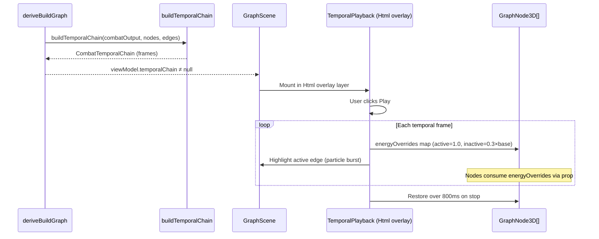

# Design Document: Neural Build Graph v2 — Tiered Quality Enhancement

## Overview

The Neural Build Graph v2 restructures the existing implementation around three sequential quality tiers, each building on the previous. The current code is **kept and enhanced** — this is not a rewrite. Every gap identified during the implementation audit maps to a specific tier, creating a clean upgrade path from "rock-solid fundamentals" through "cinematic polish" to "advanced analytical features."

The three tiers represent distinct quality levels:

1. **Foundation** — Fix frame synchronization, implement node dragging, add zoom-to-fit. The graph must be physically correct and interactable before any visual polish.
2. **Visual Intelligence** — Wire the heartbeat system, add bloom post-processing, implement per-instance particle colors, and build cinematic camera transitions. The graph becomes alive.
3. **Advanced Analysis** — Activate temporal playback, mount all analysis overlays into the 3D scene, propagate real confidence data, and generate AI-style natural language insights.

Each tier has a clear "done" definition: Tier 1 is done when drag works, physics run inside useFrame, and the camera auto-fits. Tier 2 is done when the heartbeat pulses nodes, bloom glows, particles are multi-colored, and camera lerps to focus. Tier 3 is done when temporal playback animates through the 3D scene, failure/analytics/cohesion overlays are visible, and the system generates build advice.

## Architecture

### Tier Dependency Graph



### Modified File Architecture



## Sequence Diagrams

### Tier 1: Force Simulation Inside useFrame



### Tier 1: Node Drag Interaction



### Tier 1: Zoom-to-Fit on Initial Load



### Tier 2: HeartbeatEngine → GraphNode3D Data Flow



### Tier 2: Bloom Post-Processing Pipeline



### Tier 3: Temporal Playback Wired Into 3D Scene



## Components and Interfaces

### New Files (Tier 1)

```
src/app/components/theorycraft/NeuralBuildGraph/
├── useNodeDrag.ts               # NEW: Drag gesture for 3D nodes
├── useCinematicCamera.ts        # NEW: Zoom-to-fit, focus-on-node, auto-orbit
```

### New Files (Tier 2)

```
(No new files — wiring existing HeartbeatEngine + adding postprocessing to GraphScene)
```

### New Files (Tier 3)

```
src/lib/ohmm/theorycraft/
├── buildGraphInsights.ts        # NEW: AI-style natural language insight generation
```

### Modified Files

```
src/lib/ohmm/theorycraft/buildGraph.vm.ts          # +buildTemporalChain call, +confidence propagation
src/app/components/theorycraft/NeuralBuildGraph/
├── GraphScene.tsx               # Major: +HeartbeatEngine, +bloom, +overlay layer, +camera
├── useForceGraph.ts             # Rewrite: move from rAF to useFrame
├── GraphNode3D.tsx              # +heartbeat context, +drag, +selection ring, +bloom layer
├── GraphEdge3D.tsx              # +hover highlight
├── DirectedParticles.tsx        # +InstancedBufferAttribute for per-instance color
```

## Data Models

### Shared Position Ref (Tier 1 — replaces React state for positions)

```typescript
// Used internally by useForceGraph to avoid React re-renders during simulation
export interface PositionsRef {
  /** Mutable map updated every useFrame tick — nodes read directly */
  current: Map<string, { x: number; y: number; z: number }>;
  /** Frame counter incremented on each update — consumers check for staleness */
  frameId: number;
}
```

### Drag State (Tier 1)

```typescript
export interface NodeDragState {
  /** Whether a drag is currently in progress */
  isDragging: boolean;
  /** The node ID being dragged (null if not dragging) */
  draggedNodeId: string | null;
  /** Drag plane normal (perpendicular to camera) */
  planeNormal: THREE.Vector3;
  /** Offset from node center to pointer at drag start */
  offset: THREE.Vector3;
}
```

### Cinematic Camera State (Tier 1 + Tier 2)

```typescript
export interface CinematicCameraState {
  /** Whether the camera is currently animating */
  isAnimating: boolean;
  /** Animation mode */
  mode: 'idle' | 'zoom-to-fit' | 'focus-on-node' | 'auto-orbit';
  /** Lerp progress [0, 1] */
  progress: number;
  /** Start position for interpolation */
  fromPosition: THREE.Vector3;
  /** Target position for interpolation */
  toPosition: THREE.Vector3;
  /** Start target (look-at) for interpolation */
  fromTarget: THREE.Vector3;
  /** End target (look-at) for interpolation */
  toTarget: THREE.Vector3;
  /** Duration of current animation in ms */
  duration: number;
  /** Idle timer — seconds since last user interaction */
  idleTime: number;
  /** Auto-orbit speed (radians/sec, slow: 0.05) */
  orbitSpeed: number;
}
```

### Per-Instance Particle Color Attribute (Tier 2)

```typescript
// Added to DirectedParticles.tsx as InstancedBufferAttribute
export interface ParticleColorSlot {
  /** RGB color components for this particle instance */
  r: number;
  g: number;
  b: number;
}

// The Float32Array layout: [r0, g0, b0, r1, g1, b1, ...] — 3 floats per instance
// Applied via: <instancedBufferAttribute attach="attributes-aColor" args={[colorArray, 3]} />
// ShaderMaterial or onBeforeCompile injects: attribute vec3 aColor; → vColor for fragment
```

### Build Insight (Tier 3)

```typescript
// src/lib/ohmm/theorycraft/buildGraphInsights.ts

export interface BuildInsight {
  /** Unique insight ID */
  id: string;
  /** Insight category */
  category: 'bottleneck' | 'upgrade' | 'synergy' | 'warning' | 'optimization';
  /** Severity/importance (higher = more impactful) */
  priority: number;
  /** One-line summary */
  title: string;
  /** Detailed explanation (1-2 sentences) */
  description: string;
  /** Related node IDs */
  relatedNodes: string[];
  /** Confidence in the insight */
  confidence: 'high' | 'medium' | 'low';
}

export interface BuildInsightsResult {
  /** Ordered insights (highest priority first) */
  insights: BuildInsight[];
  /** Overall build rating */
  overallRating: 'weak' | 'average' | 'strong' | 'optimal';
  /** Generated summary paragraph */
  summary: string;
}
```

## Algorithmic Pseudocode

### Algorithm: useForceGraph with useFrame (Tier 1 Rewrite)

```typescript
/**
 * REWRITE of useForceGraph.ts
 * 
 * Before: rAF loop outside R3F → setPositions(new Map()) every tick → React re-renders
 * After:  useFrame inside R3F → write to mutable ref → zero re-renders during simulation
 *
 * Key insight: GraphNode3D already runs useFrame for breathing animation.
 * It can read positions from a shared ref in that same callback — zero prop changes needed.
 */

// Preconditions:
//   - viewModel.isRenderable === true
//   - viewModel.nodes.length > 0
//   - ForceSimulation constructed with valid SimNode[] and SimEdge[]
//
// Postconditions:
//   - positionsRef.current contains a position for every node.id
//   - positionsRef.frameId increments exactly once per R3F frame
//   - No React setState calls during active simulation
//   - Simulation stops ticking when alpha < alphaMin (settled)
//
// Loop Invariant:
//   - positionsRef.current.size === viewModel.nodes.length
//   - Every key in positionsRef.current is a valid node.id

export function useForceGraph(viewModel: BuildGraphViewModel): UseForceGraphResult {
  const simulationRef = useRef<ForceSimulation | null>(null);
  const positionsRef = useRef<PositionsRef>({ current: new Map(), frameId: 0 });
  const isSettledRef = useRef(false);
  
  // Rebuild simulation when graph structure changes (fingerprint)
  useEffect(() => {
    const sim = new ForceSimulation(toSimNodes(viewModel), toSimEdges(viewModel));
    simulationRef.current = sim;
    isSettledRef.current = false;
    return () => sim.dispose();
  }, [fingerprint]);

  // Tick inside R3F render loop — no double-loop contention
  useFrame(() => {
    const sim = simulationRef.current;
    if (!sim || isSettledRef.current) return;

    const nodes = sim.tick(ticksPerFrame);
    const map = positionsRef.current.current;
    map.clear();
    for (const node of nodes) {
      map.set(node.id, { x: node.x, y: node.y, z: node.z });
    }
    positionsRef.current.frameId++;

    if (sim.isSettled()) {
      isSettledRef.current = true;
      // Trigger zoom-to-fit via callback
      onSettled?.(positionsRef.current.current);
    }
  });

  return { positionsRef, simulationRef, pinNode, unpinNode, reheat, isSettledRef };
}
```

### Algorithm: useNodeDrag (Tier 1 — New)

```typescript
/**
 * Node drag gesture handler for 3D space.
 * 
 * Strategy: Project pointer movement onto a plane perpendicular to camera,
 * passing through the node's current position. This gives intuitive drag
 * behavior regardless of camera angle.
 *
 * Preconditions:
 *   - Camera is valid (not null)
 *   - Node mesh ref is accessible
 *   - ForceSimulation pinNode/unpinNode methods available
 *
 * Postconditions:
 *   - On drag end: node is pinned at final world position
 *   - Simulation is not disrupted (other nodes continue converging)
 *   - OrbitControls are disabled during drag (re-enabled on release)
 */

export function useNodeDrag(
  nodeId: string,
  positionsRef: PositionsRef,
  simulationRef: RefObject<ForceSimulation>,
  camera: THREE.Camera,
  controlsRef: RefObject<OrbitControls>,
): { bind: ReturnType<typeof useDrag>; isDragging: boolean } {
  
  const planeRef = useRef(new THREE.Plane());
  const intersectPoint = useRef(new THREE.Vector3());
  const raycaster = useRef(new THREE.Raycaster());

  const bind = useDrag(({ active, xy: [px, py], first, memo }) => {
    if (first) {
      // Compute drag plane: perpendicular to camera, through node position
      const nodePos = positionsRef.current.current.get(nodeId);
      if (!nodePos) return;
      const worldPos = new THREE.Vector3(nodePos.x, nodePos.y, nodePos.z);
      const cameraDir = camera.getWorldDirection(new THREE.Vector3());
      planeRef.current.setFromNormalAndCoplanarPoint(cameraDir, worldPos);
      
      // Disable orbit controls during drag
      if (controlsRef.current) controlsRef.current.enabled = false;
    }

    // Cast ray from pointer through camera
    const ndcX = (px / window.innerWidth) * 2 - 1;
    const ndcY = -(py / window.innerHeight) * 2 + 1;
    raycaster.current.setFromCamera({ x: ndcX, y: ndcY }, camera);
    raycaster.current.ray.intersectPlane(planeRef.current, intersectPoint.current);

    const { x, y, z } = intersectPoint.current;
    simulationRef.current?.updatePinnedPosition(nodeId, x, y, z);

    if (!active) {
      // Drag ended: pin node at final position
      simulationRef.current?.pinNode(nodeId, x, y, z);
      if (controlsRef.current) controlsRef.current.enabled = true;
    }

    return memo;
  });

  return { bind, isDragging: false };
}
```

### Algorithm: useCinematicCamera — Zoom-to-Fit (Tier 1)

```typescript
/**
 * Compute camera position that fits all nodes in view.
 *
 * Preconditions:
 *   - positions map is non-empty
 *   - camera.fov is defined
 *
 * Postconditions:
 *   - Camera position shows all nodes with 15% padding
 *   - Camera target is set to centroid of all positions
 *   - Animation completes in 600ms with ease-out
 */

function computeZoomToFit(
  positions: Map<string, { x: number; y: number; z: number }>,
  camera: THREE.PerspectiveCamera,
): { position: THREE.Vector3; target: THREE.Vector3 } {
  // Step 1: Compute bounding box
  const min = new THREE.Vector3(Infinity, Infinity, Infinity);
  const max = new THREE.Vector3(-Infinity, -Infinity, -Infinity);
  
  for (const pos of positions.values()) {
    min.x = Math.min(min.x, pos.x);
    min.y = Math.min(min.y, pos.y);
    min.z = Math.min(min.z, pos.z);
    max.x = Math.max(max.x, pos.x);
    max.y = Math.max(max.y, pos.y);
    max.z = Math.max(max.z, pos.z);
  }

  // Step 2: Compute centroid and bounding sphere radius
  const centroid = new THREE.Vector3().addVectors(min, max).multiplyScalar(0.5);
  const radius = centroid.distanceTo(max);

  // Step 3: Compute distance for FOV (with 15% padding)
  const fovRad = (camera.fov * Math.PI) / 180;
  const distance = (radius * 1.15) / Math.sin(fovRad / 2);

  // Step 4: Position camera along current viewing direction
  const direction = camera.position.clone().sub(centroid).normalize();
  const position = centroid.clone().add(direction.multiplyScalar(distance));

  return { position, target: centroid };
}
```

### Algorithm: Per-Instance Particle Colors (Tier 2)

```typescript
/**
 * Replace the single-material approach with per-instance color attributes.
 *
 * Before: One MeshBasicMaterial color for ALL particles (picks dominant edge color)
 * After:  InstancedBufferAttribute "aColor" gives each particle its edge's color
 *
 * Preconditions:
 *   - slots[] is computed (one slot per particle per edge)
 *   - Each slot maps back to its parent edge's category
 *
 * Postconditions:
 *   - colorArray.length === slots.length * 3
 *   - Each particle renders with its own edge's semantic color
 *   - Single draw call preserved (still one InstancedMesh)
 */

function buildColorAttribute(
  slots: ParticleSlot[],
  edgeCategories: EdgeCategory[],
): Float32Array {
  const colors = new Float32Array(slots.length * 3);
  const tempColor = new THREE.Color();

  for (let i = 0; i < slots.length; i++) {
    const category = edgeCategories[i];
    const config = EDGE_VISUAL_CONFIG[category];
    tempColor.set(config.particleColor);
    colors[i * 3] = tempColor.r;
    colors[i * 3 + 1] = tempColor.g;
    colors[i * 3 + 2] = tempColor.b;
  }

  return colors;
}

// In the JSX:
// <instancedMesh ref={meshRef} args={[undefined, undefined, slots.length]}>
//   <sphereGeometry args={[1, 6, 4]}>
//     <instancedBufferAttribute
//       attach="attributes-aColor"
//       args={[colorArray, 3]}
//     />
//   </sphereGeometry>
//   <shaderMaterial  -- or use onBeforeCompile to inject vertex color
//     vertexColors
//     transparent
//     blending={THREE.AdditiveBlending}
//     depthWrite={false}
//   />
// </instancedMesh>
```

### Algorithm: HeartbeatEngine Wiring (Tier 2)

```typescript
/**
 * Wire HeartbeatEngine as context provider wrapping SceneContent.
 *
 * Current state: HeartbeatEngine exists, exports useHeartbeatContext,
 * but is never mounted in GraphScene → nodes never receive brightness data.
 *
 * Fix: Mount inside Canvas, wrap SceneContent children.
 * GraphNode3D calls useHeartbeatContext() in its useFrame to modulate emissive.
 *
 * Preconditions:
 *   - HeartbeatEngine is a valid React component (not a hook)
 *   - useHeartbeatContext returns { brightnessMultipliers, breathingScales, isActive }
 *
 * Postconditions:
 *   - GraphNode3D.emissiveIntensity *= brightnessMultiplier[node.id]
 *   - GraphNode3D.scale *= breathingScale[node.id]
 *   - When heartbeat isActive=false, multiplier=1.0, scale=1.0 (no visual change)
 */

// In GraphScene.tsx SceneContent:
function SceneContent({ viewModel }: { viewModel: BuildGraphViewModel }) {
  return (
    <HeartbeatEngine viewModel={viewModel}>
      {/* All scene children can now call useHeartbeatContext() */}
      <SceneNodes viewModel={viewModel} />
      <SceneEdges viewModel={viewModel} />
      <SceneParticles viewModel={viewModel} />
    </HeartbeatEngine>
  );
}

// In GraphNode3D.tsx useFrame:
useFrame(() => {
  const { brightnessMultipliers, breathingScales } = useHeartbeatContext();
  const brightness = brightnessMultipliers.get(node.id) ?? 1.0;
  const breathing = breathingScales.get(node.id) ?? 1.0;
  
  // Apply brightness to emissive intensity
  if (coreRef.current) {
    (coreRef.current.material as THREE.MeshStandardMaterial).emissiveIntensity = 
      baseEmissive * brightness;
  }
  // Apply breathing to group scale (replaces hardcoded internal breathing)
  if (groupRef.current) {
    groupRef.current.scale.setScalar(hoverScale * breathing);
  }
});
```

### Algorithm: Cinematic Camera — Focus on Node + Auto-Orbit (Tier 2)

```typescript
/**
 * Focus-on-node: Smoothly lerp camera to frame a selected node.
 * Auto-orbit: After 10s of idle, slowly rotate around graph centroid.
 *
 * Preconditions:
 *   - Target node position exists in positionsRef
 *   - OrbitControls ref is accessible
 *
 * Postconditions:
 *   - Focus: Camera moves to show selected node centered with 2× radius clearance
 *   - Orbit: Camera rotates at 0.05 rad/s around centroid, pauses on interaction
 *
 * Loop Invariant (auto-orbit):
 *   - Camera distance from centroid remains constant
 *   - idleTime resets to 0 on any user interaction
 */

function useCinematicCamera(
  positionsRef: PositionsRef,
  controlsRef: RefObject<OrbitControls>,
  camera: THREE.PerspectiveCamera,
): CinematicCameraAPI {

  const stateRef = useRef<CinematicCameraState>(defaultState);

  useFrame((_, delta) => {
    const state = stateRef.current;

    if (state.mode === 'zoom-to-fit' || state.mode === 'focus-on-node') {
      // Advance lerp
      state.progress += delta / (state.duration / 1000);
      state.progress = Math.min(state.progress, 1.0);
      const t = easeOutCubic(state.progress);

      camera.position.lerpVectors(state.fromPosition, state.toPosition, t);
      const target = new THREE.Vector3().lerpVectors(state.fromTarget, state.toTarget, t);
      controlsRef.current?.target.copy(target);
      controlsRef.current?.update();

      if (state.progress >= 1.0) {
        state.mode = 'idle';
        state.isAnimating = false;
      }
    }

    if (state.mode === 'idle') {
      state.idleTime += delta;
      if (state.idleTime > 10) {
        state.mode = 'auto-orbit';
      }
    }

    if (state.mode === 'auto-orbit') {
      // Rotate camera around target
      const spherical = new THREE.Spherical().setFromVector3(
        camera.position.clone().sub(controlsRef.current!.target)
      );
      spherical.theta += state.orbitSpeed * delta;
      camera.position.setFromSpherical(spherical).add(controlsRef.current!.target);
      camera.lookAt(controlsRef.current!.target);
    }
  });

  // Reset idle timer on user interaction
  useEffect(() => {
    const reset = () => { stateRef.current.idleTime = 0; stateRef.current.mode = 'idle'; };
    window.addEventListener('pointerdown', reset);
    window.addEventListener('wheel', reset);
    return () => {
      window.removeEventListener('pointerdown', reset);
      window.removeEventListener('wheel', reset);
    };
  }, []);

  return { focusOnNode, zoomToFit, stopAnimation };
}
```

### Algorithm: buildTemporalChain Integration (Tier 3)

```typescript
/**
 * Fix: deriveBuildGraph() currently sets temporalChain: null unconditionally.
 * After: Call buildTemporalChain() and populate the field.
 *
 * Preconditions:
 *   - combatOutput is non-null with timing data
 *   - nodes and edges arrays are already computed
 *
 * Postconditions:
 *   - temporalChain is CombatTemporalChain when combatOutput has timing data
 *   - temporalChain is null when DPS=0 or no weapon node
 *   - Every frame.activeNodeId references a valid node in uniqueNodes
 */

// In deriveBuildGraph(), replace:
//   temporalChain: null,
// With:
const temporalChain = buildTemporalChain(combatOutput, uniqueNodes, edges);

// This enables TemporalPlayback to actually receive data and animate.
```

### Algorithm: AI-Style Insight Generation (Tier 3)

```typescript
/**
 * Generate natural language build insights from graph analytics.
 *
 * Preconditions:
 *   - GraphAnalytics computed (centralities, communities, components)
 *   - CohesionMetrics computed
 *   - FailureModeResult available for top-3 highest-influence nodes
 *
 * Postconditions:
 *   - Returns 3-7 insights, sorted by priority descending
 *   - No insight references a nonexistent node
 *   - Each insight has actionable advice (not just observation)
 *
 * Categories:
 *   - bottleneck: Single node with >40% of shortest paths (betweenness)
 *   - upgrade: Lowest-energy equipment node with high centrality
 *   - synergy: Community with high internal density but low external connections
 *   - warning: Isolated node or disconnected component
 *   - optimization: Edge weight imbalance suggesting reallocation
 */

export function generateBuildInsights(
  nodes: GraphNode[],
  edges: GraphEdge[],
  analytics: GraphAnalytics,
  cohesion: CohesionMetrics,
): BuildInsightsResult {
  const insights: BuildInsight[] = [];

  // 1. Bottleneck detection: nodes with betweenness > 0.4
  for (const centrality of analytics.centralities) {
    if (centrality.betweenness > 0.4) {
      const node = nodes.find(n => n.id === centrality.nodeId);
      if (!node) continue;
      insights.push({
        id: `bottleneck-${node.id}`,
        category: 'bottleneck',
        priority: centrality.betweenness * 100,
        title: `${node.label} is a critical bottleneck`,
        description: `${Math.round(centrality.betweenness * 100)}% of damage paths flow through this node. If it underperforms, your entire build suffers.`,
        relatedNodes: [node.id],
        confidence: 'high',
      });
    }
  }

  // 2. Upgrade recommendations: low-energy equipment with high degree
  const equipmentNodes = nodes.filter(n => n.layer === 'equipment');
  for (const node of equipmentNodes) {
    const cent = analytics.centralities.find(c => c.nodeId === node.id);
    if (cent && cent.degree > 0.5 && node.energyLevel < 0.3) {
      insights.push({
        id: `upgrade-${node.id}`,
        category: 'upgrade',
        priority: (cent.degree - node.energyLevel) * 80,
        title: `${node.label} has upgrade potential`,
        description: `This slot connects to many stats but contributes little DPS. Upgrading it would amplify ${Math.round(cent.degree * (nodes.length - 1))} downstream nodes.`,
        relatedNodes: [node.id],
        confidence: 'medium',
      });
    }
  }

  // 3. Warning: isolated nodes
  const isolatedNodes = nodes.filter(n => {
    return !edges.some(e => e.source === n.id || e.target === n.id);
  });
  for (const node of isolatedNodes) {
    if (node.layer === 'equipment') {
      insights.push({
        id: `warning-${node.id}`,
        category: 'warning',
        priority: 60,
        title: `${node.label} is disconnected`,
        description: `This equipment piece doesn't contribute to any stat path. It may be inactive or its effects aren't recognized.`,
        relatedNodes: [node.id],
        confidence: 'high',
      });
    }
  }

  // Sort by priority, take top 7
  insights.sort((a, b) => b.priority - a.priority);
  const topInsights = insights.slice(0, 7);

  // Generate overall rating
  const overallRating = cohesion.score >= 0.75 ? 'optimal'
    : cohesion.score >= 0.55 ? 'strong'
    : cohesion.score >= 0.35 ? 'average'
    : 'weak';

  // Generate summary
  const summary = generateSummary(cohesion, topInsights, nodes.length);

  return { insights: topInsights, overallRating, summary };
}
```

### Algorithm: Confidence Propagation (Tier 3)

```typescript
/**
 * Fix: Node confidence currently defaults to "placeholder" for all nodes.
 * Real confidence should propagate from registry items through the pipeline.
 *
 * Preconditions:
 *   - Registry items carry confidence metadata (project_verified, observed, etc.)
 *   - BuildSelection references registry items by ID
 *   - CalculationInput.modifierSources carry source confidence
 *
 * Postconditions:
 *   - Equipment nodes: confidence = registry item's confidence level
 *   - Stat nodes: confidence = min(all contributing equipment confidences)
 *   - Keyword/status nodes: confidence = min(triggering stat confidences)
 *   - Formula/output nodes: confidence = min(all incoming edge source confidences)
 *   - No node has confidence = "placeholder" unless genuinely unknown
 *
 * Loop Invariant (layer-by-layer propagation):
 *   - Each layer's confidence is determined solely by the layer above it
 *   - Confidence can only decrease or stay the same as you go deeper
 */

function propagateConfidence(
  nodes: GraphNode[],
  edges: GraphEdge[],
  buildSelection: BuildSelection,
  calcInput: CalculationInput,
): void {
  // Phase 1: Equipment layer — direct from registry
  for (const node of nodes.filter(n => n.layer === 'equipment')) {
    const registryConfidence = lookupRegistryConfidence(node.id, buildSelection);
    node.metadata.confidence = registryConfidence ?? 'placeholder';
  }

  // Phase 2: Propagate layer-by-layer (stats, keywords, status, formula, output)
  for (const layer of LAYER_ORDER.slice(1)) {
    const layerNodes = nodes.filter(n => n.layer === layer);
    for (const node of layerNodes) {
      const incomingEdges = edges.filter(e => e.target === node.id);
      if (incomingEdges.length === 0) {
        node.metadata.confidence = 'placeholder';
        continue;
      }
      const sourceConfidences = incomingEdges.map(e => {
        const sourceNode = nodes.find(n => n.id === e.source);
        return sourceNode?.metadata.confidence ?? 'placeholder';
      });
      node.metadata.confidence = minConfidence(sourceConfidences);
    }
  }
}

const CONFIDENCE_ORDER: ConfidenceLevel[] = [
  'project_verified', 'observed', 'estimated', 'placeholder'
];

function minConfidence(levels: ConfidenceLevel[]): ConfidenceLevel {
  let maxIndex = 0;
  for (const level of levels) {
    const idx = CONFIDENCE_ORDER.indexOf(level);
    if (idx > maxIndex) maxIndex = idx;
  }
  return CONFIDENCE_ORDER[maxIndex];
}
```

## Key Functions with Formal Specifications

### useForceGraph (Tier 1 Rewrite)

```typescript
function useForceGraph(viewModel: BuildGraphViewModel): UseForceGraphResult
```

**Preconditions:**
- `viewModel` is a valid `BuildGraphViewModel`
- Called within R3F Canvas context (useFrame available)

**Postconditions:**
- When `viewModel.isRenderable === false`: returns empty positions, settled=true
- When renderable: simulation ticks inside useFrame, positions available via ref
- No React setState during simulation ticking (positions via mutable ref)
- Simulation disposes on unmount or structural change

**Loop Invariants:**
- `positionsRef.current.size === viewModel.nodes.length` after first tick
- `positionsRef.frameId` is monotonically increasing
- Every position value has finite x, y, z (no NaN/Infinity)

### useNodeDrag (Tier 1 New)

```typescript
function useNodeDrag(
  nodeId: string,
  positionsRef: PositionsRef,
  simulationRef: RefObject<ForceSimulation>,
  camera: THREE.Camera,
  controlsRef: RefObject<OrbitControls>,
): { bind: GestureHandlers; isDragging: boolean }
```

**Preconditions:**
- `nodeId` exists in positionsRef.current
- Camera and OrbitControls refs are populated
- Called within a valid R3F component

**Postconditions:**
- During drag: node position updates continuously from pointer projection
- On drag end: node is pinned at final 3D position
- OrbitControls disabled during drag, re-enabled on release
- No simulation disruption to other nodes

**Loop Invariants:**
- Drag plane remains perpendicular to camera direction
- Projected point is always finite (raycast hits plane)

### useCinematicCamera (Tier 1 + Tier 2)

```typescript
function useCinematicCamera(
  positionsRef: PositionsRef,
  controlsRef: RefObject<OrbitControls>,
  camera: THREE.PerspectiveCamera,
): CinematicCameraAPI
```

**Preconditions:**
- Camera has valid fov, aspect, near, far
- OrbitControls ref is populated
- positionsRef has at least one entry

**Postconditions:**
- `zoomToFit()`: camera shows all nodes with 15% padding within 600ms
- `focusOnNode(id)`: camera frames the node centered within 400ms
- Auto-orbit: activates after 10s idle, speed=0.05 rad/s
- Any user interaction cancels auto-orbit immediately

**Loop Invariants (auto-orbit):**
- Camera distance from target constant (spherical coordinates, only theta changes)
- `idleTime` resets to 0 on any pointerdown or wheel event

### generateBuildInsights (Tier 3 New)

```typescript
function generateBuildInsights(
  nodes: GraphNode[],
  edges: GraphEdge[],
  analytics: GraphAnalytics,
  cohesion: CohesionMetrics,
): BuildInsightsResult
```

**Preconditions:**
- `nodes.length > 0`
- `analytics.centralities.length === nodes.length`
- `cohesion.score` is in [0.0, 1.0]

**Postconditions:**
- Returns 0-7 insights, sorted by priority descending
- Every `insight.relatedNodes[i]` references a valid node.id
- No two insights have the same `id`
- `overallRating` matches cohesion score brackets
- Function never throws (returns empty insights on edge cases)

**Loop Invariants:**
- While iterating centralities: only nodes with betweenness > threshold generate bottleneck insights
- Priority values are always non-negative

## Example Usage

### Tier 1: GraphScene with useFrame-based Simulation

```typescript
// GraphScene.tsx — SceneContent after Tier 1 refactor
function SceneContent({ viewModel }: { viewModel: BuildGraphViewModel }) {
  const { positionsRef, pinNode, reheat, isSettledRef } = useForceGraph(viewModel);
  const controlsRef = useRef<OrbitControls>(null);
  const { camera } = useThree();
  
  // Zoom-to-fit when simulation settles
  const { zoomToFit, focusOnNode } = useCinematicCamera(positionsRef, controlsRef, camera);
  
  useEffect(() => {
    if (isSettledRef.current) {
      zoomToFit(positionsRef.current.current);
    }
  }, [isSettledRef.current]);

  return (
    <>
      <OrbitControls ref={controlsRef} enableDamping dampingFactor={0.05} />
      
      {viewModel.nodes.map((node) => (
        <GraphNode3DWithDrag
          key={node.id}
          node={node}
          positionsRef={positionsRef}
          simulationRef={simulationRef}
          controlsRef={controlsRef}
          onSelect={(id) => focusOnNode(id)}
        />
      ))}

      {viewModel.edges.map((edge) => (
        <GraphEdge3D key={edge.id} edge={edge} positionsRef={positionsRef} />
      ))}
    </>
  );
}
```

### Tier 2: GraphScene with Heartbeat + Bloom

```typescript
// GraphScene.tsx — after Tier 2 additions
import { EffectComposer, Bloom } from '@react-three/postprocessing';
import { HeartbeatEngine } from './HeartbeatEngine';

function SceneContent({ viewModel }: { viewModel: BuildGraphViewModel }) {
  // ... Tier 1 setup ...

  return (
    <HeartbeatEngine viewModel={viewModel}>
      {/* Lighting */}
      <ambientLight intensity={0.12} />
      <directionalLight position={[20, 30, 15]} intensity={0.3} />
      
      {/* Controls */}
      <OrbitControls ref={controlsRef} enableDamping />

      {/* Nodes (on bloom layer) */}
      {viewModel.nodes.map((node) => (
        <GraphNode3D key={node.id} node={node} /* ... */ />
      ))}

      {/* Edges */}
      {viewModel.edges.map((edge) => (
        <GraphEdge3D key={edge.id} edge={edge} /* ... */ />
      ))}

      {/* Particles with per-instance colors */}
      <DirectedParticles edges={viewModel.edges} positionsRef={positionsRef} />

      {/* Post-processing */}
      <EffectComposer>
        <Bloom
          luminanceThreshold={0.6}
          luminanceSmoothing={0.3}
          intensity={1.2}
          radius={0.7}
          mipmapBlur
        />
      </EffectComposer>
    </HeartbeatEngine>
  );
}
```

### Tier 3: Full Scene with All Overlays

```typescript
// GraphScene.tsx — complete after all three tiers
function GraphScene({ viewModel }: GraphSceneProps) {
  const containerRef = useRef<HTMLDivElement>(null);
  const [selectedNodeId, setSelectedNodeId] = useState<string | null>(null);
  const [showAnalytics, setShowAnalytics] = useState(false);

  return (
    <div ref={containerRef} className="relative w-full h-[500px]">
      <Canvas camera={{ position: [0, 0, 40], fov: 50 }} dpr={[1, 1.5]}>
        <SceneContent
          viewModel={viewModel}
          onNodeSelect={setSelectedNodeId}
        />
      </Canvas>

      {/* HTML Overlay Layer — positioned absolute over canvas */}
      <div className="absolute inset-0 pointer-events-none">
        {/* Temporal Playback Controls (bottom center) */}
        {viewModel.temporalChain && (
          <div className="absolute bottom-4 left-1/2 -translate-x-1/2 pointer-events-auto">
            <TemporalPlayback
              temporalChain={viewModel.temporalChain}
              nodes={viewModel.nodes}
            />
          </div>
        )}

        {/* Failure Mode Overlay (bottom bar) */}
        <div className="pointer-events-auto">
          <FailureModeOverlay
            viewModel={viewModel}
            selectedNodeId={selectedNodeId}
            onDismiss={() => setSelectedNodeId(null)}
          />
        </div>

        {/* Cohesion Indicator (top-right badge) */}
        <div className="absolute top-3 right-3 pointer-events-auto">
          <CohesionIndicator cohesion={viewModel.metrics.cohesion} />
        </div>
      </div>

      {/* Analytics Panel (collapsible sidebar) */}
      <AnalyticsPanel
        analytics={viewModel.metrics.analytics}
        nodes={viewModel.nodes}
        isOpen={showAnalytics}
        onToggle={() => setShowAnalytics(!showAnalytics)}
      />
    </div>
  );
}
```

## Correctness Properties

*A property is a characteristic or behavior that should hold true across all valid executions of a system — essentially, a formal statement about what the system should do. Properties serve as the bridge between human-readable specifications and machine-verifiable correctness guarantees.*

#### Tier 1: Foundation

### Property 1: Force simulation positions are always finite

*For any* valid BuildGraphViewModel with isRenderable=true, after any number of simulation ticks, every position in positionsRef must have finite x, y, z values. No NaN or Infinity allowed.

**Validates: Requirements 1.2, 1.7**

```typescript
fc.assert(fc.property(arbitraryRenderableViewModel, (vm) => {
  const { positionsRef } = simulateForceGraph(vm, 100);
  for (const [_, pos] of positionsRef.current.current) {
    if (!isFinite(pos.x) || !isFinite(pos.y) || !isFinite(pos.z)) return false;
  }
  return true;
}));
```

### Property 2: Position count equals node count

*For any* valid BuildGraphViewModel, after at least one simulation tick, the positions map must contain exactly one entry per node — no missing entries, no orphan entries.

**Validates: Requirement 1.5**

```typescript
fc.assert(fc.property(arbitraryRenderableViewModel, (vm) => {
  const { positionsRef } = simulateForceGraph(vm, 1);
  return positionsRef.current.current.size === vm.nodes.length;
}));
```

### Property 3: Pinned nodes maintain exact position

*For any* node pinned at coordinates (x, y, z), its position must remain exactly (x, y, z) across all subsequent simulation ticks until unpinned — the simulation does not move pinned nodes.

**Validates: Requirements 5.3, 5.5**

```typescript
fc.assert(fc.property(arbitraryRenderableViewModel, fc.float(), fc.float(), fc.float(), 
  (vm, px, py, pz) => {
    const { positionsRef, pinNode } = simulateForceGraph(vm, 10);
    const nodeId = vm.nodes[0].id;
    pinNode(nodeId, px, py, pz);
    simulateFrames(50);
    const pos = positionsRef.current.current.get(nodeId)!;
    return pos.x === px && pos.y === py && pos.z === pz;
}));
```

### Property 4: Zoom-to-fit frames all nodes within camera frustum

*For any* set of node positions (1 to 100 nodes), after computeZoomToFit produces a camera position and target, every node must project to normalized device coordinates within [-1, 1] on both X and Y axes.

**Validates: Requirements 4.1, 4.6**

```typescript
fc.assert(fc.property(arbitraryPositionsMap, (positions) => {
  const { camPos, target } = computeZoomToFit(positions, camera);
  camera.position.copy(camPos);
  camera.lookAt(target);
  camera.updateMatrixWorld();
  for (const [_, pos] of positions) {
    const ndc = projectToNDC(pos, camera);
    if (ndc.x < -1 || ndc.x > 1 || ndc.y < -1 || ndc.y > 1) return false;
  }
  return true;
}));
```

### Property 5: Graph data contracts preserved (combined invariants)

*For any* valid build inputs (BuildSelection, CalculationInput, CombatOutput), the derived BuildGraphViewModel must satisfy ALL of: unique node IDs, edge referential integrity (source/target reference valid nodes), directed flow (source layer index <= target layer index), edge weights in [0,1], no self-edges, and no mutation of input objects.

**Validates: Requirements 6.1, 6.2, 6.3, 6.4, 6.5, 6.7**

```typescript
fc.assert(fc.property(arbitraryBuildInputs, ({ buildSelection, calcInput, combatOutput }) => {
  const bsBefore = structuredClone(buildSelection);
  const ciBefore = structuredClone(calcInput);
  const coBefore = structuredClone(combatOutput);
  
  const vm = deriveBuildGraph(buildSelection, calcInput, combatOutput);
  
  // Non-mutation
  if (!deepEqual(buildSelection, bsBefore)) return false;
  if (!deepEqual(calcInput, ciBefore)) return false;
  if (!deepEqual(combatOutput, coBefore)) return false;
  
  // Unique IDs
  const ids = new Set(vm.nodes.map(n => n.id));
  if (ids.size !== vm.nodes.length) return false;
  
  // Referential integrity + no self-edges
  for (const edge of vm.edges) {
    if (!ids.has(edge.source) || !ids.has(edge.target)) return false;
    if (edge.source === edge.target) return false;
  }
  
  // Directed flow
  for (const edge of vm.edges) {
    const srcLayer = vm.nodes.find(n => n.id === edge.source)!.layer;
    const tgtLayer = vm.nodes.find(n => n.id === edge.target)!.layer;
    if (LAYER_ORDER.indexOf(srcLayer) > LAYER_ORDER.indexOf(tgtLayer)) return false;
  }
  
  // Weight normalization
  for (const edge of vm.edges) {
    if (edge.weight < 0 || edge.weight > 1) return false;
  }
  
  return true;
}));
```

#### Tier 2: Visual Intelligence

### Property 6: Heartbeat brightness multiplier is always >= 1.0 when active

*For any* BuildGraphViewModel with DPS > 0 (heartbeat active), after any number of heartbeat ticks, all brightnessMultipliers must be >= 1.0. The heartbeat only adds brightness, never subtracts.

**Validates: Requirement 7.3**

```typescript
fc.assert(fc.property(arbitraryViewModelWithHeartbeat, (vm) => {
  const { brightnessMultipliers, isActive } = simulateHeartbeat(vm, 100);
  if (!isActive) return true;
  for (const [_, mult] of brightnessMultipliers) {
    if (mult < 1.0) return false;
  }
  return true;
}));
```

### Property 7: Heartbeat frequency always clamped to [0.1, 5.0] Hz

*For any* CombatOutput timing metrics (including degenerate values like 0, Infinity, or very small cycle times), the derived baseFrequency must be within [0.1, 5.0] Hz.

**Validates: Requirements 7.1, 7.2**

```typescript
fc.assert(fc.property(arbitraryCombatTiming, (timing) => {
  const freq = deriveHeartbeatFrequency(timing);
  return freq >= 0.1 && freq <= 5.0;
}));
```

### Property 8: Per-instance particle colors match their edge categories

*For any* set of edges with assigned categories, every particle's color attribute in the InstancedBufferAttribute must match the particleColor defined in EDGE_VISUAL_CONFIG for that particle's parent edge category (within tolerance 0.001 per channel).

**Validates: Requirements 9.1, 9.3**

```typescript
fc.assert(fc.property(arbitraryEdgeArray, (edges) => {
  const { colorArray, categories } = buildParticleColorData(edges, positions);
  const tempColor = new THREE.Color();
  for (let i = 0; i < categories.length; i++) {
    tempColor.set(EDGE_VISUAL_CONFIG[categories[i]].particleColor);
    if (Math.abs(colorArray[i * 3] - tempColor.r) > 0.001) return false;
    if (Math.abs(colorArray[i * 3 + 1] - tempColor.g) > 0.001) return false;
    if (Math.abs(colorArray[i * 3 + 2] - tempColor.b) > 0.001) return false;
  }
  return true;
}));
```

### Property 9: Auto-orbit maintains constant distance from target

*For any* camera state in auto-orbit mode, the distance between camera.position and controls.target must remain constant (within floating point tolerance 0.001) across any number of orbit frames — only theta changes, radius stays fixed.

**Validates: Requirement 10.1**

```typescript
fc.assert(fc.property(arbitraryOrbitState, (state) => {
  const d0 = state.camera.position.distanceTo(state.target);
  advanceOrbitFrames(state, 60);
  const d1 = state.camera.position.distanceTo(state.target);
  return Math.abs(d1 - d0) < 0.001;
}));
```

#### Tier 3: Advanced Analysis

### Property 10: Temporal chain presence matches DPS and weapon conditions

*For any* build inputs, if combatOutput.damageOutput.DPS > 0 AND the graph contains at least one equipment-layer node with category "weapon", then temporalChain must be non-null. Otherwise, temporalChain must be null.

**Validates: Requirements 11.1, 11.2**

```typescript
fc.assert(fc.property(arbitraryBuildInputs, ({ buildSelection, calcInput, combatOutput }) => {
  const vm = deriveBuildGraph(buildSelection, calcInput, combatOutput);
  const hasDPS = combatOutput?.damageOutput?.DPS > 0;
  const hasWeapon = vm.nodes.some(n => n.layer === 'equipment' && n.category === 'weapon');
  if (hasDPS && hasWeapon) {
    return vm.temporalChain !== null;
  } else {
    return vm.temporalChain === null;
  }
}));
```

### Property 11: Temporal frame ordering and referential integrity

*For any* non-null CombatTemporalChain, all frames must have strictly increasing timestamps, every frame.activeNodeId must reference a valid node.id, and every non-null frame.activeEdgeId must reference a valid edge.id.

**Validates: Requirements 11.3, 11.4**

```typescript
fc.assert(fc.property(arbitraryBuildWithTemporalChain, ({ vm }) => {
  const chain = vm.temporalChain!;
  const nodeIds = new Set(vm.nodes.map(n => n.id));
  const edgeIds = new Set(vm.edges.map(e => e.id));
  
  for (let i = 0; i < chain.frames.length - 1; i++) {
    if (chain.frames[i].timestamp >= chain.frames[i + 1].timestamp) return false;
  }
  for (const frame of chain.frames) {
    if (!nodeIds.has(frame.activeNodeId)) return false;
    if (frame.activeEdgeId !== null && !edgeIds.has(frame.activeEdgeId)) return false;
  }
  return true;
}));
```

### Property 12: Failure mode analysis never mutates input data

*For any* graph (nodes, edges, analytics) and any target node ID, running failure mode analysis must leave the original arrays and objects with identical reference identity and deep equality to their state before the call.

**Validates: Requirements 12.1, 12.2**

```typescript
fc.assert(fc.property(arbitraryGraphWithTarget, ({ nodes, edges, analytics, targetId }) => {
  const nodesBefore = structuredClone(nodes);
  const edgesBefore = structuredClone(edges);
  const analyticsBefore = structuredClone(analytics);
  
  computeFailureImpact(nodes, edges, analytics, targetId);
  
  return deepEqual(nodes, nodesBefore) && 
         deepEqual(edges, edgesBefore) && 
         deepEqual(analytics, analyticsBefore);
}));
```

### Property 13: Confidence monotonically decreases through pipeline layers

*For any* derived BuildGraphViewModel, for every edge, the target node's confidence level index in CONFIDENCE_ORDER must be greater than or equal to the source node's confidence level index — confidence never increases as data flows through the pipeline.

**Validates: Requirements 13.2, 13.3**

```typescript
fc.assert(fc.property(arbitraryFullBuild, ({ buildSelection, calcInput, combatOutput }) => {
  const vm = deriveBuildGraph(buildSelection, calcInput, combatOutput);
  for (const edge of vm.edges) {
    const srcNode = vm.nodes.find(n => n.id === edge.source)!;
    const tgtNode = vm.nodes.find(n => n.id === edge.target)!;
    if (CONFIDENCE_ORDER.indexOf(tgtNode.metadata.confidence) <
        CONFIDENCE_ORDER.indexOf(srcNode.metadata.confidence)) return false;
  }
  return true;
}));
```

### Property 14: Insight engine referential integrity and ordering

*For any* analytics input (nodes, edges, analytics, cohesion), the generateBuildInsights function must return insights where: (a) all relatedNodes reference valid node IDs, (b) insights are sorted by priority descending, (c) no two insights share an id, and (d) the function never throws.

**Validates: Requirements 17.1, 17.2, 17.3, 17.5**

```typescript
fc.assert(fc.property(arbitraryAnalyticsInput, ({ nodes, edges, analytics, cohesion }) => {
  let result: BuildInsightsResult;
  try {
    result = generateBuildInsights(nodes, edges, analytics, cohesion);
  } catch {
    return false; // Must never throw
  }
  
  const nodeIds = new Set(nodes.map(n => n.id));
  const insightIds = new Set<string>();
  
  for (let i = 0; i < result.insights.length; i++) {
    const insight = result.insights[i];
    // Valid references
    for (const nodeId of insight.relatedNodes) {
      if (!nodeIds.has(nodeId)) return false;
    }
    // Unique IDs
    if (insightIds.has(insight.id)) return false;
    insightIds.add(insight.id);
    // Priority ordering
    if (i > 0 && result.insights[i - 1].priority < insight.priority) return false;
  }
  return true;
}));
```

### Property 15: Overall rating matches cohesion score brackets

*For any* cohesion score in [0, 1], the overallRating must be 'optimal' when score >= 0.75, 'strong' when >= 0.55, 'average' when >= 0.35, otherwise 'weak'.

**Validates: Requirement 17.4**

```typescript
fc.assert(fc.property(arbitraryAnalyticsInput, ({ nodes, edges, analytics, cohesion }) => {
  const result = generateBuildInsights(nodes, edges, analytics, cohesion);
  const expected = cohesion.score >= 0.75 ? 'optimal'
    : cohesion.score >= 0.55 ? 'strong'
    : cohesion.score >= 0.35 ? 'average' : 'weak';
  return result.overallRating === expected;
}));
```

### Property 16: LOD tier assignment matches node count with hysteresis

*For any* sequence of node count changes, the LOD tier must follow: Full (1–30), Reduced (31–60), Collapsed (61–100), Static (>100), with a hysteresis margin of 3 nodes at each boundary preventing rapid oscillation.

**Validates: Requirements 15.1, 15.2, 15.3, 15.4, 15.5**

```typescript
fc.assert(fc.property(arbitraryNodeCountSequence, (counts) => {
  let currentTier = determineLODTier(counts[0]);
  for (let i = 1; i < counts.length; i++) {
    const newTier = computeLODTransition(currentTier, counts[i]);
    // Verify hysteresis: tier only changes when margin exceeded
    if (newTier !== currentTier) {
      const boundary = getTierBoundary(currentTier, newTier);
      const margin = Math.abs(counts[i] - boundary);
      if (margin < 3) return false; // Hysteresis violated
    }
    currentTier = newTier;
  }
  return true;
}));
```

## Error Handling

### Scenario 1: WebGL Context Lost During 3D Rendering

**Condition**: Browser revokes WebGL context (memory pressure, GPU crash, tab switch on mobile)
**Response**: Canvas fires `webglcontextlost` event → transition to 2D SVG fallback with current graph state preserved
**Recovery**: On `webglcontextrestored`, offer user a "Restore 3D" button rather than auto-switching back

### Scenario 2: ForceSimulation Diverges (NaN positions)

**Condition**: Extreme force parameters or degenerate graph produces NaN/Infinity in node coordinates
**Response**: useForceGraph detects non-finite values in tick output → clamp to bounding box → reheat with lower alpha
**Recovery**: If three consecutive reheats produce NaN, fall back to static grid layout

### Scenario 3: HeartbeatEngine rAF Starvation

**Condition**: Tab backgrounded or heavy DOM work starves rAF, causing deltaMs spikes > 1000ms
**Response**: Clamp deltaMs to 100ms maximum to prevent phase jumps → smooth recovery when tab refocuses
**Recovery**: Automatic — phase advances at capped rate, no visual discontinuity

### Scenario 4: buildTemporalChain Returns Invalid Frame References

**Condition**: CombatOutput timing data references node IDs that no longer exist in the current graph (stale data)
**Response**: Filter out frames with invalid activeNodeId references before returning chain → log warning
**Recovery**: Temporal chain is shorter but functional; full chain resumes on next derivation cycle

### Scenario 5: Drag Plane Raycast Misses

**Condition**: User drags pointer outside canvas bounds or at extreme angle where ray doesn't intersect drag plane
**Response**: Keep node at last valid position, continue drag gesture (don't snap or release)
**Recovery**: Node moves to valid intersection point when pointer re-enters valid region

### Scenario 6: @react-three/postprocessing Not Installed

**Condition**: Bloom dependencies not available (not yet installed during Tier 2 work)
**Response**: Conditional import — if postprocessing unavailable, render without EffectComposer (graceful degradation)
**Recovery**: Once installed, bloom activates automatically on next render

## Testing Strategy

### Unit Testing (per tier)

**Tier 1:**
- `useForceGraph` rewrite: positions are finite, count matches, settled detection works
- `computeZoomToFit`: bounding box calculation, distance formula, edge cases (1 node, coplanar)
- `useNodeDrag`: plane construction from camera direction, intersection math

**Tier 2:**
- `buildColorAttribute`: output array length, color correctness per category
- HeartbeatEngine context: multipliers ≥ 1.0 when active, fade to 1.0 when inactive
- Camera animations: lerp completes in specified duration, idle timer resets

**Tier 3:**
- `buildTemporalChain` integration: non-null when combatOutput has data
- `generateBuildInsights`: valid node references, priority ordering, rating brackets
- `propagateConfidence`: monotonic decrease through layers, no spurious "placeholder"

### Property-Based Testing (fast-check)

All correctness properties above (P1–P13) should be implemented as fast-check property tests. The existing test infrastructure (tsx + fast-check, no Jest/Vitest) applies:

```typescript
// tests/neuralBuildGraphV2.smoke.ts
import * as fc from 'fast-check';

// Generators
const arbitraryViewModel = fc.record({
  nodes: fc.array(arbitraryGraphNode(), { minLength: 1, maxLength: 100 }),
  edges: fc.array(arbitraryGraphEdge(), { minLength: 0, maxLength: 200 }),
  // ... etc
});

// Run
fc.assert(fc.property(arbitraryViewModel, (vm) => {
  // P1: All positions finite
  // P2: Position count matches
  // ...
}));
```

### Integration Testing

- Mount `<GraphScene>` with a known viewModel, verify:
  - Canvas renders without error
  - Bloom EffectComposer initializes
  - HeartbeatEngine context provides values
  - Temporal controls appear when temporalChain is non-null
  - FailureModeOverlay appears on node selection

## Performance Considerations

### Frame Budget (unchanged: 8ms total)

| Component | Budget | Notes |
|-----------|--------|-------|
| Force simulation (useFrame) | 2ms | 3 ticks × ~0.6ms each |
| Node rendering (60 nodes) | 2ms | Simple sphere geometry |
| Edge rendering (100 edges) | 1ms | Tube geometry reuse |
| Particles (instanced) | 0.5ms | Single draw call |
| Bloom post-processing | 1.5ms | Selective bloom (layer 1 only) |
| Heartbeat computation | 0.3ms | rAF in context provider |
| Camera animation | 0.1ms | Lerp + spherical |
| **Total** | **~7.4ms** | Under 8ms budget |

### Key Performance Decisions

1. **Positions via mutable ref, not React state** — eliminates 60fps re-renders during simulation
2. **Selective bloom (layer-based)** — only nodes bloom, not edges/particles (cheaper pass)
3. **Per-instance color via BufferAttribute** — no extra draw calls for colored particles
4. **Heartbeat runs in rAF (context provider)** — decoupled from R3F render loop, only writes to context once per frame
5. **LOD system unchanged** — existing 4-tier LOD with hysteresis continues to gate all Tier 2 features

## Security Considerations

No security implications. All computation is client-side, no network requests, no user-generated content beyond build selections from the existing system.

## Dependencies

### New Dependencies (to install)

| Package | Version | Tier | Purpose |
|---------|---------|------|---------|
| `@use-gesture/react` | ^10.3 | 1 | Drag gesture handling for node interaction |
| `@react-three/postprocessing` | ^2.16 | 2 | Bloom, selective bloom, EffectComposer |

### Existing Dependencies (already installed)

| Package | Purpose |
|---------|---------|
| `three` | Core 3D engine |
| `@react-three/fiber` | React renderer for Three.js |
| `@react-three/drei` | R3F utilities (OrbitControls, Html, etc.) |
| `d3-force-3d` | Force simulation physics |
| `fast-check` | Property-based testing |

### No Dependencies Required For

- Cinematic camera (pure Three.js math + useFrame)
- HeartbeatEngine wiring (already exists, just needs mounting)
- Temporal chain integration (already exists, needs function call)
- AI insights (pure TypeScript string generation)
- Confidence propagation (pure TypeScript)
