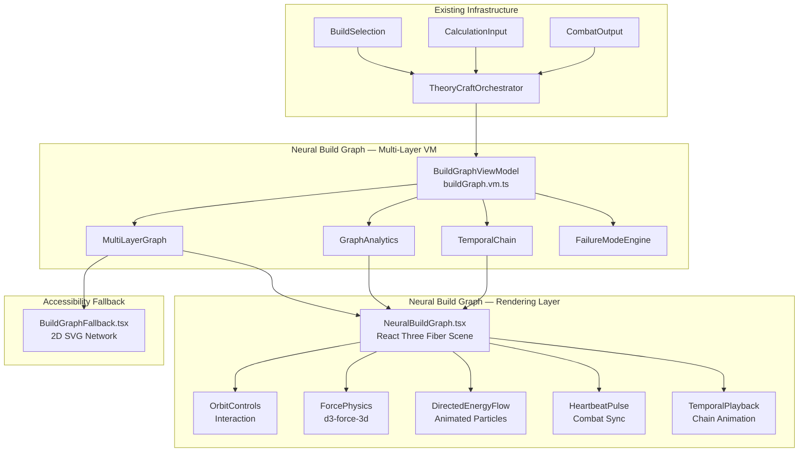
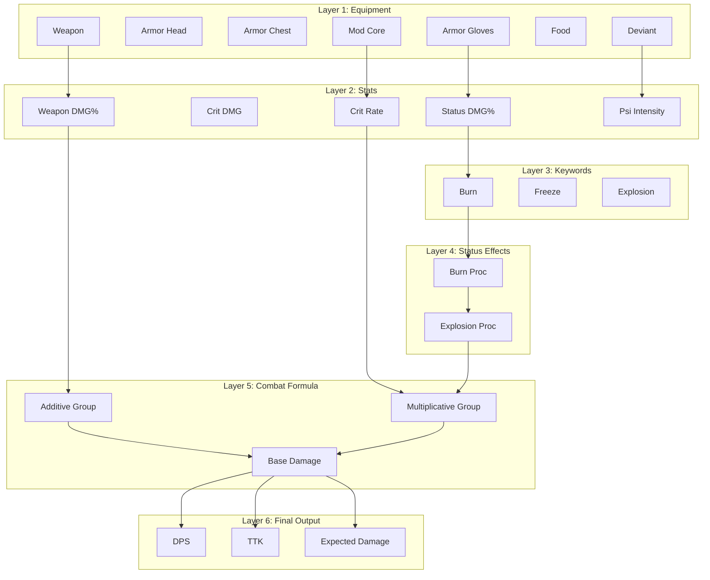
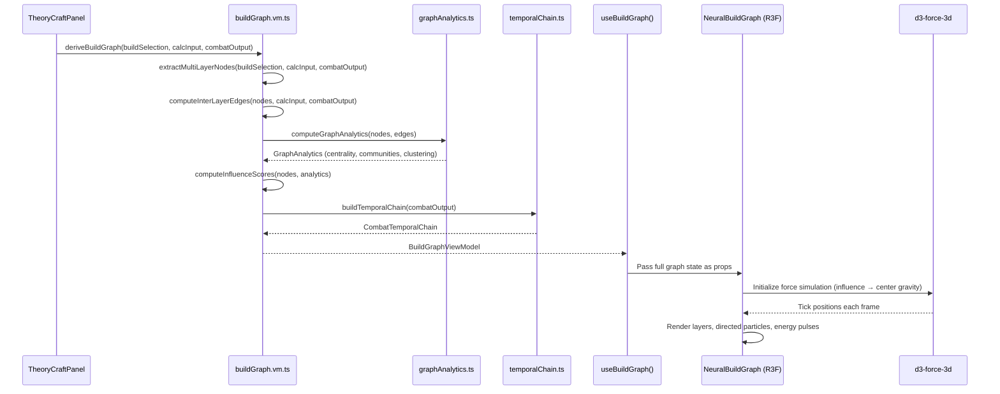
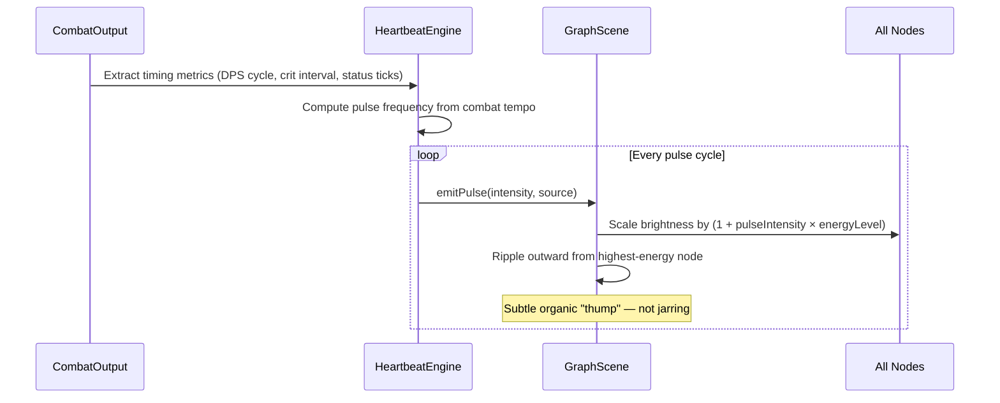
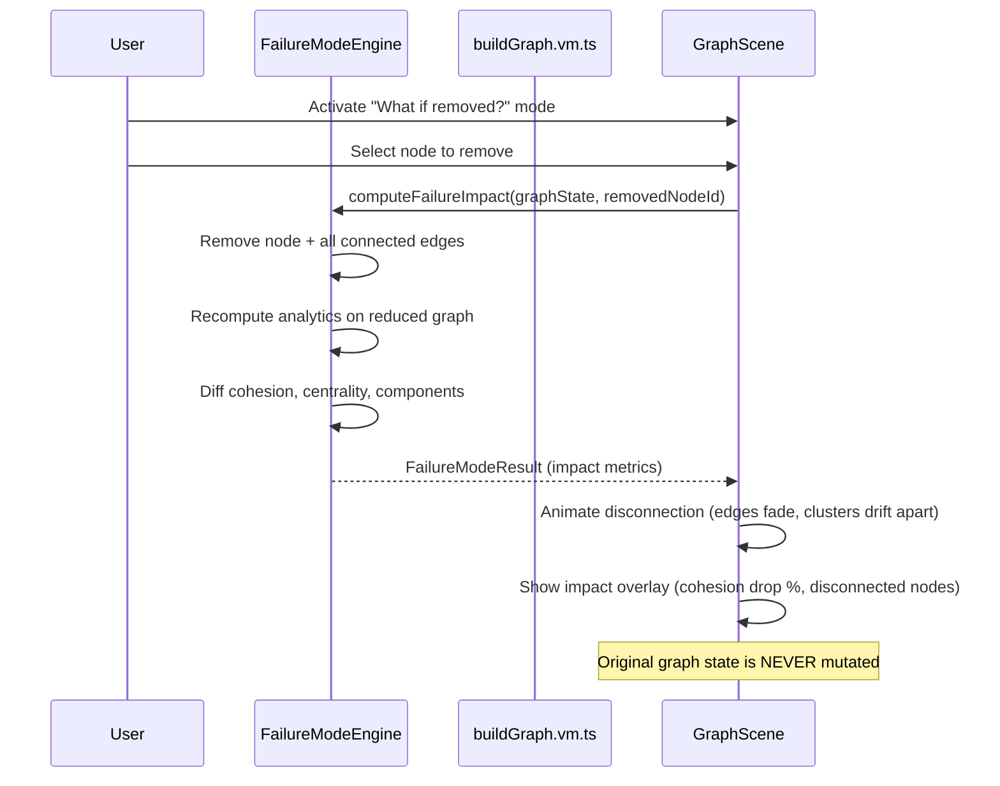
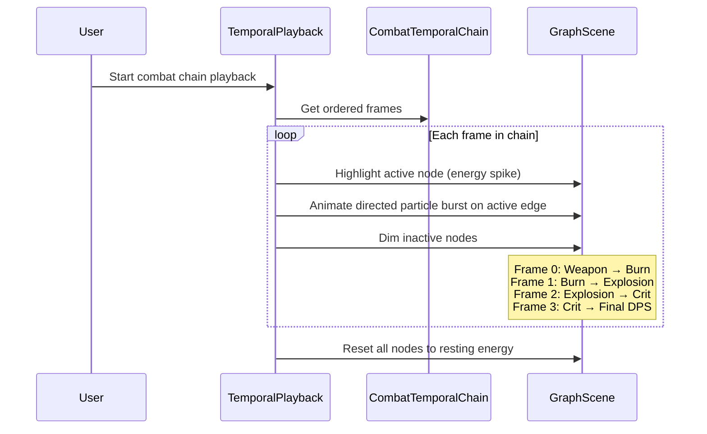

# Design Document: Neural Network Build Graph

## Overview

The Neural Network Build Graph is a **living, multi-layer force-directed 3D visualization** that renders a player's equipment loadout as an organic neural network. Unlike a static diagram, this graph breathes — every node pulses with an energy level proportional to its combat contribution, directed particles flow along edges showing damage/modifier causality, and the entire graph "heartbeats" in sync with combat simulation timing (DPS spikes, crit procs, status ticks).

The graph is organized into **six semantic layers** that map the entire combat pipeline:

```
Layer 1: Equipment      (weapon, armor, mods, food, deviant, cradle)
Layer 2: Stats          (crit rate, weapon DMG%, status DMG%, etc.)
Layer 3: Keywords       (burn, freeze, corrosion, explosion, etc.)
Layer 4: Status Effects (active status procs, DoTs, debuffs)
Layer 5: Combat Formula (additive group, multiplicative group, base damage)
Layer 6: Final Output   (DPS, TTK, Expected Damage)
```

Players can literally trace: `Gloves → Status Damage → Burn → Explosion → Crit → Final DPS`.

Beyond visualization, the system computes **full graph analytics** — degree centrality, betweenness centrality, eigenvector centrality, clustering coefficient, connected components, and community detection (Louvain algorithm). These power insights like: *"Removing your gloves decreases overall network cohesion by 27%"* via the **failure mode analysis** system.

A **temporal dimension** animates the combat execution chain frame-by-frame during simulation playback, turning the graph into an explainable-AI-style visualization of the entire combat pipeline.

This feature integrates into the existing TheoryCraft panel, deriving all data from `BuildSelection`, `CalculationInput`, and `CombatOutput`. A pure TypeScript view model layer (`buildGraph.vm.ts`) transforms theorycraft state into multi-layer graph structures, consumed by a React Three Fiber 3D scene. The design prioritizes: performance (frame budget isolation), accessibility (2D SVG fallback), correctness (no invented synergies — every edge traces to real engine data), and the organic "alive" feel that distinguishes this from any static graph tool.

## Architecture

### System Integration



### Multi-Layer Architecture



## Data Flow

### Primary Derivation Flow



### Heartbeat Pulse Flow



### Failure Mode Analysis Flow



### Temporal Combat Chain Playback



## Key Architectural Decisions

1. **Multi-layer semantic graph**: Six distinct layers (Equipment → Stats → Keywords → Status Effects → Combat Formula → Final Output) connected by inter-layer edges. Each layer represents a conceptual stage in the combat pipeline, making the graph an explainable-AI visualization.

2. **Living energy system**: Every node has an `energyLevel` (0.0–1.0) derived from its DPS contribution percentage. Energy drives brightness, pulse amplitude, and subtle breathing animation. The graph feels alive, not static.

3. **Directed energy flow**: Edges show DIRECTION via animated particles that flow from source to target. Flow direction indicates causality: where damage originates, where amplification occurs, where modifiers branch.

4. **Heartbeat synchronized to combat**: The graph pulses with combat simulation timing. DPS spikes, crit procs, and status ticks trigger subtle "thumps" that ripple through the network. Data source: `CombatOutput` timing metrics.

5. **Graph centrality determines importance**: Node importance uses `InfluenceScore = centrality + DPS_contribution + dependency_count + synergy_weight`. The most influential node naturally gravitates toward the center via force simulation parameterization.

6. **Full graph analytics engine**: Degree, betweenness, and eigenvector centrality; clustering coefficient; connected components; community detection (Louvain). These power the cohesion formula, failure mode analysis, and player-facing insights.

7. **Richer cohesion formula**: `Cohesion = NetworkDensity × AvgEdgeWeight × Connectivity × NodeUtilization × CriticalPathEfficiency` — replaces simple `avgWeight × connectivity`.

8. **Temporal combat chain**: During simulation playback, the execution chain animates frame-by-frame through the graph, showing actual execution order (not just static synergy).

9. **Failure mode analysis**: "What if removed?" mode computes the impact of removing any single node — shows cohesion drop, disconnected clusters, broken chains. Never mutates the original graph state.

10. **Confidence visualization on edges**: Edge visual style communicates data provenance — solid for verified, translucent for reverse-engineered, dashed for estimated, faint glow for unknown.

11. **View Model derivation is pure TypeScript**: Follows the identical pattern as `heroMetrics.vm.ts` — a pure function with no React/DOM dependencies. Testable in isolation.

12. **Force simulation runs on the render side**: d3-force-3d lives in the React Three Fiber component (via `useFrame`), not in the VM. The VM produces static topology + energy levels; the component animates positions and pulses.

13. **Performance isolation via `<Canvas>` boundary**: React Three Fiber renders into its own WebGL canvas, decoupled from the React tree. Frame budget: 8ms per frame for the graph scene.

14. **LOD (Level of Detail) strategy**: When node count exceeds thresholds or device performance drops, reduce particle counts, simplify geometry, lower simulation iterations, collapse inner layers.

15. **Accessibility first**: WebGL detection at mount. 2D SVG fallback for no-WebGL or `prefers-reduced-motion`. Full keyboard navigation and ARIA labels in fallback mode.

## Components and Interfaces

### File Structure

```
src/lib/ohmm/theorycraft/
├── buildGraph.vm.ts             # Pure: BuildSelection + CalcInput + CombatOutput → BuildGraphViewModel
├── buildGraph.types.ts          # All graph type definitions (multi-layer, analytics, temporal)
├── buildGraph.constants.ts      # Node categories, physics params, color palette, layer config
├── graphAnalytics.ts            # Centrality, clustering, community detection, connected components
├── temporalChain.ts             # Combat chain construction from CombatOutput timing
├── failureMode.ts               # "What if removed?" impact computation
├── graphCohesion.ts             # Richer cohesion formula computation
└── __tests__/
    ├── buildGraph.vm.test.ts    # Property-based + example tests
    ├── graphAnalytics.test.ts   # Analytics correctness tests
    ├── temporalChain.test.ts    # Temporal ordering tests
    └── failureMode.test.ts      # Failure mode non-mutation + accuracy tests

src/app/components/theorycraft/
├── NeuralBuildGraph/
│   ├── NeuralBuildGraph.tsx     # Main: detects WebGL, renders Canvas or Fallback
│   ├── GraphScene.tsx           # R3F scene: layers, nodes, edges, particles, controls
│   ├── GraphNode3D.tsx          # Node mesh (sphere + glow + energy pulse + label)
│   ├── GraphEdge3D.tsx          # Directed edge with flow particles + confidence styling
│   ├── DirectedParticles.tsx    # Instanced particle system for directional edge flow
│   ├── HeartbeatEngine.tsx      # Combat-synced pulse system
│   ├── TemporalPlayback.tsx     # Combat chain animation controller
│   ├── FailureModeOverlay.tsx   # "What if removed?" visualization overlay
│   ├── LayerRenderer.tsx        # Renders nodes grouped by semantic layer
│   ├── ForceSimulation.ts       # d3-force-3d wrapper with influence-weighted gravity
│   ├── BuildGraphFallback.tsx   # 2D SVG accessibility fallback
│   ├── CohesionIndicator.tsx    # Build cohesion score badge (richer formula)
│   ├── AnalyticsPanel.tsx       # Graph analytics sidebar (centrality, communities)
│   ├── useForceGraph.ts         # Hook: simulation lifecycle + node dragging
│   └── useHeartbeat.ts          # Hook: combat timing → pulse frequency
└── TheoryCraftPanel.tsx         # (modified) — adds NeuralBuildGraph section
```

### Core Type Definitions

```typescript
// src/lib/ohmm/theorycraft/buildGraph.types.ts

// ─── Layer System ─────────────────────────────────────────────────────────────

export type GraphLayer =
  | "equipment"       // Layer 1: Physical equipment pieces
  | "stats"           // Layer 2: Stat contributions (the 42 StatKeys)
  | "keywords"        // Layer 3: Damage/effect keywords (burn, freeze, etc.)
  | "status-effects"  // Layer 4: Active status procs, DoTs, debuffs
  | "combat-formula"  // Layer 5: Formula groups (additive, multiplicative, base)
  | "final-output";   // Layer 6: Terminal nodes (DPS, TTK, Expected Damage)

export const LAYER_ORDER: GraphLayer[] = [
  "equipment",
  "stats",
  "keywords",
  "status-effects",
  "combat-formula",
  "final-output",
];

// ─── Node Types ───────────────────────────────────────────────────────────────

export type EquipmentCategory =
  | "weapon"
  | "armor"
  | "mod-core"
  | "mod-suffix"
  | "food"
  | "deviant"
  | "cradle";

export type StatCategory = "offensive" | "defensive" | "utility" | "status";

export type KeywordCategory = "elemental" | "physical" | "psi" | "compound";

export type FormulaNodeType = "additive-group" | "multiplicative-group" | "base-damage";

export type OutputNodeType = "dps" | "ttk" | "expected-damage";

export interface GraphNode {
  /** Unique identifier */
  id: string;
  /** Human-readable label */
  label: string;
  /** Which semantic layer this node belongs to */
  layer: GraphLayer;
  /** Layer-specific category for visual styling */
  category: EquipmentCategory | StatCategory | KeywordCategory | FormulaNodeType | OutputNodeType;
  /** Whether this node is active/equipped (Layer 1) or derived (Layers 2-6) */
  isActive: boolean;
  /** Energy level 0.0–1.0 — drives brightness, pulse amplitude, breathing */
  energyLevel: number;
  /** Influence score (centrality + DPS contribution + dependency + synergy weight) */
  influenceScore: number;
  /** Normalized visual size 0.0–1.0 (driven by influenceScore, not raw magnitude) */
  normalizedSize: number;
  /** Node metadata for tooltips */
  metadata: NodeMetadata;
}

export interface NodeMetadata {
  /** Display name of the item/stat/keyword */
  displayName: string;
  /** Primary value (damage number, stat percentage, etc.) */
  primaryValue?: number;
  /** Formatted primary value for display */
  formattedValue?: string;
  /** Data confidence level */
  confidence: ConfidenceLevel;
  /** DPS contribution percentage (0-100) for this node */
  dpsContribution?: number;
  /** Layer-specific additional data */
  layerData?: Record<string, unknown>;
}

// ─── Edge Types ───────────────────────────────────────────────────────────────

export type EdgeCategory =
  | "damage"         // Direct damage contribution
  | "defense"        // Defensive stat contribution
  | "resource"       // Resource generation/consumption
  | "cooldown"       // Cooldown interaction
  | "status"         // Status effect application/propagation
  | "scaling"        // Multiplicative scaling relationship
  | "conversion"     // Type conversion (e.g., status → explosion)
  | "trigger"        // Trigger condition (e.g., crit triggers effect)
  | "proc"           // Proc chance relationship
  | "conditional"    // Conditional activation
  | "enemy"          // Enemy-dependent interaction
  | "environmental"  // Environmental modifier
  | "set-bonus"      // Armor set bonus activation
  | "stat-stacking"  // Multiple sources stacking same stat
  | "modifier-amplify" // Mod boosting a weapon/armor stat
  | "combo-synergy"; // Status × modifier multiplication

export interface GraphEdge {
  /** Unique edge ID */
  id: string;
  /** Source node ID (where energy/damage ORIGINATES) */
  source: string;
  /** Target node ID (where energy/damage FLOWS TO) */
  target: string;
  /** Edge classification */
  category: EdgeCategory;
  /** Whether this edge crosses layers (inter-layer) or stays within a layer (intra-layer) */
  isInterLayer: boolean;
  /** Source layer */
  sourceLayer: GraphLayer;
  /** Target layer */
  targetLayer: GraphLayer;
  /** Strength 0.0–1.0 (visual thickness + attraction force) */
  weight: number;
  /** Direction of energy flow (always source → target) */
  directed: true;
  /** The shared stat, keyword, or relationship causing the edge */
  relation: string;
  /** Human-readable description */
  description: string;
  /** Data confidence — drives edge visual style */
  confidence: ConfidenceLevel;
  /** Combined contribution value */
  combinedValue: number;
}

// ─── Graph Analytics ──────────────────────────────────────────────────────────

export interface NodeCentrality {
  nodeId: string;
  /** Degree centrality: connections / (totalNodes - 1) */
  degree: number;
  /** Betweenness centrality: fraction of shortest paths passing through */
  betweenness: number;
  /** Eigenvector centrality: importance based on neighbor importance */
  eigenvector: number;
  /** Clustering coefficient: how tightly connected the neighborhood is */
  clusteringCoefficient: number;
}

export interface Community {
  /** Community identifier */
  id: string;
  /** Human-readable community label (auto-generated from dominant category) */
  label: string;
  /** Node IDs in this community */
  members: string[];
  /** Dominant layer in this community */
  dominantLayer: GraphLayer;
  /** Internal edge density */
  internalDensity: number;
}

export interface ConnectedComponent {
  /** Component identifier */
  id: string;
  /** Node IDs in this component */
  members: string[];
  /** Whether this is the main (largest) component */
  isMain: boolean;
  /** Component size */
  size: number;
}

export interface GraphAnalytics {
  /** Per-node centrality metrics */
  centralities: NodeCentrality[];
  /** Detected communities (Louvain algorithm) */
  communities: Community[];
  /** Connected components */
  connectedComponents: ConnectedComponent[];
  /** Global network density: actualEdges / maxPossibleEdges */
  networkDensity: number;
  /** Average clustering coefficient across all nodes */
  averageClusteringCoefficient: number;
  /** Graph diameter: longest shortest path */
  diameter: number;
  /** Whether the graph is fully connected (single component) */
  isFullyConnected: boolean;
}

// ─── Cohesion (Richer Formula) ────────────────────────────────────────────────

export interface CohesionMetrics {
  /** Overall cohesion score 0.0–1.0 */
  score: number;
  /** Human-readable label */
  label: "Scattered" | "Loose" | "Moderate" | "Tight" | "Unified";
  /** Component breakdown */
  components: {
    networkDensity: number;
    averageEdgeWeight: number;
    connectivity: number;
    nodeUtilization: number;
    criticalPathEfficiency: number;
  };
  /** Insight string for the player */
  insight: string;
}

// ─── Energy & Heartbeat ───────────────────────────────────────────────────────

export interface EnergyState {
  /** Base energy level per node (from DPS contribution) */
  baseEnergy: Map<string, number>;
  /** Current pulse phase (0.0–1.0, cycles with heartbeat) */
  pulsePhase: number;
  /** Pulse frequency in Hz (derived from combat tempo) */
  pulseFrequency: number;
  /** Pulse intensity (0.0–1.0, scaled by current combat activity) */
  pulseIntensity: number;
}

export interface HeartbeatConfig {
  /** Base pulse frequency derived from DPS cycle time */
  baseFrequency: number;
  /** Amplitude of the pulse (how much brightness changes) */
  amplitude: number;
  /** Decay rate (how quickly pulse fades) */
  decay: number;
  /** Whether heartbeat is active */
  isActive: boolean;
}

// ─── Temporal Combat Chain ────────────────────────────────────────────────────

export interface TemporalFrame {
  /** Frame index in the chain */
  index: number;
  /** Timestamp in the combat cycle (ms) */
  timestamp: number;
  /** Active node ID (currently "firing") */
  activeNodeId: string;
  /** Active edge ID (energy flowing along this edge) */
  activeEdgeId: string | null;
  /** Event description */
  event: string;
  /** Damage/value at this frame */
  value?: number;
}

export interface CombatTemporalChain {
  /** Ordered frames representing the combat execution chain */
  frames: TemporalFrame[];
  /** Total cycle duration in ms */
  cycleDuration: number;
  /** Whether the chain loops */
  isLooping: boolean;
  /** Chain source description */
  sourceDescription: string;
}

// ─── Failure Mode Analysis ────────────────────────────────────────────────────

export interface FailureModeResult {
  /** Node that was hypothetically removed */
  removedNodeId: string;
  /** Cohesion score BEFORE removal */
  originalCohesion: number;
  /** Cohesion score AFTER removal */
  reducedCohesion: number;
  /** Percentage cohesion drop */
  cohesionDropPercent: number;
  /** Nodes that became disconnected */
  disconnectedNodes: string[];
  /** Edges that were severed */
  severedEdges: string[];
  /** Communities that were split */
  splitCommunities: string[];
  /** Number of new connected components created */
  newComponentsCreated: number;
  /** Human-readable impact summary */
  impactSummary: string;
  /** Severity: how critical is this node? */
  severity: "negligible" | "minor" | "moderate" | "major" | "critical";
}

// ─── Confidence Visualization ─────────────────────────────────────────────────

export type ConfidenceLevel = "project_verified" | "observed" | "estimated" | "placeholder";

export interface ConfidenceVisual {
  /** Line style */
  lineStyle: "solid" | "dashed" | "dotted";
  /** Opacity multiplier */
  opacity: number;
  /** Whether to show glow */
  glowEnabled: boolean;
  /** Glow intensity */
  glowIntensity: number;
}

export const CONFIDENCE_VISUAL_MAP: Record<ConfidenceLevel, ConfidenceVisual> = {
  project_verified: { lineStyle: "solid", opacity: 1.0, glowEnabled: true, glowIntensity: 0.8 },
  observed:         { lineStyle: "solid", opacity: 0.85, glowEnabled: true, glowIntensity: 0.5 },
  estimated:        { lineStyle: "dashed", opacity: 0.6, glowEnabled: false, glowIntensity: 0 },
  placeholder:      { lineStyle: "dotted", opacity: 0.35, glowEnabled: true, glowIntensity: 0.2 },
};

// ─── Graph Metrics (Expanded) ─────────────────────────────────────────────────

export interface GraphMetrics {
  /** Richer cohesion metrics */
  cohesion: CohesionMetrics;
  /** Full graph analytics */
  analytics: GraphAnalytics;
  /** Total active synergies (edges) */
  totalEdges: number;
  /** Strongest synergy description */
  strongestSynergy: string | null;
  /** Number of isolated nodes (no edges) */
  isolatedNodeCount: number;
  /** Number of active nodes */
  activeNodeCount: number;
  /** Total nodes across all layers */
  totalNodeCount: number;
  /** Per-layer node counts */
  layerNodeCounts: Record<GraphLayer, number>;
  /** Per-layer edge counts */
  layerEdgeCounts: Record<GraphLayer, number>;
  /** Inter-layer edge count */
  interLayerEdgeCount: number;
}

// ─── Top-Level View Model ─────────────────────────────────────────────────────

export interface BuildGraphViewModel {
  /** All nodes across all 6 layers */
  nodes: GraphNode[];
  /** All edges (intra-layer + inter-layer) */
  edges: GraphEdge[];
  /** Expanded graph metrics */
  metrics: GraphMetrics;
  /** Energy state for living animation */
  energyState: EnergyState;
  /** Heartbeat configuration */
  heartbeat: HeartbeatConfig;
  /** Temporal combat chain (for playback) */
  temporalChain: CombatTemporalChain | null;
  /** Whether the graph has enough data to render */
  isRenderable: boolean;
  /** Message when not renderable */
  emptyStateMessage: string | null;
  /** Active layer filter (null = show all) */
  visibleLayers: GraphLayer[] | null;
}
```

### Graph Constants

```typescript
// src/lib/ohmm/theorycraft/buildGraph.constants.ts

/** Physics simulation parameters for d3-force-3d */
export const FORCE_CONFIG = {
  /** Repulsion strength between all nodes */
  chargeStrength: -150,
  /** Attraction multiplier (edge.weight × this = link force) */
  linkStrengthMultiplier: 0.8,
  /** Natural link distance (intra-layer) */
  intraLayerLinkDistance: 40,
  /** Natural link distance (inter-layer — longer to separate layers visually) */
  interLayerLinkDistance: 80,
  /** Center gravity — pulls all nodes toward origin */
  centerStrength: 0.05,
  /** Influence-weighted center force multiplier (higher influence → stronger pull to center) */
  influenceCenterMultiplier: 0.15,
  /** Velocity decay per tick */
  velocityDecay: 0.4,
  /** Alpha target for settled state */
  alphaTarget: 0.0,
  /** Alpha min before simulation sleeps */
  alphaMin: 0.001,
  /** Simulation ticks per frame */
  ticksPerFrame: 3,
  /** Layer separation force (pushes nodes to their layer's Y-band) */
  layerSeparationStrength: 0.1,
} as const;

/** Layer Y-positions in 3D space (stacked vertically) */
export const LAYER_Y_POSITIONS: Record<GraphLayer, number> = {
  "equipment": 30,
  "stats": 15,
  "keywords": 0,
  "status-effects": -15,
  "combat-formula": -30,
  "final-output": -45,
};

/** Performance LOD thresholds */
export const LOD_CONFIG = {
  /** Full quality: all features enabled */
  fullQualityMaxNodes: 30,
  /** Reduced quality threshold */
  reducedQualityMaxNodes: 60,
  /** Minimal quality: collapse inner layers */
  minimalQualityMaxNodes: 100,
  /** Max particles per edge at full quality */
  maxParticlesPerEdge: 8,
  /** Reduced mode particles */
  reducedParticlesPerEdge: 3,
  /** Disable particles above this total node count */
  particleDisableThreshold: 60,
  /** Low-perf ticks per frame */
  lowPerfTicksPerFrame: 1,
  /** Collapse inner layers (2-5) into single representative nodes above threshold */
  layerCollapseThreshold: 80,
} as const;

/** Energy & Heartbeat defaults */
export const ENERGY_CONFIG = {
  /** Minimum energy level (ensures nodes are always slightly visible) */
  minEnergy: 0.05,
  /** Maximum energy level */
  maxEnergy: 1.0,
  /** Breathing animation speed (cycles per second) */
  breathingFrequency: 0.3,
  /** Breathing amplitude (how much size oscillates) */
  breathingAmplitude: 0.05,
  /** Pulse decay time (ms) */
  pulseDecayMs: 800,
  /** Default heartbeat frequency (Hz) — overridden by combat tempo */
  defaultHeartbeatHz: 1.2,
  /** Heartbeat intensity range */
  heartbeatMinIntensity: 0.02,
  heartbeatMaxIntensity: 0.15,
} as const;

/** Node layer visual config */
export const LAYER_VISUAL_CONFIG: Record<GraphLayer, {
  color: string;
  emissiveIntensity: number;
  baseRadius: number;
  label: string;
}> = {
  "equipment":      { color: "#ff6b35", emissiveIntensity: 0.6, baseRadius: 0.8, label: "Equipment" },
  "stats":          { color: "#4ecdc4", emissiveIntensity: 0.5, baseRadius: 0.5, label: "Stats" },
  "keywords":       { color: "#a855f7", emissiveIntensity: 0.5, baseRadius: 0.5, label: "Keywords" },
  "status-effects": { color: "#ef4444", emissiveIntensity: 0.5, baseRadius: 0.55, label: "Status Effects" },
  "combat-formula": { color: "#06b6d4", emissiveIntensity: 0.4, baseRadius: 0.45, label: "Formula" },
  "final-output":   { color: "#fbbf24", emissiveIntensity: 0.7, baseRadius: 0.9, label: "Output" },
};

/** Edge category visual config (expanded from 4 to 16 types) */
export const EDGE_VISUAL_CONFIG: Record<EdgeCategory, {
  color: string;
  particleColor: string;
  particleSpeed: number;
  dashPattern: [number, number] | null;
}> = {
  "damage":           { color: "#ff6b35", particleColor: "#ffaa80", particleSpeed: 1.2, dashPattern: null },
  "defense":          { color: "#4ecdc4", particleColor: "#7eddd6", particleSpeed: 0.8, dashPattern: null },
  "resource":         { color: "#22c55e", particleColor: "#6ee7a0", particleSpeed: 0.6, dashPattern: [0.1, 0.05] },
  "cooldown":         { color: "#64748b", particleColor: "#94a3b8", particleSpeed: 0.5, dashPattern: [0.08, 0.08] },
  "status":           { color: "#ef4444", particleColor: "#fca5a5", particleSpeed: 1.0, dashPattern: null },
  "scaling":          { color: "#eab308", particleColor: "#fde047", particleSpeed: 1.5, dashPattern: null },
  "conversion":       { color: "#a855f7", particleColor: "#d8b4fe", particleSpeed: 1.3, dashPattern: null },
  "trigger":          { color: "#f97316", particleColor: "#fdba74", particleSpeed: 2.0, dashPattern: null },
  "proc":             { color: "#ec4899", particleColor: "#f9a8d4", particleSpeed: 1.8, dashPattern: [0.12, 0.06] },
  "conditional":      { color: "#8b5cf6", particleColor: "#c4b5fd", particleSpeed: 0.9, dashPattern: [0.15, 0.08] },
  "enemy":            { color: "#dc2626", particleColor: "#fca5a5", particleSpeed: 0.7, dashPattern: [0.1, 0.1] },
  "environmental":    { color: "#059669", particleColor: "#6ee7b7", particleSpeed: 0.6, dashPattern: [0.12, 0.06] },
  "set-bonus":        { color: "#34d399", particleColor: "#6ee7b7", particleSpeed: 0.8, dashPattern: null },
  "stat-stacking":    { color: "#60a5fa", particleColor: "#93c5fd", particleSpeed: 0.9, dashPattern: null },
  "modifier-amplify": { color: "#c084fc", particleColor: "#e9d5ff", particleSpeed: 1.1, dashPattern: [0.1, 0.05] },
  "combo-synergy":    { color: "#fbbf24", particleColor: "#fde68a", particleSpeed: 1.4, dashPattern: [0.15, 0.08] },
};

/** Cohesion score thresholds (unchanged boundaries, richer formula) */
export const COHESION_THRESHOLDS = {
  scattered: 0.15,
  loose: 0.35,
  moderate: 0.55,
  tight: 0.75,
} as const;

/** Influence score weights */
export const INFLUENCE_WEIGHTS = {
  centrality: 0.3,
  dpsContribution: 0.35,
  dependencyCount: 0.2,
  synergyWeight: 0.15,
} as const;
```

### Component Interface Contracts

#### Build Graph View Model (Entry Point)

```typescript
// src/lib/ohmm/theorycraft/buildGraph.vm.ts

import type { BuildSelection } from "@/ohai/src/ui/types";
import type { CalculationInput } from "@/ohai/src/ui/formulaBridge";
import type { CombatOutput } from "@/ohai/src/ui/combatOutput";
import type { BuildGraphViewModel } from "./buildGraph.types";

/**
 * Derives the complete multi-layer graph from current build state.
 * Pure function — no side effects, no DOM access, no React dependencies.
 *
 * Extracts 6 layers of nodes, computes inter-layer edges, runs graph analytics,
 * builds temporal chain, and computes energy levels.
 */
export function deriveBuildGraph(
  buildSelection: BuildSelection,
  calcInput: CalculationInput,
  combatOutput: CombatOutput,
): BuildGraphViewModel;
```

#### Graph Analytics Module

```typescript
// src/lib/ohmm/theorycraft/graphAnalytics.ts

import type { GraphNode, GraphEdge, GraphAnalytics, NodeCentrality } from "./buildGraph.types";

/**
 * Computes full graph analytics: centrality measures, community detection,
 * connected components, and global metrics.
 * Pure function — O(V² + VE) for centrality, O(E) for community detection.
 */
export function computeGraphAnalytics(
  nodes: GraphNode[],
  edges: GraphEdge[],
): GraphAnalytics;

/** Degree centrality: connections / (totalNodes - 1) */
export function computeDegreeCentrality(nodeId: string, edges: GraphEdge[], totalNodes: number): number;

/** Betweenness centrality via BFS-based Brandes algorithm */
export function computeBetweennessCentrality(nodes: GraphNode[], edges: GraphEdge[]): Map<string, number>;

/** Eigenvector centrality via power iteration */
export function computeEigenvectorCentrality(nodes: GraphNode[], edges: GraphEdge[], iterations?: number): Map<string, number>;

/** Clustering coefficient for a single node */
export function computeClusteringCoefficient(nodeId: string, edges: GraphEdge[]): number;

/** Connected components via BFS */
export function findConnectedComponents(nodes: GraphNode[], edges: GraphEdge[]): ConnectedComponent[];

/** Community detection via Louvain algorithm */
export function detectCommunities(nodes: GraphNode[], edges: GraphEdge[]): Community[];
```

#### Temporal Chain Module

```typescript
// src/lib/ohmm/theorycraft/temporalChain.ts

import type { CombatOutput } from "@/ohai/src/ui/combatOutput";
import type { CombatTemporalChain, TemporalFrame } from "./buildGraph.types";

/**
 * Constructs a temporal combat chain from CombatOutput timing data.
 * Maps the combat execution order into a sequence of frames that can
 * be played back as an animation through the graph.
 *
 * Returns null if CombatOutput lacks sufficient timing data.
 */
export function buildTemporalChain(
  combatOutput: CombatOutput,
  nodes: GraphNode[],
  edges: GraphEdge[],
): CombatTemporalChain | null;
```

#### Failure Mode Module

```typescript
// src/lib/ohmm/theorycraft/failureMode.ts

import type { GraphNode, GraphEdge, GraphAnalytics, FailureModeResult } from "./buildGraph.types";

/**
 * Computes the impact of hypothetically removing a node from the graph.
 * NEVER mutates the input graph state — operates on copies.
 *
 * Returns impact metrics: cohesion drop, disconnected nodes, severed edges,
 * split communities, and a severity rating.
 */
export function computeFailureImpact(
  nodes: GraphNode[],
  edges: GraphEdge[],
  analytics: GraphAnalytics,
  removedNodeId: string,
): FailureModeResult;
```

#### Cohesion Module

```typescript
// src/lib/ohmm/theorycraft/graphCohesion.ts

import type { GraphNode, GraphEdge, GraphAnalytics, CohesionMetrics } from "./buildGraph.types";

/**
 * Computes the richer cohesion formula:
 * Cohesion = NetworkDensity × AvgEdgeWeight × Connectivity × NodeUtilization × CriticalPathEfficiency
 *
 * Each component is in [0, 1], and the product is clamped to [0, 1].
 */
export function computeCohesion(
  nodes: GraphNode[],
  edges: GraphEdge[],
  analytics: GraphAnalytics,
): CohesionMetrics;
```

#### NeuralBuildGraph Component

```typescript
// src/app/components/theorycraft/NeuralBuildGraph/NeuralBuildGraph.tsx

import type { BuildGraphViewModel } from "@/lib/ohmm/theorycraft/buildGraph.types";

export interface NeuralBuildGraphProps {
  viewModel: BuildGraphViewModel;
  /** Container height in pixels (default: 500) */
  height?: number;
  /** Show cohesion indicator badge */
  showCohesion?: boolean;
  /** Show analytics panel sidebar */
  showAnalytics?: boolean;
  /** Enable failure mode interaction */
  enableFailureMode?: boolean;
  /** Enable temporal playback controls */
  enableTemporalPlayback?: boolean;
  /** Visible layers (null = all) */
  visibleLayers?: GraphLayer[] | null;
  /** Callback when failure mode analysis completes */
  onFailureAnalysis?: (result: FailureModeResult) => void;
}

/**
 * Main entry point — detects WebGL + prefers-reduced-motion,
 * renders either 3D GraphScene or 2D BuildGraphFallback.
 */
export function NeuralBuildGraph(props: NeuralBuildGraphProps): JSX.Element;
```

#### Force Simulation Hook

```typescript
// src/app/components/theorycraft/NeuralBuildGraph/useForceGraph.ts

import type { GraphNode, GraphEdge } from "@/lib/ohmm/theorycraft/buildGraph.types";

export interface SimulationNode extends GraphNode {
  x: number; y: number; z: number;
  vx: number; vy: number; vz: number;
  fx: number | null; fy: number | null; fz: number | null;
}

export interface UseForceGraphReturn {
  simulationNodes: SimulationNode[];
  simulationEdges: GraphEdge[];
  pinNode: (nodeId: string, x: number, y: number, z: number) => void;
  unpinNode: (nodeId: string) => void;
  reheat: () => void;
  isSettled: boolean;
}

/**
 * Manages d3-force-3d simulation lifecycle.
 * Key difference from v1: influence scores weight center gravity,
 * and layer separation force keeps layers visually distinct.
 */
export function useForceGraph(
  nodes: GraphNode[],
  edges: GraphEdge[],
): UseForceGraphReturn;
```

#### Heartbeat Hook

```typescript
// src/app/components/theorycraft/NeuralBuildGraph/useHeartbeat.ts

import type { CombatOutput } from "@/ohai/src/ui/combatOutput";
import type { HeartbeatConfig, EnergyState } from "@/lib/ohmm/theorycraft/buildGraph.types";

/**
 * Derives heartbeat timing from CombatOutput and provides
 * a pulse phase value that oscillates with combat tempo.
 * Used to drive the "breathing" animation on all nodes.
 */
export function useHeartbeat(
  combatOutput: CombatOutput,
  energyState: EnergyState,
): {
  config: HeartbeatConfig;
  currentPulsePhase: number;
  currentIntensity: number;
};
```

## Data Models

### Multi-Layer Node Extraction

Each layer extracts nodes from different data sources:

| Layer | Source | Nodes Generated | Example |
|-------|--------|----------------|---------|
| Equipment | `BuildSelection` | 1 per equipped slot (max 24) | `"equip-weapon"`, `"equip-armor-head"` |
| Stats | `CalculationInput.modifierSources` | 1 per unique statKey with contributions | `"stat-critRate"`, `"stat-weaponDMG"` |
| Keywords | `CalculationInput.modeledEffects` | 1 per active damage keyword | `"kw-burn"`, `"kw-freeze"`, `"kw-explosion"` |
| Status Effects | `CombatOutput.statusEffects` | 1 per active status proc | `"fx-burn-proc"`, `"fx-corrosion-proc"` |
| Combat Formula | `CombatOutput.formulaBreakdown` | 3 fixed nodes | `"formula-additive"`, `"formula-multiplicative"`, `"formula-base"` |
| Final Output | `CombatOutput.damageOutput` | 3 fixed nodes | `"output-dps"`, `"output-ttk"`, `"output-expected"` |

**Max theoretical nodes**: 24 (equipment) + ~20 (stats) + ~8 (keywords) + ~6 (status) + 3 (formula) + 3 (output) = **~64 nodes** for a fully loaded build.

### Inter-Layer Edge Derivation

Edges connect nodes across layers following the combat pipeline:

| Connection | Category | Direction | Detection Rule |
|-----------|----------|-----------|----------------|
| Equipment → Stats | `damage`/`defense` | Equipment feeds stat | ModifierSource.origin maps to equipment slot |
| Stats → Keywords | `scaling` | Stat scales keyword effectiveness | Stat is a keyword multiplier (e.g., statusDMG → burn) |
| Keywords → Status Effects | `trigger` | Keyword triggers status proc | Keyword matches status effect type |
| Status Effects → Combat Formula | `conversion` | Status feeds into formula group | Status damage feeds additive/multiplicative |
| Combat Formula → Final Output | `scaling` | Formula produces output | Additive+Multiplicative → Base → Output |
| Equipment → Equipment | `set-bonus`/`stat-stacking` | Intra-layer synergy | Same set / same stat contribution |

### Energy Level Computation

```typescript
/**
 * Energy level for each node is derived from its DPS contribution percentage.
 * Nodes that contribute more to final DPS glow brighter and pulse more intensely.
 *
 * For equipment layer: energy = (node's total stat contribution to DPS) / totalDPS
 * For stat layer: energy = (stat's multiplicative factor on DPS) / maxFactor
 * For keyword layer: energy = (keyword's proc DPS) / totalDPS
 * For status layer: energy = (status tick DPS) / totalDPS
 * For formula layer: energy = (group's multiplicative weight) / maxWeight
 * For output layer: always 1.0 (terminal nodes)
 *
 * All values clamped to [ENERGY_CONFIG.minEnergy, ENERGY_CONFIG.maxEnergy]
 */
```

### Influence Score Computation

```typescript
/**
 * InfluenceScore determines node importance for sizing and center gravity.
 * Replaces simple magnitude-based sizing from v1.
 *
 * InfluenceScore = (INFLUENCE_WEIGHTS.centrality × normalizedEigenvector)
 *               + (INFLUENCE_WEIGHTS.dpsContribution × normalizedDPSContrib)
 *               + (INFLUENCE_WEIGHTS.dependencyCount × normalizedDegree)
 *               + (INFLUENCE_WEIGHTS.synergyWeight × normalizedEdgeWeightSum)
 *
 * All components normalized to [0, 1] before weighting.
 * Final score in [0, 1].
 */
```

## Low-Level Design

### Algorithm 1: Multi-Layer Node Extraction

```typescript
function extractMultiLayerNodes(
  buildSelection: BuildSelection,
  calcInput: CalculationInput,
  combatOutput: CombatOutput,
): GraphNode[] {
  const nodes: GraphNode[] = [];

  // ─── Layer 1: Equipment ───────────────────────────────────────────
  // Extract one node per equipment slot (weapon, 6 armor, up to 14 mods, food, deviant, cradle)
  const equipmentNodes = extractEquipmentNodes(buildSelection);
  nodes.push(...equipmentNodes);

  // ─── Layer 2: Stats ───────────────────────────────────────────────
  // Group modifierSources by statKey → one node per unique stat with contributions
  const statContributions = new Map<string, { total: number; sources: string[] }>();
  for (const source of calcInput.modifierSources ?? []) {
    const entry = statContributions.get(source.statKey) ?? { total: 0, sources: [] };
    entry.total += Math.abs(source.value);
    entry.sources.push(resolveSourceToNodeId(source) ?? "unknown");
    statContributions.set(source.statKey, entry);
  }
  for (const [statKey, data] of statContributions) {
    nodes.push({
      id: `stat-${statKey}`,
      label: formatStatLabel(statKey),
      layer: "stats",
      category: classifyStatCategory(statKey),
      isActive: data.total > 0,
      energyLevel: 0, // computed later
      influenceScore: 0, // computed later
      normalizedSize: 0,
      metadata: {
        displayName: formatStatLabel(statKey),
        primaryValue: data.total,
        formattedValue: formatStatValue(statKey, data.total),
        confidence: "observed",
      },
    });
  }

  // ─── Layer 3: Keywords ──────────────────────────────────────────────
  // Extract active damage/effect keywords from modeledEffects
  const activeKeywords = extractActiveKeywords(calcInput, combatOutput);
  for (const kw of activeKeywords) {
    nodes.push({
      id: `kw-${kw.id}`,
      label: kw.label,
      layer: "keywords",
      category: kw.category,
      isActive: true,
      energyLevel: 0,
      influenceScore: 0,
      normalizedSize: 0,
      metadata: {
        displayName: kw.label,
        confidence: kw.confidence,
        dpsContribution: kw.dpsShare,
      },
    });
  }

  // ─── Layer 4: Status Effects ──────────────────────────────────────
  // Extract active status procs from CombatOutput
  const statusEffects = extractStatusEffects(combatOutput);
  for (const fx of statusEffects) {
    nodes.push({
      id: `fx-${fx.id}`,
      label: fx.label,
      layer: "status-effects",
      category: "elemental",
      isActive: fx.isActive,
      energyLevel: 0,
      influenceScore: 0,
      normalizedSize: 0,
      metadata: {
        displayName: fx.label,
        primaryValue: fx.tickDamage,
        formattedValue: `${fx.tickDamage}/tick`,
        confidence: fx.confidence,
        dpsContribution: fx.dpsShare,
      },
    });
  }

  // ─── Layer 5: Combat Formula ──────────────────────────────────────
  // Fixed 3 nodes representing the formula structure
  nodes.push(
    { id: "formula-additive", label: "Additive Group", layer: "combat-formula",
      category: "additive-group", isActive: true, energyLevel: 0, influenceScore: 0,
      normalizedSize: 0, metadata: { displayName: "Additive Multipliers", confidence: "project_verified" } },
    { id: "formula-multiplicative", label: "Multiplicative Group", layer: "combat-formula",
      category: "multiplicative-group", isActive: true, energyLevel: 0, influenceScore: 0,
      normalizedSize: 0, metadata: { displayName: "Multiplicative Multipliers", confidence: "project_verified" } },
    { id: "formula-base", label: "Base Damage", layer: "combat-formula",
      category: "base-damage", isActive: true, energyLevel: 0, influenceScore: 0,
      normalizedSize: 0, metadata: { displayName: "Computed Base Damage",
        primaryValue: combatOutput?.damageOutput?.expectedDamage ?? 0,
        confidence: "project_verified" } },
  );

  // ─── Layer 6: Final Output ────────────────────────────────────────
  nodes.push(
    { id: "output-dps", label: "DPS", layer: "final-output", category: "dps",
      isActive: true, energyLevel: 1.0, influenceScore: 0, normalizedSize: 0,
      metadata: { displayName: "Damage Per Second",
        primaryValue: combatOutput?.damageOutput?.DPS ?? 0,
        formattedValue: formatNumber(combatOutput?.damageOutput?.DPS ?? 0),
        confidence: "project_verified" } },
    { id: "output-ttk", label: "TTK", layer: "final-output", category: "ttk",
      isActive: true, energyLevel: 1.0, influenceScore: 0, normalizedSize: 0,
      metadata: { displayName: "Time to Kill", confidence: "project_verified" } },
    { id: "output-expected", label: "Expected DMG", layer: "final-output", category: "expected-damage",
      isActive: true, energyLevel: 1.0, influenceScore: 0, normalizedSize: 0,
      metadata: { displayName: "Expected Damage Per Hit",
        primaryValue: combatOutput?.damageOutput?.expectedDamage ?? 0,
        confidence: "project_verified" } },
  );

  return nodes;
}
```

### Algorithm 2: Inter-Layer Edge Derivation

```typescript
function computeInterLayerEdges(
  nodes: GraphNode[],
  calcInput: CalculationInput,
  combatOutput: CombatOutput,
): GraphEdge[] {
  const edges: GraphEdge[] = [];
  const nodeIds = new Set(nodes.map(n => n.id));

  // ─── Equipment → Stats (which equipment contributes which stats) ───
  for (const source of calcInput.modifierSources ?? []) {
    const equipNodeId = resolveSourceToNodeId(source);
    const statNodeId = `stat-${source.statKey}`;
    if (!equipNodeId || !nodeIds.has(equipNodeId) || !nodeIds.has(statNodeId)) continue;

    edges.push({
      id: `${equipNodeId}→${statNodeId}`,
      source: equipNodeId,
      target: statNodeId,
      category: classifyEdgeCategory(source.statKey),
      isInterLayer: true,
      sourceLayer: "equipment",
      targetLayer: "stats",
      weight: 0, // normalized later
      directed: true,
      relation: source.statKey,
      description: `${source.label ?? equipNodeId} → ${formatStatLabel(source.statKey)}`,
      confidence: source.confidence ?? "observed",
      combinedValue: Math.abs(source.value),
    });
  }

  // ─── Stats → Keywords (stat that scales a keyword) ─────────────────
  const statToKeywordMap = buildStatKeywordMapping(calcInput);
  for (const [statKey, keywords] of statToKeywordMap) {
    const statNodeId = `stat-${statKey}`;
    if (!nodeIds.has(statNodeId)) continue;
    for (const kwId of keywords) {
      const kwNodeId = `kw-${kwId}`;
      if (!nodeIds.has(kwNodeId)) continue;
      edges.push({
        id: `${statNodeId}→${kwNodeId}`,
        source: statNodeId,
        target: kwNodeId,
        category: "scaling",
        isInterLayer: true,
        sourceLayer: "stats",
        targetLayer: "keywords",
        weight: 0,
        directed: true,
        relation: `${statKey} scales ${kwId}`,
        description: `${formatStatLabel(statKey)} scales ${kwId}`,
        confidence: "observed",
        combinedValue: 0,
      });
    }
  }

  // ─── Keywords → Status Effects (keyword triggers status) ───────────
  const kwToStatusMap = buildKeywordStatusMapping(combatOutput);
  for (const [kwId, statusIds] of kwToStatusMap) {
    const kwNodeId = `kw-${kwId}`;
    if (!nodeIds.has(kwNodeId)) continue;
    for (const fxId of statusIds) {
      const fxNodeId = `fx-${fxId}`;
      if (!nodeIds.has(fxNodeId)) continue;
      edges.push({
        id: `${kwNodeId}→${fxNodeId}`,
        source: kwNodeId,
        target: fxNodeId,
        category: "trigger",
        isInterLayer: true,
        sourceLayer: "keywords",
        targetLayer: "status-effects",
        weight: 0,
        directed: true,
        relation: `${kwId} triggers ${fxId}`,
        description: `${kwId} → ${fxId} proc`,
        confidence: "observed",
        combinedValue: 0,
      });
    }
  }

  // ─── Status Effects → Combat Formula (status feeds formula) ─────────
  for (const node of nodes.filter(n => n.layer === "status-effects" && n.isActive)) {
    // Status effects feed into the multiplicative group
    edges.push({
      id: `${node.id}→formula-multiplicative`,
      source: node.id,
      target: "formula-multiplicative",
      category: "conversion",
      isInterLayer: true,
      sourceLayer: "status-effects",
      targetLayer: "combat-formula",
      weight: 0,
      directed: true,
      relation: `${node.label} → multiplicative`,
      description: `${node.label} feeds into multiplicative group`,
      confidence: "project_verified",
      combinedValue: node.metadata.primaryValue ?? 0,
    });
  }

  // ─── Stats → Combat Formula (direct stat contributions) ────────────
  // Additive stats (flat bonuses) → additive group
  // Multiplicative stats (percentage bonuses) → multiplicative group
  for (const node of nodes.filter(n => n.layer === "stats" && n.isActive)) {
    const targetFormula = isMultiplicativeStat(node.id.replace("stat-", ""))
      ? "formula-multiplicative"
      : "formula-additive";
    edges.push({
      id: `${node.id}→${targetFormula}`,
      source: node.id,
      target: targetFormula,
      category: "scaling",
      isInterLayer: true,
      sourceLayer: "stats",
      targetLayer: "combat-formula",
      weight: 0,
      directed: true,
      relation: `${node.label} → ${targetFormula.replace("formula-", "")}`,
      description: `${node.label} contributes to ${targetFormula.replace("formula-", "")} group`,
      confidence: "project_verified",
      combinedValue: node.metadata.primaryValue ?? 0,
    });
  }

  // ─── Combat Formula → Final Output ────────────────────────────────
  edges.push(
    { id: "formula-additive→formula-base", source: "formula-additive", target: "formula-base",
      category: "scaling", isInterLayer: false, sourceLayer: "combat-formula",
      targetLayer: "combat-formula", weight: 0.9, directed: true,
      relation: "additive → base", description: "Additive group feeds base damage",
      confidence: "project_verified", combinedValue: 0 },
    { id: "formula-multiplicative→formula-base", source: "formula-multiplicative",
      target: "formula-base", category: "scaling", isInterLayer: false,
      sourceLayer: "combat-formula", targetLayer: "combat-formula", weight: 0.9,
      directed: true, relation: "multiplicative → base",
      description: "Multiplicative group feeds base damage",
      confidence: "project_verified", combinedValue: 0 },
    { id: "formula-base→output-dps", source: "formula-base", target: "output-dps",
      category: "damage", isInterLayer: true, sourceLayer: "combat-formula",
      targetLayer: "final-output", weight: 1.0, directed: true,
      relation: "base → DPS", description: "Base damage produces DPS",
      confidence: "project_verified", combinedValue: combatOutput?.damageOutput?.DPS ?? 0 },
    { id: "formula-base→output-expected", source: "formula-base", target: "output-expected",
      category: "damage", isInterLayer: true, sourceLayer: "combat-formula",
      targetLayer: "final-output", weight: 0.9, directed: true,
      relation: "base → expected", description: "Base damage produces expected hit",
      confidence: "project_verified", combinedValue: combatOutput?.damageOutput?.expectedDamage ?? 0 },
    { id: "formula-base→output-ttk", source: "formula-base", target: "output-ttk",
      category: "damage", isInterLayer: true, sourceLayer: "combat-formula",
      targetLayer: "final-output", weight: 0.8, directed: true,
      relation: "base → TTK", description: "Base damage determines TTK",
      confidence: "project_verified", combinedValue: 0 },
  );

  // ─── Intra-Equipment edges (set bonuses, stat stacking) ────────────
  edges.push(...deriveEquipmentIntraEdges(nodes, calcInput, combatOutput));

  return edges;
}
```

### Algorithm 3: Graph Analytics Computation

```typescript
function computeGraphAnalytics(nodes: GraphNode[], edges: GraphEdge[]): GraphAnalytics {
  const n = nodes.length;
  if (n === 0) return EMPTY_ANALYTICS;

  // Build adjacency list for efficient traversal
  const adjacency = buildAdjacencyList(nodes, edges);

  // ─── Degree Centrality ────────────────────────────────────────────
  const degreeCentralities = new Map<string, number>();
  for (const node of nodes) {
    const degree = (adjacency.get(node.id) ?? []).length;
    degreeCentralities.set(node.id, n > 1 ? degree / (n - 1) : 0);
  }

  // ─── Betweenness Centrality (Brandes algorithm) ───────────────────
  // O(V × E) — for each node as source, BFS to find shortest paths,
  // then accumulate pair dependencies
  const betweenness = computeBrandesBetweenness(nodes, adjacency);

  // ─── Eigenvector Centrality (Power iteration) ─────────────────────
  // Initialize all scores to 1/sqrt(n), iterate until convergence
  const eigenvector = computePowerIteration(nodes, adjacency, 50); // max 50 iterations

  // ─── Clustering Coefficient ───────────────────────────────────────
  const clustering = new Map<string, number>();
  for (const node of nodes) {
    const neighbors = adjacency.get(node.id) ?? [];
    if (neighbors.length < 2) {
      clustering.set(node.id, 0);
      continue;
    }
    // Count edges between neighbors
    let triangles = 0;
    for (let i = 0; i < neighbors.length - 1; i++) {
      for (let j = i + 1; j < neighbors.length; j++) {
        if ((adjacency.get(neighbors[i]) ?? []).includes(neighbors[j])) {
          triangles++;
        }
      }
    }
    const maxTriangles = (neighbors.length * (neighbors.length - 1)) / 2;
    clustering.set(node.id, triangles / maxTriangles);
  }

  // ─── Connected Components (BFS) ──────────────────────────────────
  const components = findConnectedComponentsBFS(nodes, adjacency);

  // ─── Community Detection (Louvain) ────────────────────────────────
  const communities = louvainCommunityDetection(nodes, edges);

  // ─── Global metrics ───────────────────────────────────────────────
  const maxEdges = (n * (n - 1)) / 2;
  const networkDensity = maxEdges > 0 ? edges.length / maxEdges : 0;
  const avgClustering = [...clustering.values()].reduce((s, v) => s + v, 0) / n;
  const diameter = computeGraphDiameter(nodes, adjacency);

  // Assemble per-node centrality objects
  const centralities: NodeCentrality[] = nodes.map(node => ({
    nodeId: node.id,
    degree: degreeCentralities.get(node.id) ?? 0,
    betweenness: betweenness.get(node.id) ?? 0,
    eigenvector: eigenvector.get(node.id) ?? 0,
    clusteringCoefficient: clustering.get(node.id) ?? 0,
  }));

  return {
    centralities,
    communities,
    connectedComponents: components,
    networkDensity,
    averageClusteringCoefficient: avgClustering,
    diameter,
    isFullyConnected: components.length === 1,
  };
}
```

### Algorithm 4: Louvain Community Detection

```typescript
/**
 * Simplified Louvain algorithm for community detection.
 * Optimizes modularity Q = (1/2m) Σ [A_ij - (k_i × k_j / 2m)] × δ(c_i, c_j)
 *
 * Phase 1: Local modularity optimization — each node moves to neighbor's community
 *          if it increases modularity. Repeat until no improvement.
 * Phase 2: Community aggregation — build super-graph of communities, repeat Phase 1.
 *
 * For our graph sizes (~64 nodes), single-phase is sufficient.
 */
function louvainCommunityDetection(nodes: GraphNode[], edges: GraphEdge[]): Community[] {
  // Initialize: each node in its own community
  const communityOf = new Map<string, string>();
  for (const node of nodes) communityOf.set(node.id, node.id);

  const m = edges.reduce((sum, e) => sum + e.weight, 0); // total edge weight
  if (m === 0) {
    // No edges — each node is its own community
    return nodes.map(n => ({
      id: n.id, label: n.label, members: [n.id],
      dominantLayer: n.layer, internalDensity: 0,
    }));
  }

  // Compute node strengths (sum of edge weights for each node)
  const strength = new Map<string, number>();
  for (const node of nodes) strength.set(node.id, 0);
  for (const edge of edges) {
    strength.set(edge.source, (strength.get(edge.source) ?? 0) + edge.weight);
    strength.set(edge.target, (strength.get(edge.target) ?? 0) + edge.weight);
  }

  // Phase 1: Local optimization
  let improved = true;
  while (improved) {
    improved = false;
    for (const node of nodes) {
      const currentCommunity = communityOf.get(node.id)!;
      let bestCommunity = currentCommunity;
      let bestGain = 0;

      // Check modularity gain from moving to each neighbor's community
      const neighborCommunities = new Set<string>();
      for (const edge of edges) {
        if (edge.source === node.id) neighborCommunities.add(communityOf.get(edge.target)!);
        if (edge.target === node.id) neighborCommunities.add(communityOf.get(edge.source)!);
      }

      for (const targetCommunity of neighborCommunities) {
        if (targetCommunity === currentCommunity) continue;
        const gain = computeModularityGain(node.id, targetCommunity, communityOf, edges, strength, m);
        if (gain > bestGain) {
          bestGain = gain;
          bestCommunity = targetCommunity;
        }
      }

      if (bestCommunity !== currentCommunity) {
        communityOf.set(node.id, bestCommunity);
        improved = true;
      }
    }
  }

  // Group nodes by community, generate labels
  return groupIntoCommunities(nodes, communityOf);
}
```

### Algorithm 5: Richer Cohesion Formula

```typescript
/**
 * Cohesion = NetworkDensity × AvgEdgeWeight × Connectivity × NodeUtilization × CriticalPathEfficiency
 *
 * NetworkDensity: actualEdges / maxPossibleEdges
 * AvgEdgeWeight: mean(edge.weight) across all edges
 * Connectivity: fraction of active nodes in the main connected component
 * NodeUtilization: activeNodes / totalNodes (how much of the build is utilized)
 * CriticalPathEfficiency: (longest weighted path from equipment to output) / theoreticalMax
 */
function computeCohesion(
  nodes: GraphNode[],
  edges: GraphEdge[],
  analytics: GraphAnalytics,
): CohesionMetrics {
  const activeNodes = nodes.filter(n => n.isActive);
  if (activeNodes.length < 2 || edges.length === 0) {
    return { score: 0, label: "Scattered", components: { networkDensity: 0, averageEdgeWeight: 0,
      connectivity: 0, nodeUtilization: 0, criticalPathEfficiency: 0 }, insight: "Equip more items to see synergies." };
  }

  // Component 1: Network Density
  const networkDensity = analytics.networkDensity;

  // Component 2: Average Edge Weight
  const avgEdgeWeight = edges.reduce((s, e) => s + e.weight, 0) / edges.length;

  // Component 3: Connectivity (main component coverage)
  const mainComponent = analytics.connectedComponents.find(c => c.isMain);
  const connectivity = mainComponent
    ? mainComponent.size / activeNodes.length
    : 0;

  // Component 4: Node Utilization (how much of potential is used)
  const equipmentNodes = nodes.filter(n => n.layer === "equipment");
  const activeEquipment = equipmentNodes.filter(n => n.isActive);
  const nodeUtilization = equipmentNodes.length > 0
    ? activeEquipment.length / equipmentNodes.length
    : 0;

  // Component 5: Critical Path Efficiency
  // Longest weighted path from any equipment node to any output node / theoretical max
  const criticalPathEfficiency = computeCriticalPathEfficiency(nodes, edges);

  // Product formula, clamped to [0, 1]
  // Use geometric-mean-like weighting to prevent single zero from killing score
  const rawScore = networkDensity * avgEdgeWeight * connectivity * nodeUtilization * criticalPathEfficiency;
  // Apply power correction (5th root since 5 multiplicands) to keep scores from being too low
  const score = Math.min(1.0, Math.pow(rawScore, 1/3));

  // Classify label
  const label = score < COHESION_THRESHOLDS.scattered ? "Scattered"
    : score < COHESION_THRESHOLDS.loose ? "Loose"
    : score < COHESION_THRESHOLDS.moderate ? "Moderate"
    : score < COHESION_THRESHOLDS.tight ? "Tight"
    : "Unified";

  // Generate insight
  const insight = generateCohesionInsight(label, score, analytics);

  return {
    score,
    label,
    components: { networkDensity, averageEdgeWeight: avgEdgeWeight, connectivity, nodeUtilization, criticalPathEfficiency },
    insight,
  };
}
```

### Algorithm 6: Temporal Combat Chain Construction

```typescript
/**
 * Builds a temporal chain representing the combat execution order.
 * Uses CombatOutput timing data: DPS cycle time, crit intervals,
 * status tick timing, explosion proc timing.
 *
 * The chain represents one full DPS cycle:
 * Weapon Hit → Stat Application → Keyword Activation → Status Proc → Formula Calculation → DPS Output
 */
function buildTemporalChain(
  combatOutput: CombatOutput,
  nodes: GraphNode[],
  edges: GraphEdge[],
): CombatTemporalChain | null {
  if (!combatOutput?.damageOutput?.DPS) return null;

  const frames: TemporalFrame[] = [];
  const nodeMap = new Map(nodes.map(n => [n.id, n]));
  let timestamp = 0;

  // Frame 0: Weapon fires (base hit)
  const weaponNode = nodes.find(n => n.layer === "equipment" && n.category === "weapon");
  if (weaponNode) {
    frames.push({
      index: 0, timestamp, activeNodeId: weaponNode.id,
      activeEdgeId: findEdgeFrom(weaponNode.id, edges)?.id ?? null,
      event: "Weapon fires", value: combatOutput.damageOutput.expectedDamage,
    });
    timestamp += 50; // 50ms for hit registration
  }

  // Frame 1+: Stat applications activate
  const statNodes = nodes.filter(n => n.layer === "stats" && n.isActive);
  for (const stat of statNodes.slice(0, 3)) { // Top 3 stats by energy
    frames.push({
      index: frames.length, timestamp, activeNodeId: stat.id,
      activeEdgeId: findEdgeTo(stat.id, edges)?.id ?? null,
      event: `${stat.label} applies`, value: stat.metadata.primaryValue,
    });
    timestamp += 30;
  }

  // Frame N: Keyword activations
  const kwNodes = nodes.filter(n => n.layer === "keywords" && n.isActive);
  for (const kw of kwNodes) {
    frames.push({
      index: frames.length, timestamp, activeNodeId: kw.id,
      activeEdgeId: findEdgeTo(kw.id, edges)?.id ?? null,
      event: `${kw.label} triggers`,
    });
    timestamp += 100; // Status application delay
  }

  // Frame N+: Status effect procs
  const fxNodes = nodes.filter(n => n.layer === "status-effects" && n.isActive);
  for (const fx of fxNodes) {
    frames.push({
      index: frames.length, timestamp, activeNodeId: fx.id,
      activeEdgeId: findEdgeTo(fx.id, edges)?.id ?? null,
      event: `${fx.label} procs`, value: fx.metadata.primaryValue,
    });
    timestamp += 150; // Proc interval
  }

  // Frame N+: Formula computation
  frames.push({
    index: frames.length, timestamp, activeNodeId: "formula-base",
    activeEdgeId: "formula-base→output-dps",
    event: "Damage calculated",
    value: combatOutput.damageOutput.expectedDamage,
  });
  timestamp += 20;

  // Final frame: DPS output
  frames.push({
    index: frames.length, timestamp, activeNodeId: "output-dps",
    activeEdgeId: null,
    event: "DPS registered", value: combatOutput.damageOutput.DPS,
  });

  const cycleDuration = timestamp;

  return {
    frames,
    cycleDuration,
    isLooping: true,
    sourceDescription: `Combat cycle: ${frames.length} steps over ${cycleDuration}ms`,
  };
}
```

### Algorithm 7: Failure Mode Impact Computation

```typescript
/**
 * Computes the impact of removing a single node from the graph.
 * CRITICAL: Never mutates the original graph state.
 * Operates entirely on filtered copies.
 */
function computeFailureImpact(
  nodes: GraphNode[],
  edges: GraphEdge[],
  analytics: GraphAnalytics,
  removedNodeId: string,
): FailureModeResult {
  // Create reduced graph (filter, don't mutate)
  const reducedNodes = nodes.filter(n => n.id !== removedNodeId);
  const severedEdgeIds: string[] = [];
  const reducedEdges = edges.filter(e => {
    if (e.source === removedNodeId || e.target === removedNodeId) {
      severedEdgeIds.push(e.id);
      return false;
    }
    return true;
  });

  // Recompute analytics on reduced graph
  const reducedAnalytics = computeGraphAnalytics(reducedNodes, reducedEdges);

  // Recompute cohesion
  const originalCohesion = computeCohesion(nodes, edges, analytics);
  const reducedCohesion = computeCohesion(reducedNodes, reducedEdges, reducedAnalytics);

  // Find nodes that became disconnected (were in main component, now isolated or in new component)
  const originalMain = analytics.connectedComponents.find(c => c.isMain);
  const reducedComponents = reducedAnalytics.connectedComponents;
  const disconnectedNodes: string[] = [];
  for (const comp of reducedComponents) {
    if (!comp.isMain && comp.size === 1) {
      // This node was connected before but is now isolated
      if (originalMain?.members.includes(comp.members[0])) {
        disconnectedNodes.push(comp.members[0]);
      }
    }
  }

  // Find split communities
  const originalCommunityCount = analytics.communities.length;
  const reducedCommunityCount = reducedAnalytics.communities.length;
  const splitCommunities = reducedCommunityCount > originalCommunityCount
    ? reducedAnalytics.communities
        .filter(c => !analytics.communities.some(oc => oc.id === c.id))
        .map(c => c.id)
    : [];

  // Calculate severity
  const cohesionDrop = originalCohesion.score - reducedCohesion.score;
  const cohesionDropPercent = originalCohesion.score > 0
    ? (cohesionDrop / originalCohesion.score) * 100
    : 0;

  const newComponentsCreated = reducedComponents.length - analytics.connectedComponents.length + 1;

  const severity: FailureModeResult["severity"] =
    cohesionDropPercent < 5 ? "negligible"
    : cohesionDropPercent < 15 ? "minor"
    : cohesionDropPercent < 30 ? "moderate"
    : cohesionDropPercent < 50 ? "major"
    : "critical";

  const removedNode = nodes.find(n => n.id === removedNodeId);
  const impactSummary = `Removing ${removedNode?.label ?? removedNodeId} drops cohesion by ${cohesionDropPercent.toFixed(1)}%. ` +
    `${disconnectedNodes.length} nodes become disconnected. ${severedEdgeIds.length} connections severed.`;

  return {
    removedNodeId,
    originalCohesion: originalCohesion.score,
    reducedCohesion: reducedCohesion.score,
    cohesionDropPercent,
    disconnectedNodes,
    severedEdges: severedEdgeIds,
    splitCommunities,
    newComponentsCreated: Math.max(0, newComponentsCreated),
    impactSummary,
    severity,
  };
}
```

### Algorithm 8: Node Influence Score Calculation

```typescript
/**
 * Computes the InfluenceScore for each node.
 * InfluenceScore = weighted combination of:
 *   - Eigenvector centrality (how important are my neighbors?)
 *   - DPS contribution (what fraction of final DPS does this node contribute?)
 *   - Dependency count (how many other nodes depend on me?)
 *   - Synergy weight (total weight of my edges)
 *
 * The most influential node naturally gravitates to the center via force config.
 */
function computeInfluenceScores(
  nodes: GraphNode[],
  edges: GraphEdge[],
  analytics: GraphAnalytics,
  combatOutput: CombatOutput,
): Map<string, number> {
  const scores = new Map<string, number>();
  const totalDPS = combatOutput?.damageOutput?.DPS ?? 1;

  // Normalize each component to [0, 1]
  const maxEigenvector = Math.max(...analytics.centralities.map(c => c.eigenvector), 0.001);
  const maxDPS = Math.max(...nodes.map(n => n.metadata.dpsContribution ?? 0), 0.001);
  const maxDegree = Math.max(...analytics.centralities.map(c => c.degree), 0.001);
  const maxEdgeWeightSum = Math.max(
    ...nodes.map(n => edges.filter(e => e.source === n.id || e.target === n.id)
      .reduce((sum, e) => sum + e.weight, 0)),
    0.001,
  );

  for (const node of nodes) {
    const centrality = analytics.centralities.find(c => c.nodeId === node.id);
    if (!centrality) { scores.set(node.id, 0); continue; }

    const normalizedEigenvector = centrality.eigenvector / maxEigenvector;
    const normalizedDPS = (node.metadata.dpsContribution ?? 0) / maxDPS;
    const normalizedDegree = centrality.degree / maxDegree;
    const edgeWeightSum = edges
      .filter(e => e.source === node.id || e.target === node.id)
      .reduce((sum, e) => sum + e.weight, 0);
    const normalizedSynergy = edgeWeightSum / maxEdgeWeightSum;

    const influence =
      INFLUENCE_WEIGHTS.centrality * normalizedEigenvector +
      INFLUENCE_WEIGHTS.dpsContribution * normalizedDPS +
      INFLUENCE_WEIGHTS.dependencyCount * normalizedDegree +
      INFLUENCE_WEIGHTS.synergyWeight * normalizedSynergy;

    scores.set(node.id, Math.min(1.0, influence));
  }

  return scores;
}
```

### Algorithm 9: Main Graph Derivation (Orchestrator)

```typescript
function deriveBuildGraph(
  buildSelection: BuildSelection,
  calcInput: CalculationInput,
  combatOutput: CombatOutput,
): BuildGraphViewModel {
  // Step 1: Extract all nodes across 6 layers
  const rawNodes = extractMultiLayerNodes(buildSelection, calcInput, combatOutput);

  // Step 2: Check minimum renderability
  const equippedCount = rawNodes.filter(n => n.layer === "equipment" && n.isActive).length;
  if (equippedCount < 2) {
    return {
      nodes: rawNodes, edges: [], metrics: emptyMetrics(rawNodes),
      energyState: emptyEnergyState(), heartbeat: defaultHeartbeat(),
      temporalChain: null, isRenderable: false,
      emptyStateMessage: "Equip at least 2 pieces to see the neural network.",
      visibleLayers: null,
    };
  }

  // Step 3: Compute all edges (intra-layer + inter-layer)
  const rawEdges = computeInterLayerEdges(rawNodes, calcInput, combatOutput);

  // Step 4: Deduplicate and normalize edge weights
  const dedupedEdges = deduplicateEdges(rawEdges);
  const edges = normalizeEdgeWeights(dedupedEdges);

  // Step 5: Compute full graph analytics
  const analytics = computeGraphAnalytics(rawNodes, edges);

  // Step 6: Compute influence scores and update nodes
  const influenceScores = computeInfluenceScores(rawNodes, edges, analytics, combatOutput);
  const nodes = rawNodes.map(n => ({
    ...n,
    influenceScore: influenceScores.get(n.id) ?? 0,
    normalizedSize: influenceScores.get(n.id) ?? 0,
  }));

  // Step 7: Compute energy levels
  const energyLevels = computeEnergyLevels(nodes, edges, combatOutput);
  const energizedNodes = nodes.map(n => ({
    ...n,
    energyLevel: energyLevels.get(n.id) ?? ENERGY_CONFIG.minEnergy,
  }));

  // Step 8: Compute cohesion metrics
  const cohesion = computeCohesion(energizedNodes, edges, analytics);

  // Step 9: Build temporal chain
  const temporalChain = buildTemporalChain(combatOutput, energizedNodes, edges);

  // Step 10: Derive heartbeat config from combat tempo
  const heartbeat = deriveHeartbeatConfig(combatOutput);

  // Step 11: Build energy state
  const energyState: EnergyState = {
    baseEnergy: energyLevels,
    pulsePhase: 0,
    pulseFrequency: heartbeat.baseFrequency,
    pulseIntensity: heartbeat.amplitude,
  };

  // Step 12: Assemble metrics
  const metrics: GraphMetrics = {
    cohesion,
    analytics,
    totalEdges: edges.length,
    strongestSynergy: edges.length > 0
      ? edges.reduce((a, b) => a.weight > b.weight ? a : b).description
      : null,
    isolatedNodeCount: energizedNodes.filter(n => n.isActive &&
      !edges.some(e => e.source === n.id || e.target === n.id)).length,
    activeNodeCount: energizedNodes.filter(n => n.isActive).length,
    totalNodeCount: energizedNodes.length,
    layerNodeCounts: computeLayerCounts(energizedNodes, "nodes"),
    layerEdgeCounts: computeLayerCounts(edges, "edges"),
    interLayerEdgeCount: edges.filter(e => e.isInterLayer).length,
  };

  return {
    nodes: energizedNodes,
    edges,
    metrics,
    energyState,
    heartbeat,
    temporalChain,
    isRenderable: true,
    emptyStateMessage: null,
    visibleLayers: null,
  };
}
```

## Example Usage

```typescript
// Integration in TheoryCraftPanel

import { NeuralBuildGraph } from "./NeuralBuildGraph/NeuralBuildGraph";
import { deriveBuildGraph } from "@/lib/ohmm/theorycraft/buildGraph.vm";

// Inside TheoryCraftPanel component:
const buildGraph = useMemo(
  () => deriveBuildGraph(buildSelection, calcInput, combatOutput),
  [buildSelection, calcInput, combatOutput],
);

// Render with full features:
<NeuralBuildGraph
  viewModel={buildGraph}
  height={500}
  showCohesion
  showAnalytics
  enableFailureMode
  enableTemporalPlayback
/>
```

```typescript
// ─── Example: Multi-layer trace for a burn/explosion build ───────────────────

// Given a build with:
// - Weapon: "Inferno Rifle" (kinetic + burn keyword)
// - Gloves: "Pyro Gauntlets" (Status DMG +15%)
// - Mod Core: "Burn Duration +20%"
// - Deviant: "Spark" (Psi Intensity +15)
// - Food: "Spicy Hotpot" (Weapon DMG +5%)

// deriveBuildGraph produces a 6-layer graph:
//
// Layer 1 (Equipment): weapon, armor-gloves, mod-weapon-core, deviant, food
// Layer 2 (Stats):     stat-weaponDMG, stat-statusDMG, stat-psiIntensity, stat-burnDuration
// Layer 3 (Keywords):  kw-burn, kw-explosion
// Layer 4 (Status):    fx-burn-proc, fx-explosion-proc
// Layer 5 (Formula):   formula-additive, formula-multiplicative, formula-base
// Layer 6 (Output):    output-dps, output-ttk, output-expected
//
// Key inter-layer edges:
//   weapon → stat-weaponDMG (damage)
//   armor-gloves → stat-statusDMG (damage)
//   deviant → stat-psiIntensity (scaling)
//   stat-statusDMG → kw-burn (scaling)
//   stat-psiIntensity → kw-explosion (scaling)
//   kw-burn → fx-burn-proc (trigger)
//   fx-burn-proc → fx-explosion-proc (conversion) ← THIS is the chain!
//   fx-explosion-proc → formula-multiplicative (conversion)
//   formula-base → output-dps (damage)
//
// Temporal chain playback:
//   Frame 0: weapon fires (expected damage: 1200)
//   Frame 1: stat-weaponDMG applies (+5%)
//   Frame 2: kw-burn triggers
//   Frame 3: fx-burn-proc procs (450/tick)
//   Frame 4: fx-explosion-proc procs (2800 burst)
//   Frame 5: formula-base calculated
//   Frame 6: output-dps registered (4523 DPS)
//
// Failure mode: removing "armor-gloves":
//   Cohesion drops from 0.62 → 0.41 (33.9% decrease)
//   stat-statusDMG loses its primary contributor
//   kw-burn edge weight drops significantly
//   Severity: "major"
//   Insight: "Your gloves are a critical bridge node for status damage scaling."
```

## Correctness Properties

*A property is a characteristic or behavior that should hold true across all valid executions of a system — essentially, a formal statement about what the system should do. Properties serve as the bridge between human-readable specifications and machine-verifiable correctness guarantees.*

### Property 1: Node ID Uniqueness (Across All Layers)

*For any* input state, `deriveBuildGraph` SHALL produce a `nodes` array where every `node.id` is unique — no two nodes share the same ID, even across different layers.

**Validates: Requirement 1.7**

### Property 2: Edge Referential Integrity

*For any* graph result, every edge SHALL have `edge.source` and `edge.target` that each match exactly one `node.id` in the `nodes` array.

**Validates: Requirement 2.7**

### Property 3: No Self-Referencing Edges

*For any* graph result, no edge SHALL have `edge.source === edge.target`.

**Validates: Requirement 2.8**

### Property 4: Edge Weight Bounds

*For any* graph result with at least one edge, all edges SHALL have `weight` in [0.0, 1.0], and the maximum-weight edge SHALL have `weight === 1.0`.

**Validates: Requirement 2.10**

### Property 5: Layer Consistency

*For any* graph result, every node's `layer` field SHALL be one of the six defined `GraphLayer` values, and every inter-layer edge SHALL have `sourceLayer !== targetLayer` and `isInterLayer === true`.

**Validates: Requirements 1.1, 2.6**

### Property 6: Directed Flow Integrity

*For any* inter-layer edge, the `sourceLayer` SHALL have a lower or equal index in `LAYER_ORDER` than `targetLayer` — energy flows DOWN the pipeline (Equipment → Stats → Keywords → Status → Formula → Output), never backwards.

**Validates: Requirement 2.6**

### Property 7: Energy Level Bounds

*For any* graph result, every node's `energyLevel` SHALL be in [`ENERGY_CONFIG.minEnergy`, `ENERGY_CONFIG.maxEnergy`] (i.e., [0.05, 1.0]), and all final-output layer nodes SHALL have `energyLevel === 1.0`.

**Validates: Requirements 3.1, 3.2**

### Property 8: Influence Score Bounds

*For any* graph result, every node's `influenceScore` SHALL be in [0.0, 1.0].

**Validates: Requirement 3.4**

### Property 9: Cohesion Score Bounds

*For any* graph result, `metrics.cohesion.score` SHALL be in [0.0, 1.0].

**Validates: Requirement 5.1**

### Property 10: Cohesion Label Consistency

*For any* graph result, `metrics.cohesion.label` SHALL correspond to `metrics.cohesion.score` according to `COHESION_THRESHOLDS`: Scattered (< 0.15), Loose (0.15–0.35), Moderate (0.35–0.55), Tight (0.55–0.75), Unified (>= 0.75).

**Validates: Requirements 5.2, 5.3**

### Property 11: Analytics Centrality Bounds

*For any* graph result, all centrality values (degree, betweenness, eigenvector) SHALL be in [0.0, 1.0], and clustering coefficient SHALL be in [0.0, 1.0] with nodes having fewer than 2 neighbors receiving coefficient 0.

**Validates: Requirements 4.1, 4.2**

### Property 12: Community Coverage

*For any* graph result, the union of all `community.members` across all communities SHALL equal the complete set of `node.id` values — every node belongs to exactly one community.

**Validates: Requirement 4.4**

### Property 13: Connected Component Coverage

*For any* graph result, the union of all `connectedComponent.members` SHALL equal the complete set of `node.id` values.

**Validates: Requirement 4.3**

### Property 14: Temporal Chain Ordering

*For any* non-null `temporalChain`, the `frames` array SHALL be ordered by strictly increasing `timestamp` — `frames[i].timestamp < frames[i+1].timestamp` for all adjacent pairs.

**Validates: Requirement 7.2**

### Property 15: Temporal Chain Node References

*For any* non-null `temporalChain`, every `frame.activeNodeId` SHALL reference a valid `node.id` in the graph's `nodes` array.

**Validates: Requirement 7.3**

### Property 16: Failure Mode Non-Mutation

*For any* call to `computeFailureImpact(nodes, edges, analytics, removedNodeId)`, the `nodes`, `edges`, and `analytics` objects SHALL be deeply equal to their state before the function was called — no fields mutated, no array items removed from the originals.

**Validates: Requirement 6.1**

### Property 17: Failure Mode Cohesion Drop Formula

*For any* `FailureModeResult`, `cohesionDropPercent` SHALL equal `((originalCohesion - reducedCohesion) / originalCohesion) × 100` when `originalCohesion > 0`, and SHALL be 0 when `originalCohesion === 0`.

**Validates: Requirement 6.3**

### Property 18: No Invented Synergies

*For any* graph result, every edge's `relation` field SHALL trace back to a stat, keyword, status effect, or set bonus actually present in the input `CalculationInput` or `CombatOutput`. No edge may reference a synergy not derivable from engine data.

**Validates: Requirements 14.1, 14.2**

### Property 19: Safe Defaults on Invalid Input

*For any* input (including null/undefined fields, empty objects, or partially populated structures), `deriveBuildGraph` SHALL return a well-typed `BuildGraphViewModel` without throwing.

**Validates: Requirement 13.1**

### Property 20: Minimum Renderability Threshold

*For any* `BuildSelection` with fewer than 2 equipped slots, `deriveBuildGraph` SHALL return `isRenderable === false` and a non-null `emptyStateMessage`.

**Validates: Requirement 13.2**

### Property 21: Edge Deduplication

*For any* graph result, no two edges SHALL have the same combination of `(source, target, category)`.

**Validates: Requirement 2.9**

### Property 22: Confidence Propagation

*For any* edge connecting two nodes, the edge's `confidence` level SHALL be the MINIMUM (worst-case) of the confidence levels of its source and target node metadata.

**Validates: Requirement 9.3**

### Property 23: Heartbeat Frequency Bounds

*For any* graph result, `heartbeat.baseFrequency` SHALL be a positive number clamped to [0.1, 5.0] Hz.

**Validates: Requirement 8.2**

### Property 24: Metrics Accuracy

*For any* graph result, `metrics.layerNodeCounts[layer]` SHALL equal the count of nodes where `node.layer === layer` for every layer, `metrics.totalNodeCount` SHALL equal `nodes.length`, `metrics.activeNodeCount` SHALL equal the count of active nodes, `metrics.interLayerEdgeCount` SHALL equal the count of inter-layer edges, and `metrics.totalEdges` SHALL equal `edges.length`.

**Validates: Requirements 15.1, 15.2, 15.3, 15.4, 15.5**

### Property 25: Non-Mutation Guarantee

*For any* `BuildSelection`, `CalculationInput`, and `CombatOutput` passed to `deriveBuildGraph`, the input objects SHALL be deeply equal to their state before the function was called.

**Validates: Requirement 13.7**

### Property 26: Confidence Classification Completeness

*For any* graph result, every node SHALL have a `metadata.confidence` field set to one of the four defined ConfidenceLevel values (project_verified, observed, estimated, placeholder), and every edge SHALL have a `confidence` field set to one of these values.

**Validates: Requirement 9.1**

### Property 27: Failure Mode Severity Consistency

*For any* `FailureModeResult`, the `severity` rating SHALL correspond to `cohesionDropPercent` according to defined thresholds: negligible (< 5%), minor (5–15%), moderate (15–30%), major (30–50%), critical (>= 50%).

**Validates: Requirement 6.4**

## Performance Considerations

### Performance Budget

| Metric | Target | Notes |
|--------|--------|-------|
| `deriveBuildGraph` execution (all layers) | < 15ms | More complex than v1 due to analytics |
| Graph analytics computation | < 8ms | Brandes algorithm is O(VE), bounded by ~64 nodes |
| Failure mode analysis | < 10ms | Recomputes analytics on reduced graph |
| Frame render time (graph scene) | < 8ms | Targeting 60fps, isolated canvas |
| Memory per graph instance | < 25MB | Increased due to multi-layer + analytics state |
| Time to settled simulation | < 3s | More nodes = longer settling |
| Bundle size impact | < 180KB gzipped | Three.js + d3-force-3d + louvain |
| Temporal chain construction | < 2ms | Simple sequential frame building |
| Energy level computation | < 1ms | Linear pass over nodes |

### LOD Strategy (Updated for Multi-Layer)

```
Total Nodes 1-30:   Full quality
  - All 6 layers rendered
  - 8 directed particles/edge
  - 3 simulation ticks/frame
  - Full glow + energy pulse
  - Heartbeat active

Total Nodes 31-60:  Reduced quality
  - All 6 layers rendered
  - 3 directed particles/edge
  - 2 simulation ticks/frame
  - Reduced glow
  - Heartbeat at half intensity

Total Nodes 61-100: Minimal quality
  - Collapse layers 2-5 into summary nodes
  - 0 particles (edge color only)
  - 1 simulation tick/frame
  - No glow, no pulse
  - Heartbeat disabled

Total Nodes 100+:   Static mode
  - Collapse to 2 layers (Equipment + Output)
  - No simulation (pre-computed layout)
  - Static SVG rendering preferred
```

### Optimization Techniques

1. **Instanced rendering**: `InstancedMesh` for nodes of the same layer — single draw call per layer.
2. **Instanced particles**: All directed flow particles via single `InstancedBufferGeometry` with per-instance position, direction, and color attributes.
3. **Lazy Canvas mount**: `React.lazy` + `Suspense` — doesn't block initial panel render.
4. **Simulation sleep**: When alpha reaches `alphaMin`, stop ticking. Wake on topology change or user interaction.
5. **Offscreen detection**: `IntersectionObserver` pauses simulation + render when not visible.
6. **Analytics memoization**: Graph analytics only recompute when node/edge topology changes (not on position updates).
7. **Temporal chain pre-computation**: Chain is built once per `CombatOutput` change, not per frame.
8. **Failure mode caching**: Results are cached by `removedNodeId` until graph topology changes.
9. **Layer visibility culling**: Hidden layers skip all rendering (geometry not submitted to GPU).
10. **Web Worker for analytics**: If analytics computation exceeds 10ms, offload Brandes + Louvain to a Web Worker (progressive enhancement).

## Error Handling

### View Model Layer (buildGraph.vm.ts)

| Scenario | Handling |
|----------|----------|
| `BuildSelection` has all empty slots | Return `isRenderable: false`, empty graph |
| `calcInput.modifierSources` is undefined/empty | Equipment nodes only, no stat/edge derivation |
| Modifier source can't map to a known node ID | Skip that source, don't crash |
| `CombatOutput.damageOutput.DPS` is NaN/0 | Energy levels default to `minEnergy`, heartbeat disabled |
| Armor piece ID not in registry | Node created with `isActive: false`, label "Unknown" |
| Edge weight computation produces NaN/Infinity | Clamp to 0 |
| More than 100 nodes generated | Truncate inner layers, log warning |
| `structuredClone` fails | Fall back to `JSON.parse(JSON.stringify(...))` |
| Analytics computation exceeds time budget | Return partial analytics (centrality only, skip Louvain) |
| Temporal chain has no timing data | Return `temporalChain: null` |
| Failure mode targets non-existent node | Return result with all zeros and "Node not found" summary |

### Graph Analytics Layer (graphAnalytics.ts)

| Scenario | Handling |
|----------|----------|
| Empty graph (0 nodes) | Return `EMPTY_ANALYTICS` constant |
| Disconnected graph | Report multiple components, communities per component |
| Power iteration doesn't converge (50 iterations) | Use last iteration result |
| Division by zero in density calculation | Return 0 |
| Louvain produces degenerate result (all one community) | Report single community spanning all nodes |

### Rendering Layer (React Three Fiber)

| Scenario | Handling |
|----------|----------|
| WebGL not available | Detect → render 2D SVG fallback |
| Frame budget exceeded (>16ms) | Auto-downgrade LOD tier |
| `prefers-reduced-motion` set | Disable all animation, static layout |
| Touch devices (no hover) | Support touch-drag via raycaster |
| Layer toggle results in empty scene | Show "No visible layers" message |
| Temporal playback with null chain | Disable playback controls |
| Failure mode on unremovable node (output nodes) | Reject with "Cannot remove output nodes" |
| Three.js geometry disposal | Cleanup via `useEffect` + `dispose()` on unmount |

### Heartbeat & Energy Layer

| Scenario | Handling |
|----------|----------|
| CombatOutput has no timing metrics | Use `ENERGY_CONFIG.defaultHeartbeatHz` |
| DPS is 0 (no combat output) | Heartbeat disabled, all nodes at `minEnergy` |
| Pulse frequency would be < 0.1Hz or > 5Hz | Clamp to [0.1, 5.0] range |
| Energy computation finds no DPS contributors | All equipment nodes get uniform energy (0.3) |

## Testing Strategy

### Property-Based Testing (fast-check)

**Core Properties (25 properties from Correctness section)**:
- Generate arbitrary `BuildSelection`, `CalculationInput`, `CombatOutput` objects
- Verify all 25 correctness properties hold across random inputs
- Shrink failing cases to minimal counterexamples

**Analytics Properties**:
- For any graph: sum of all community members = total node count
- For any graph: sum of all component members = total node count
- For any undirected graph: degree centrality is symmetric
- For any graph: clustering coefficient of a node with <2 neighbors is 0
- For any graph: eigenvector centrality values converge (last iteration close to previous)

**Failure Mode Properties**:
- For any removal: original graph state is unchanged (deep equality check)
- For any removal: reduced graph has exactly (originalNodes - 1) nodes
- For any removal: cohesionDropPercent >= 0 (removal can't improve cohesion)
- For any removal: severedEdges contains only edges that referenced the removed node

**Temporal Chain Properties**:
- Frames are strictly time-ordered
- Every frame references a valid node
- Cycle duration = last frame timestamp + final step interval
- Chain is deterministic (same input → same chain)

### Example-Based Tests

**Graph Derivation**:
- Empty build → `isRenderable: false`, empty graph
- Single weapon only → `isRenderable: false`
- Full build with 4-piece set → correct set-bonus intra-layer edges
- Build with status DMG + psi intensity → combo-synergy edges
- Build with burn keyword → Layer 3 keyword node + Layer 4 status node created

**Multi-Layer Integrity**:
- Every equipment node generates at least one edge to Layer 2 (if equipped and has stats)
- Output layer always has exactly 3 nodes
- Formula layer always has exactly 3 nodes
- Layer 2 nodes are created only for stats that have actual contributions

**Analytics**:
- Star topology (1 center, N leaves) → center has highest betweenness
- Complete graph → all nodes have equal eigenvector centrality
- Two disconnected clusters → 2 connected components, 2 communities
- Linear chain → endpoints have lowest betweenness

**Energy & Heartbeat**:
- Node with highest DPS contribution has highest energy level
- Output nodes always have energy 1.0
- Combat with no DPS → heartbeat disabled
- Heartbeat frequency scales with DPS cycle time

**Failure Mode**:
- Remove a leaf node (1 connection) → minimal impact, severity "negligible"
- Remove a bridge node (only path between clusters) → components split, severity "major"+"critical"
- Remove output node → rejected (output nodes non-removable)
- Original graph unchanged after any removal analysis

**Confidence Visualization**:
- Edge between two "project_verified" nodes → solid, full opacity
- Edge between "project_verified" and "estimated" nodes → dashed, reduced opacity
- Edge involving "placeholder" node → dotted, faint

### Integration Testing

- Mount `NeuralBuildGraph` with mock viewModel → Canvas renders
- `isRenderable: false` → fallback/empty state renders
- `prefers-reduced-motion` → animation disabled, static layout
- WebGL detection routes to fallback
- Temporal playback controls visible when `enableTemporalPlayback` + chain exists
- Failure mode overlay appears on node selection in failure mode
- Layer toggles show/hide appropriate nodes

### Performance Testing

- Benchmark `deriveBuildGraph` with max node count (64 nodes) — target <15ms
- Benchmark `computeGraphAnalytics` with 64 nodes, ~80 edges — target <8ms
- Benchmark `computeFailureImpact` — target <10ms
- Measure frame time with full graph rendered — target <8ms
- Profile memory: ensure no geometry leaks across re-renders
- Verify LOD transitions are smooth (no frame drops during downgrade)

## Security Considerations

No significant security concerns — entirely client-side with no network requests, no user-generated content rendered as HTML, no external data fetching. Three.js WebGL context is sandboxed by the browser.

Considerations:
- `JSON.stringify` for memoization hashes: ensure no sensitive fields leak if `BuildSelection` is extended
- Web Worker communication: only serialized graph data crosses the boundary (no functions, no DOM refs)
- No `eval()` or dynamic code execution in analytics algorithms

## Accessibility

### WebGL Fallback (2D SVG)

When WebGL is unavailable or `prefers-reduced-motion` is set:

- Nodes rendered as colored circles with text labels, grouped by layer
- Edges rendered as SVG lines with arrowheads showing direction
- Edge thickness proportional to weight, style (solid/dashed/dotted) shows confidence
- Static layout: layers stacked vertically, nodes arranged radially within each layer
- All nodes and edges keyboard-focusable
- Screen reader announces: node label, layer, energy level, connected synergies

### ARIA Implementation

```html
<!-- 3D mode: Canvas is decorative, metrics are the accessible summary -->
<div role="figure" aria-label="Neural build graph showing {metrics.totalNodeCount} nodes across 6 layers with {metrics.totalEdges} connections. Build cohesion: {metrics.cohesion.label}">
  <canvas aria-hidden="true" />
  <div role="status" aria-live="polite">
    Build cohesion: {metrics.cohesion.label} ({Math.round(metrics.cohesion.score * 100)}%)
  </div>
  <div role="log" aria-live="polite" aria-label="Graph analytics">
    {analytics.communities.length} equipment clusters detected.
    {analytics.connectedComponents.length} connected group(s).
  </div>
</div>

<!-- 2D fallback: full keyboard navigation -->
<svg role="img" aria-label="Build synergy network diagram — multi-layer view">
  {LAYER_ORDER.map(layer => (
    <g role="list" aria-label="{LAYER_VISUAL_CONFIG[layer].label} layer">
      {nodesInLayer.map(node => (
        <circle role="listitem"
          aria-label="{node.label}, {layer} layer, energy {Math.round(node.energyLevel * 100)}%"
          tabindex="0" />
      ))}
    </g>
  ))}
</svg>
```

### Reduced Motion

When `prefers-reduced-motion: reduce` is detected:
- Directed flow particles disabled
- Heartbeat pulse disabled
- Force simulation runs to completion instantly (no visible animation)
- Temporal playback shows step-by-step highlights (no smooth animation between)
- Node transitions on equipment change are immediate
- Energy levels displayed as static brightness (no breathing)

### Failure Mode Accessibility

When failure mode analysis completes:
- Screen reader announces impact summary
- Disconnected nodes highlighted with distinct pattern (not color alone)
- Severity communicated via both text label and icon shape

## Dependencies

### New Dependencies (to be added)

| Package | Version | Purpose | Bundle Impact |
|---------|---------|---------|---------------|
| `three` | ^0.170.0 | 3D rendering engine | ~150KB gzipped (tree-shaken) |
| `@react-three/fiber` | ^9.0.0 | React reconciler for Three.js | ~30KB gzipped |
| `@react-three/drei` | ^10.0.0 | Helpers: OrbitControls, Float, instances | ~20KB (selective import) |
| `d3-force-3d` | ^4.0.0 | 3D force-directed simulation | ~12KB gzipped |

### Existing Dependencies Leveraged

| Package | Usage in this feature |
|---------|----------------------|
| `react` 18 | Component rendering, hooks |
| `motion` (Framer) | 2D fallback transitions, cohesion badge animation |
| `lucide-react` | Node category icons, layer labels |
| `tailwind-merge` + Tailwind CSS 4 | Container styling, responsive layout |
| `fast-check` (dev) | Property-based testing |
| `vitest` (dev) | Test runner |

### No Additional Dependencies Needed

The Louvain community detection and Brandes betweenness algorithms are implemented as pure TypeScript functions in `graphAnalytics.ts` — no external graph library required. This keeps the bundle lean and avoids pulling in heavyweight graph libraries (like graphology or cytoscape) for algorithms we only partially need. The implementations are bounded by our graph size (~64 nodes max) and don't need the optimizations that larger-scale graph libraries provide.
