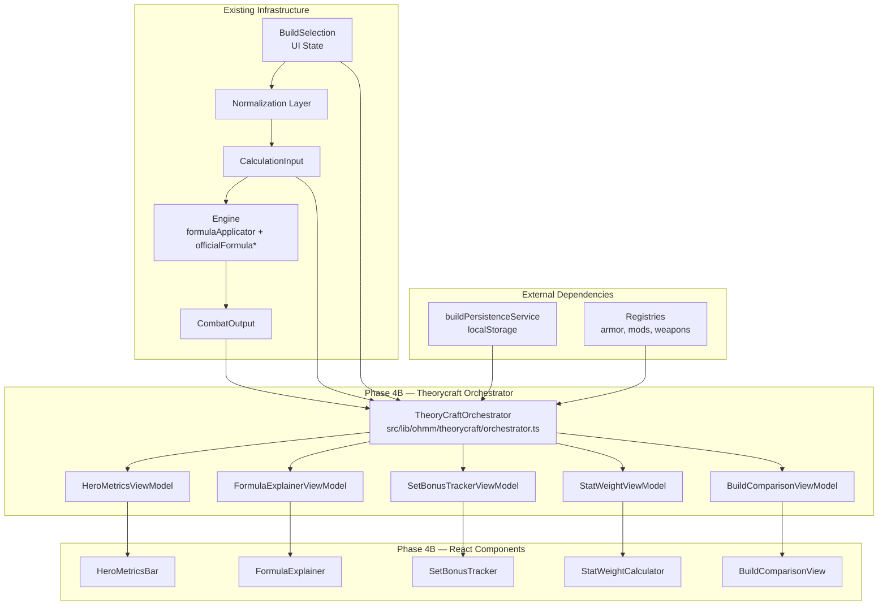
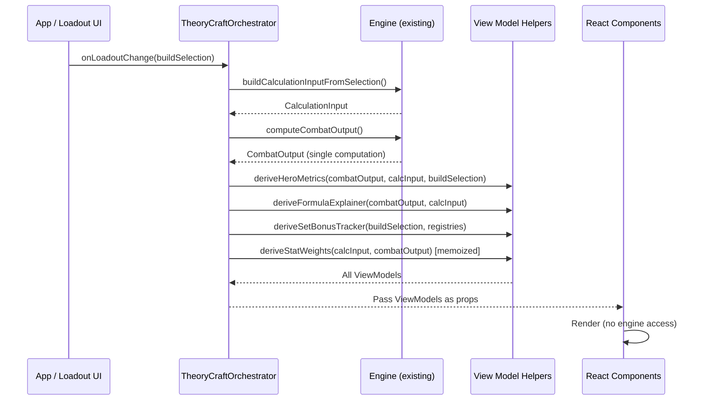

# Design Document — Phase 4B: Theorycraft UX / Decision-Support Layer

## Overview

Phase 4B transforms OHMM's raw engine output into actionable decision-support through five presentation features: Hero Metrics Bar, Formula Explainer, Set Bonus Tracker, Stat Weight Calculator, and Build Comparison Delta View. All features are read-only derivation layers consuming a shared `CombatOutput` computation — no engine rewrites or persistence changes are in scope.

The architecture follows a strict **View Model pattern**: pure TypeScript helper modules derive presentation-ready data structures from engine output, and React components render those structures without direct engine access. This keeps derivation logic testable in isolation and prevents the 3100-line App.tsx from accumulating more orchestration responsibility.

Implementation proceeds in two stages: MVP (core data pipelines + safe fallback states) then Polish (animations, micro-interactions, teaching moments).

## Architecture

### High-Level System Diagram



### Data Flow



### Key Architectural Decisions

1. **Single CombatOutput per change**: The orchestrator computes `CombatOutput` once per loadout change and distributes to all view model derivations. No component re-triggers engine computation.

2. **View Models are pure functions**: Every `derive*` helper is a pure TypeScript function: `(inputs) → ViewModel`. No side effects, no React hooks, no DOM access.

3. **Orchestrator lives outside App.tsx**: A dedicated `TheoryCraftOrchestrator` module in `src/lib/ohmm/theorycraft/` owns feature coordination. App.tsx only mounts the orchestrator hook.

4. **Memoized stat weights**: Perturbation simulation is expensive (7 engine re-runs). Results are memoized by a hash of the `BuildSelection`, recomputed only on actual loadout change.

5. **Safe defaults over exceptions**: All view model helpers return well-typed safe defaults on invalid input. Components never need try/catch around view model consumption.

## Components and Interfaces

### File Structure

```
src/lib/ohmm/theorycraft/
├── orchestrator.ts              # Coordinates computation, distributes view models
├── useTheoryCraft.ts            # React hook wrapping orchestrator for component tree
├── heroMetrics.vm.ts            # Pure: CombatOutput → HeroMetricsViewModel
├── formulaExplainer.vm.ts       # Pure: CombatOutput + CalcInput → FormulaExplainerViewModel
├── setBonusTracker.vm.ts        # Pure: BuildSelection + registries → SetBonusTrackerViewModel
├── statWeightCalculator.vm.ts   # Pure: CalcInput → StatWeightViewModel (perturbation engine)
├── buildComparison.vm.ts        # Pure: 2x CombatOutput + 2x BuildSelection → ComparisonViewModel
├── types.ts                     # All ViewModel interfaces
├── constants.ts                 # Stat categories, perturbation deltas, thresholds
└── utils.ts                     # Shared helpers (safe formatting, clamping, hashing)

src/app/components/theorycraft/
├── HeroMetricsBar.tsx           # Presentational — receives HeroMetricsViewModel
├── FormulaExplainer.tsx         # Presentational — receives FormulaExplainerViewModel
├── SetBonusTracker.tsx          # Presentational — receives SetBonusTrackerViewModel
├── StatWeightCalculator.tsx     # Presentational — receives StatWeightViewModel
├── BuildComparisonView.tsx      # Presentational — receives BuildComparisonViewModel
├── TheoryCraftPanel.tsx         # Layout wrapper mounting all 5 features
└── shared/
    ├── MetricCard.tsx           # Reusable metric display atom
    ├── DeltaIndicator.tsx       # Up/down arrow with label
    ├── ConfidenceBadge.tsx      # Provenance pill
    └── EmptyState.tsx           # Reusable empty/guidance state
```

### Component Interface Contracts

#### TheoryCraftOrchestrator

```typescript
// src/lib/ohmm/theorycraft/orchestrator.ts

export interface TheoryCraftState {
  heroMetrics: HeroMetricsViewModel;
  formulaExplainer: FormulaExplainerViewModel;
  setBonusTracker: SetBonusTrackerViewModel;
  statWeights: StatWeightViewModel;
  buildComparison: BuildComparisonViewModel | null;
  lastComputedAt: number; // Date.now() timestamp
}

export function computeTheoryCraftState(
  buildSelection: BuildSelection,
  calcInput: CalculationInput,
  combatOutput: CombatOutput,
  savedBuildId?: string,
): TheoryCraftState;
```

#### useTheoryCraft Hook

```typescript
// src/lib/ohmm/theorycraft/useTheoryCraft.ts

export function useTheoryCraft(
  buildSelection: BuildSelection,
  calcInput: CalculationInput,
  combatOutput: CombatOutput,
): TheoryCraftState;
```

This hook wraps `computeTheoryCraftState` with `useMemo` keyed on input references. It lives in the theorycraft module — not in App.tsx — and is consumed by `TheoryCraftPanel`.

#### Hero Metrics View Model

```typescript
// src/lib/ohmm/theorycraft/heroMetrics.vm.ts

export interface MetricCardData {
  id: string;
  label: string;
  value: string;          // Formatted string, never NaN/undefined/Infinity — "—" for missing
  numericValue: number;   // Raw number for animations (0 for missing)
  icon: string;           // Lucide icon name
  tooltip: string;        // Plain-language explanation
  confidence: ConfidenceLevel;
}

export interface HeroMetricsViewModel {
  metrics: MetricCardData[];       // DPS, Expected Hit, TTK, Status DMG, Build Mode, [PvP Mitigation]
  buildCompleteness: number;       // 0.0–1.0 ratio of filled slots
  confidenceScore: ConfidenceLevel; // Aggregated across all input sources
  buildMode: "pve" | "pvp";
}

export function deriveHeroMetrics(
  combatOutput: CombatOutput,
  calcInput: CalculationInput,
  buildSelection: BuildSelection,
): HeroMetricsViewModel;
```

**Algorithm — `deriveHeroMetrics`:**
1. Extract DPS from `combatOutput.damageOutput.DPS` → format or "—"
2. Extract expected hit from `combatOutput.damageOutput.expectedDamage` → format or "—"
3. Derive TTK from `combatOutput.pvpDuel.outgoingTTK` (PvP) or compute from DPS + target health (PvE) → format or "—"
4. Extract status DMG contribution from `calcInput.modifierSources` filtered to status-type → sum and format
5. Set build mode from `combatOutput.buildMode`
6. If PvP: add PvP mitigation % from `combatOutput.survivability.damageTakenMultiplier`
7. Compute build completeness: count non-empty slots in `buildSelection` / total slots (weapon + 6 armor + mods + food + deviant + cradle)
8. Aggregate confidence: scan `calcInput.modeledEffects` confidence fields → worst-case or weighted average
9. Guard every numeric output: if `isNaN(v) || !isFinite(v) || v === undefined` → substitute "—" / 0

#### Formula Explainer View Model

```typescript
// src/lib/ohmm/theorycraft/formulaExplainer.vm.ts

export type MultiplierGroupType = "additive" | "multiplicative";

export interface ExplainerLineItem {
  id: string;
  label: string;
  source: string;            // "Calibration", "Mod: XXX", "Set Bonus: YYY", etc.
  value: number;
  formattedValue: string;    // "+12.5%" or "×1.125"
  groupType: MultiplierGroupType;
  confidence: ConfidenceLevel;
  contributionPercent: number; // 0–100, share of total output (for Polish contribution bars)
}

export interface TargetAssumption {
  label: string;
  value: string;
  source: string;            // "Registry: PvE Training Dummy" etc.
}

export interface FormulaExplainerViewModel {
  baseWeaponDamage: string;      // Formatted, or "—"
  totalExpectedDamage: string;   // Formatted summary
  activeContributorCount: number;
  additiveGroup: ExplainerLineItem[];
  multiplicativeGroup: ExplainerLineItem[];
  targetAssumptions: TargetAssumption[];
  pvpMitigationSection: { applied: boolean; reductionPercent: string } | null;
  summaryLine: string;           // "12 active contributors → 4,523 expected damage"
  isExpanded: boolean;           // UI state (not derived — passed through)
}

export function deriveFormulaExplainer(
  combatOutput: CombatOutput,
  calcInput: CalculationInput,
): Omit<FormulaExplainerViewModel, 'isExpanded'>;
```

**Algorithm — `deriveFormulaExplainer`:**
1. Read `calcInput.baseWeaponDMG` → format or "—"
2. Read `combatOutput.damageOutput.expectedDamage` → format
3. Iterate `calcInput.modifierSources` → classify each as additive (same-stat flat bonuses) or multiplicative (percentage multipliers)
4. For each source, extract: label from source name, value, confidence from the bridged effect
5. Compute `contributionPercent` per item: (item's DPS share / total) × 100
6. Build `targetAssumptions` from `calcInput.enemyType` + available target registry data
7. If `calcInput.buildMode === "pvp"` → populate pvpMitigationSection from survivability metrics
8. Count active contributors (items with value > 0)
9. Never include any line item that doesn't trace back to a real `ModifierSource` in `calcInput`

#### Set Bonus Tracker View Model

```typescript
// src/lib/ohmm/theorycraft/setBonusTracker.vm.ts

export interface SetThreshold {
  requiredPieces: number;    // 2, 3, 4, 6
  bonusText: string;
  isActive: boolean;
  confidence: ConfidenceLevel;
}

export interface SetBonusEntry {
  setName: string;
  equippedCount: number;
  totalSlots: number;        // Always 6 (head, mask, chest, gloves, pants, boots)
  occupiedSlots: string[];   // ["head", "chest", "boots"]
  unoccupiedSlots: string[]; // ["mask", "gloves", "pants"]
  thresholds: SetThreshold[];
  nextThreshold: number | null;     // Next reachable threshold count, or null if maxed
  piecesNeeded: number | null;      // nextThreshold - equippedCount, or null
}

export interface SetBonusTrackerViewModel {
  sets: SetBonusEntry[];
  isEmpty: boolean;
  emptyStateMessage: string;
}

export function deriveSetBonusTracker(
  buildSelection: BuildSelection,
): SetBonusTrackerViewModel;
```

**Algorithm — `deriveSetBonusTracker`:**
1. Iterate `buildSelection.armor` slots → resolve each piece ID against `armorRegistry`/`keyGearRegistry`
2. Group by `piece.armorSet` → count pieces per set, track which slots
3. For each set with ≥1 piece:
   a. Look up set in `armorSetMetaMap` for name
   b. Look up thresholds from `armorSetTierOverrides` (keys: `${setName}-${N}pc`)
   c. For each threshold: `isActive = equippedCount >= requiredPieces`
   d. Find next inactive threshold → `piecesNeeded = nextThreshold - equippedCount`
   e. Compute `unoccupiedSlots = allSlots - occupiedSlots`
4. If no armor equipped: return `isEmpty: true` with guidance message
5. Sort sets by equipped count descending (most progress first)

#### Stat Weight Calculator View Model

```typescript
// src/lib/ohmm/theorycraft/statWeightCalculator.vm.ts

export type PerturbableStat =
  | "weaponDMGBonus"
  | "statusDMGBonus"
  | "elementalDMGBonus"
  | "critRate"
  | "critDMG"
  | "weakspotDMG"
  | "psiIntensity";

export interface StatWeightEntry {
  stat: PerturbableStat;
  label: string;               // Human-readable: "Crit Rate", "Weapon DMG%"
  absoluteGain: number;        // DPS delta from +1 perturbation
  relativeGainPercent: number; // (absoluteGain / baselineDPS) × 100
  barWidth: number;            // 0.0–1.0, scaled relative to max gain
  rank: number;                // 1 = highest gain
}

export interface StatWeightViewModel {
  entries: StatWeightEntry[];   // Sorted descending by absoluteGain
  baselineDPS: number;
  disclaimer: string;           // "Estimate — based on simulation"
  isComputable: boolean;        // false if baseline is 0/undefined
  errorMessage: string | null;  // Message when !isComputable
}

export function deriveStatWeights(
  calcInput: CalculationInput,
  combatOutput: CombatOutput,
): StatWeightViewModel;
```

**Algorithm — `deriveStatWeights` (Perturbation Engine):**

```typescript
const PERTURBATION_DELTAS: Record<PerturbableStat, number> = {
  weaponDMGBonus: 0.01,      // +1% weapon damage
  statusDMGBonus: 0.01,      // +1% status damage
  elementalDMGBonus: 0.01,   // +1% elemental damage
  critRate: 0.01,            // +1% crit rate
  critDMG: 0.01,             // +1% crit damage
  weakspotDMG: 0.01,         // +1% weakspot damage
  psiIntensity: 1.0,         // +1 flat psi intensity
};

function perturbAndCompute(
  calcInput: CalculationInput,
  stat: PerturbableStat,
  delta: number,
): number {
  // 1. Deep clone calcInput (structuredClone)
  // 2. Inject synthetic modifier source: { stat, value: delta, source: "perturbation" }
  // 3. Re-run computeCombatOutput on cloned input
  // 4. Return new DPS value
}

function deriveStatWeights(calcInput, combatOutput): StatWeightViewModel {
  const baselineDPS = combatOutput.damageOutput.DPS ?? 0;
  if (baselineDPS <= 0) {
    return { entries: [], baselineDPS: 0, isComputable: false, ... };
  }

  const results: StatWeightEntry[] = [];
  for (const [stat, delta] of Object.entries(PERTURBATION_DELTAS)) {
    const perturbedDPS = perturbAndCompute(calcInput, stat, delta);
    const absoluteGain = perturbedDPS - baselineDPS;
    results.push({ stat, absoluteGain, ... });
  }

  // Sort descending, assign ranks, compute barWidths
  results.sort((a, b) => b.absoluteGain - a.absoluteGain);
  const maxGain = results[0]?.absoluteGain || 1;
  results.forEach((r, i) => {
    r.rank = i + 1;
    r.barWidth = maxGain > 0 ? r.absoluteGain / maxGain : 0;
    r.relativeGainPercent = (r.absoluteGain / baselineDPS) * 100;
  });

  return { entries: results, baselineDPS, isComputable: true, ... };
}
```

**Non-mutation guarantee**: `structuredClone(calcInput)` ensures the original `CalculationInput` (and by extension `BuildSelection`) is never mutated. Each perturbation operates on an independent copy.

**Memoization strategy**: The orchestrator hashes the `BuildSelection` (using `JSON.stringify` of key fields or a stable hash). If the hash hasn't changed, cached `StatWeightViewModel` is returned.

#### Build Comparison View Model

```typescript
// src/lib/ohmm/theorycraft/buildComparison.vm.ts

export type DeltaDirection = "gain" | "loss" | "unchanged";

export interface MetricDelta {
  label: string;
  currentValue: string;
  savedValue: string;
  delta: string;           // "+1,234" or "-567"
  direction: DeltaDirection;
  icon: "arrow-up" | "arrow-down" | "minus"; // Lucide icon names
}

export interface SlotDiff {
  slot: string;            // "weapon", "head", "chest", etc.
  currentItem: string;     // Item name or "Empty"
  savedItem: string;       // Item name or "Empty"
  hasChanged: boolean;
}

export interface BuildComparisonViewModel {
  currentBuildName: string;
  savedBuildName: string;
  metricDeltas: MetricDelta[];  // DPS, Expected Damage, TTK
  slotDiffs: SlotDiff[];
  isAvailable: boolean;         // false if no saved builds or validation error
  errorMessage: string | null;
  emptyStateMessage: string | null;
}

export function deriveBuildComparison(
  currentSelection: BuildSelection,
  currentOutput: CombatOutput,
  savedBuild: SavedBuild | null,
): BuildComparisonViewModel;
```

**Algorithm — `deriveBuildComparison`:**
1. If `savedBuild` is null → return with `isAvailable: false`, empty state message
2. Validate `savedBuild` against `savedBuildSchema` → on failure, return error message
3. Compute comparison output: `buildCalculationInputFromSelection(savedBuild.build)` → `computeCombatOutput()`
4. Use existing `compareCombatOutputs(savedOutput, currentOutput)` for metric deltas
5. Walk each loadout slot comparing `currentSelection` vs `savedBuild.build`:
   - weapon: compare `blueprintId`
   - armor slots: compare piece IDs
   - mods: compare core+suffix per slot
   - food/drink, deviant, cradle
6. Assign direction: positive delta = "gain", negative = "loss", zero = "unchanged"
7. Format deltas with `+`/`-` prefix and thousands separator
8. Neither `currentSelection` nor `savedBuild` are mutated — comparison uses `compareCombatOutputs` on independently computed outputs

### Shared Utilities

```typescript
// src/lib/ohmm/theorycraft/utils.ts

/** Format a number for display, returning "—" for invalid values */
export function safeFormat(value: number | undefined | null, decimals?: number): string;

/** Returns true if value is displayable (not NaN, not Infinity, defined) */
export function isDisplayable(value: unknown): value is number;

/** Clamp a number to a range */
export function clamp(value: number, min: number, max: number): number;

/** Compute a stable hash of a BuildSelection for memoization */
export function hashBuildSelection(build: BuildSelection): string;

/** Aggregate confidence levels: returns worst-case across all sources */
export function aggregateConfidence(levels: ConfidenceLevel[]): ConfidenceLevel;

/** Format a delta value with +/- prefix and thousands separator */
export function formatDelta(value: number, decimals?: number): string;

/** Compute build completeness ratio */
export function computeCompleteness(build: BuildSelection): number;
```

## Data Models

### ConfidenceLevel (reused from existing engine types)

```typescript
// Maps from engine Confidence → display-friendly labels
export type ConfidenceLevel = "project_verified" | "observed" | "estimated" | "placeholder";

export const CONFIDENCE_DISPLAY: Record<ConfidenceLevel, { label: string; icon: string }> = {
  project_verified: { label: "Verified", icon: "check-circle" },
  observed: { label: "Observed", icon: "eye" },
  estimated: { label: "Estimated", icon: "alert-triangle" },
  placeholder: { label: "Placeholder", icon: "help-circle" },
};
```

### Existing Types Consumed (not modified)

| Type | Location | Role in Phase 4B |
|------|----------|-----------------|
| `BuildSelection` | `src/ohai/src/ui/types.ts` | Input to all view model derivations |
| `CalculationInput` | `src/ohai/src/ui/formulaBridge.ts` | Carries modifier sources, confidence, base stats |
| `CombatOutput` | `src/ohai/src/ui/combatOutput.ts` | Primary computed result (DPS, expected damage, survivability) |
| `CombatOutputDelta` | `src/ohai/src/ui/combatOutputComparison.ts` | Existing delta computation for build comparison |
| `SavedBuild` | `src/ohai/src/ui/savedBuildSchema.ts` | Schema-validated persisted build from Phase 4A |
| `FormulaResult` | `src/ohai/src/engine/formulaTypes.ts` | Multiplier breakdown for formula explainer |
| `ModifierSource` | `src/ohai/src/engine/modifierTypes.ts` | Individual stat contributions for line items |
| `ArmorSetMeta` | `src/ohai/src/ui/registries/generated/armor-sets.generated.ts` | Set names and metadata |
| `ArmorSetTierOverride` | `src/ohai/src/ui/registries/armorSetTierOverrides.ts` | Threshold bonus definitions |

### Integration with Existing Infrastructure

**Build Comparison** leverages the existing `buildComparisonEngine.ts` module which already provides:
- `buildComparisonData()` — creates `ComparisonBuildData` from a `BuildSelection`
- `compareBuilds()` — produces `BuildComparisonResult` with deltas and scoring
- `compareCombatOutputs()` — raw metric delta computation

The Phase 4B `deriveBuildComparison` view model wraps this existing logic, adding presentation formatting (direction labels, slot diffs, error handling) without duplicating computation.

**Set Bonus Tracker** leverages the existing `armorSetBonusResolver.ts` which already:
- Counts equipped pieces per set
- Resolves threshold activation from `armorSetTierOverrides`
- Produces `EffectPipelineItem[]` with active/inactive flags

The Phase 4B `deriveSetBonusTracker` view model reformats this data for UI consumption, grouping by set and computing `piecesNeeded`.

## Correctness Properties

*A property is a characteristic or behavior that should hold true across all valid executions of a system — essentially, a formal statement about what the system should do. Properties serve as the bridge between human-readable specifications and machine-verifiable correctness guarantees.*

### Property 1: Hero Metrics Safe Display

*For any* `CombatOutput` (including those with NaN, Infinity, undefined, or null in numeric fields), the `deriveHeroMetrics` function SHALL never produce a `MetricCardData.value` string containing "NaN", "undefined", "Infinity", or "-Infinity" — substituting "—" for any non-displayable value.

**Validates: Requirements 1.6, 1.7**

### Property 2: Hero Metrics Correct Mapping

*For any* valid `CombatOutput` with `buildMode === "pve"`, the `deriveHeroMetrics` function SHALL produce exactly 5 metric cards (DPS, Expected Hit, TTK, Status DMG, Build Mode). *For any* valid `CombatOutput` with `buildMode === "pvp"`, it SHALL produce 6 metric cards (adding PvP Mitigation).

**Validates: Requirements 1.1, 1.2**

### Property 3: Build Completeness Derivation

*For any* `BuildSelection`, the `computeCompleteness` function SHALL return a value equal to (count of non-empty loadout slots) / (total available slots), and the result SHALL always be in the range [0.0, 1.0].

**Validates: Requirements 1.3**

### Property 4: Formula Explainer Grouping Integrity

*For any* `CalculationInput` with N modifier sources, the `deriveFormulaExplainer` function SHALL partition all line items into exactly two groups (additive and multiplicative), and the total count of line items across both groups SHALL equal the count of non-zero modifier sources in the input.

**Validates: Requirements 3.2, 3.3**

### Property 5: No Invented Data Invariant

*For any* `CalculationInput` and `CombatOutput`, every `ExplainerLineItem` produced by `deriveFormulaExplainer` SHALL have a `source` that maps to an existing entry in `calcInput.modifierSources` or `calcInput.modeledEffects` — no line item may reference a mechanic, multiplier, or bonus not present in the input.

**Validates: Requirements 3.7, 11.1**

### Property 6: Confidence Label Propagation

*For any* `CalculationInput` containing effects with confidence levels "estimated" or "placeholder", the derived view models SHALL preserve and propagate those confidence levels to all UI-facing data items derived from those effects.

**Validates: Requirements 3.6, 11.2, 11.3**

### Property 7: Set Bonus Tracker Derivation

*For any* `BuildSelection` with armor pieces equipped, the `deriveSetBonusTracker` function SHALL: (a) include exactly those sets that have ≥1 piece equipped, (b) report `equippedCount` equal to the actual count of pieces from that set, (c) mark each threshold as `isActive` if and only if `equippedCount >= threshold.requiredPieces`, and (d) compute `piecesNeeded` as the difference between the next inactive threshold and current count (or null if no further thresholds exist).

**Validates: Requirements 5.1, 5.2, 5.4, 5.5**

### Property 8: Perturbation Non-Mutation

*For any* `CalculationInput` and `BuildSelection`, after running `deriveStatWeights`, the original `CalculationInput` and `BuildSelection` objects SHALL be deeply equal to their state before the function was called — no fields mutated, no references changed.

**Validates: Requirements 6.4**

### Property 9: Perturbation Stat Coverage

*For any* valid `CalculationInput` with non-zero baseline DPS, `deriveStatWeights` SHALL return entries for exactly 7 stats: weaponDMGBonus, statusDMGBonus, elementalDMGBonus, critRate, critDMG, weakspotDMG, and psiIntensity.

**Validates: Requirements 6.2**

### Property 10: Perturbation Result Ordering

*For any* stat weight result produced by `deriveStatWeights`, the `entries` array SHALL be sorted in strictly non-increasing order of `absoluteGain` — that is, for all adjacent pairs `entries[i]` and `entries[i+1]`, `entries[i].absoluteGain >= entries[i+1].absoluteGain`.

**Validates: Requirements 6.3, 7.5**

### Property 11: Stat Weight Bar Scaling

*For any* stat weight result with at least one positive-gain entry, the highest-ranked entry SHALL have `barWidth === 1.0`, and all other entries SHALL have `barWidth === absoluteGain / maxAbsoluteGain`, with barWidth in [0.0, 1.0].

**Validates: Requirements 7.2**

### Property 12: Build Comparison Delta Correctness

*For any* two valid `CombatOutput` objects (current and saved), the `deriveBuildComparison` function SHALL compute DPS delta equal to `current.damageOutput.DPS - saved.damageOutput.DPS`, and assign `direction: "gain"` when delta > 0, `direction: "loss"` when delta < 0, and `direction: "unchanged"` when delta === 0.

**Validates: Requirements 8.2, 9.1**

### Property 13: Build Comparison Slot Diff

*For any* two `BuildSelection` objects (current and saved), the `deriveBuildComparison` function SHALL produce a `slotDiffs` array where `hasChanged === true` if and only if the item ID in that slot differs between the two builds.

**Validates: Requirements 8.3, 8.9**

### Property 14: Build Comparison Non-Mutation

*For any* `BuildSelection` (current) and `SavedBuild` (target), after running `deriveBuildComparison`, both objects SHALL be deeply equal to their state before the function was called.

**Validates: Requirements 8.4**

### Property 15: View Model Safe Defaults

*For any* input to any view model derivation function (including null, undefined, empty objects, or partially populated structures), the function SHALL return a well-typed view model object without throwing — using safe defaults ("—" for strings, 0 for numbers, empty arrays for collections).

**Validates: Requirements 10.3**

## Error Handling

### View Model Layer (Pure Helpers)

All view model derivation functions follow a **safe-default** pattern rather than throwing exceptions:

| Scenario | Handling |
|----------|----------|
| `CombatOutput.damageOutput.DPS` is `undefined` | Return `value: "—"`, `numericValue: 0` |
| Any numeric field is `NaN` or `Infinity` | Substitute with 0, format as "—" |
| `BuildSelection` has empty/missing slots | Treat as unfilled for completeness, skip in set resolution |
| `calcInput.modifierSources` is empty | Return empty arrays, `activeContributorCount: 0` |
| Baseline DPS is 0 in stat weight calc | Return `isComputable: false`, `errorMessage: "Equip a weapon..."` |
| `savedBuild` fails schema validation | Return `isAvailable: false`, `errorMessage: "Saved build is incompatible..."` |
| No saved builds in persistence | Return `isAvailable: false`, `emptyStateMessage: "Save a build first..."` |
| Armor piece ID not found in registry | Skip piece (don't crash), reduce `equippedCount` |
| `structuredClone` fails on exotic objects | Fall back to `JSON.parse(JSON.stringify(...))` |

### Orchestrator Layer

```typescript
// Orchestrator wraps all view model calls defensively
function safeDerive<T>(fn: () => T, fallback: T): T {
  try { return fn(); }
  catch { return fallback; }
}
```

### Component Layer

React components receive only well-typed view models. No error boundaries needed for data issues — all errors are absorbed at the view model layer. Components only need standard React error boundaries for rendering bugs.

### Confidence/Provenance Indicators

When data carries low confidence ("estimated" or "placeholder"):
- View model includes `confidence` field on affected items
- Components render a `ConfidenceBadge` (triangle-alert icon + text label) next to the value
- No blocking — low-confidence data is still displayed, just annotated

## Testing Strategy

### Overview

Testing follows a dual approach: **property-based tests** verify universal correctness guarantees across all inputs, and **example-based tests** cover specific scenarios, edge cases, and integration points.

### Property-Based Testing

**Library**: [fast-check](https://github.com/dubzzz/fast-check) (TypeScript-native, integrates with any test runner)

**Test Runner**: Vitest (to be added as a dev dependency — the project currently has no test framework for the root project)

**Configuration**: Minimum 100 iterations per property test.

**Tag format**: Each property test file will include a comment referencing its design property:
```typescript
// Feature: phase-4b-theorycraft-ux, Property 1: Hero Metrics Safe Display
```

**Property tests cover** (one test per design property):
1. Hero Metrics safe display (no NaN/Infinity/undefined in output)
2. Hero Metrics correct metric count by build mode
3. Build completeness range invariant [0, 1]
4. Formula explainer grouping integrity
5. No invented data invariant
6. Confidence label propagation
7. Set bonus tracker derivation correctness
8. Perturbation non-mutation
9. Perturbation stat coverage (7 stats)
10. Perturbation result ordering (descending)
11. Stat weight bar scaling
12. Build comparison delta correctness and direction
13. Build comparison slot diff accuracy
14. Build comparison non-mutation
15. View model safe defaults (no exceptions on bad input)

**Generators needed**:
- `arbitraryCombatOutput()` — generates valid and edge-case CombatOutput shapes
- `arbitraryCalculationInput()` — generates CalculationInput with varying modifier sources
- `arbitraryBuildSelection()` — generates BuildSelection with random slot fill patterns
- `arbitrarySavedBuild()` — generates valid SavedBuild instances
- `arbitraryInvalidInput()` — generates null, undefined, empty, and partial objects

### Example-Based Tests

| Test Area | What's Tested | Count |
|-----------|--------------|-------|
| Hero Metrics — responsive layout | Viewport < 768px → 2-row grid | 1 |
| Hero Metrics — keyboard a11y | Tab order, aria-labels | 1 |
| Formula Explainer — collapsed default | Initial render shows summary only | 1 |
| Formula Explainer — expand/collapse | Click/Enter/Space toggle | 3 |
| Set Bonus Tracker — empty state | No armor → guidance message | 1 |
| Stat Weight — zero baseline | DPS=0 → error message | 1 |
| Build Comparison — no saved builds | Empty persistence → guidance | 1 |
| Build Comparison — schema failure | Corrupted saved build → error | 1 |
| Build Comparison — layout | Side-by-side with correct headers | 1 |

### Smoke Tests

| Test | What's Verified |
|------|----------------|
| Architectural boundary | View model files don't import React |
| Architectural boundary | Component files don't import engine directly |
| Architectural boundary | App.tsx has no theorycraft orchestration |

### Integration Tests

| Test | What's Verified |
|------|----------------|
| Persistence round-trip | `loadBuild()` → `deriveBuildComparison()` produces valid output |
| Memoization | Same BuildSelection → same stat weight result (referential equality) |
| Set tracker performance | `deriveSetBonusTracker` completes in < 5ms for 6-piece loadout |

### Test File Location

```
src/lib/ohmm/theorycraft/__tests__/
├── heroMetrics.vm.property.test.ts
├── formulaExplainer.vm.property.test.ts
├── setBonusTracker.vm.property.test.ts
├── statWeightCalculator.vm.property.test.ts
├── buildComparison.vm.property.test.ts
├── viewModel.safeDefaults.property.test.ts
├── generators.ts                          # Shared fast-check arbitraries
└── integration/
    ├── orchestrator.test.ts
    └── persistence.test.ts
```
